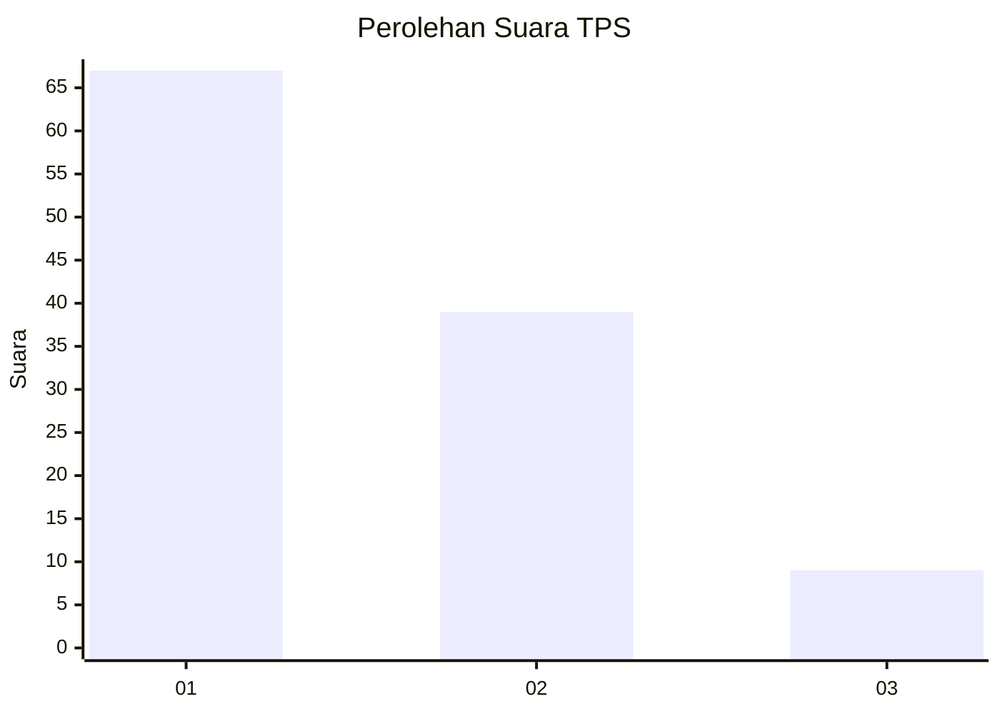
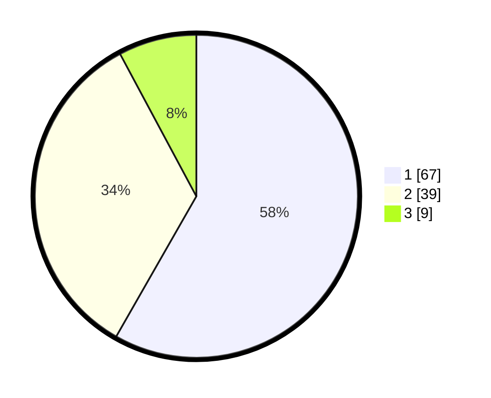

# Hasil

## Grafik

## Tabel

| No. | Nama Paslon    | Suara | Suara (raw) | Persentase |
|:--- |:-------------- | -----:| -----------:| ----------:|
| 1   | ANIES MUHAIMIN | 67    | [67][p-1]   | 58,26      |
| 2   | PRABOWO GIBRAN | 39    | [39][p-2]   | 33,91      |
| 3   | GANJAR MAHFUD  | 9     | [9][p-3]    | 7,83       |

[p-1]: https://github.com/gigit-pemilu/pemilu-2024-12-sumatera-utara/blob/main/pilpres/hitung-suara/sub/12-sumatera-utara/sub/09-asahan/sub/20-kota-kisaran-timur/sub/1001-teladan/sub/022-tps/sub/paslon-1.txt
[p-2]: https://github.com/gigit-pemilu/pemilu-2024-12-sumatera-utara/blob/main/pilpres/hitung-suara/sub/12-sumatera-utara/sub/09-asahan/sub/20-kota-kisaran-timur/sub/1001-teladan/sub/022-tps/sub/paslon-2.txt
[p-3]: https://github.com/gigit-pemilu/pemilu-2024-12-sumatera-utara/blob/main/pilpres/hitung-suara/sub/12-sumatera-utara/sub/09-asahan/sub/20-kota-kisaran-timur/sub/1001-teladan/sub/022-tps/sub/paslon-3.txt

## Foto C Plano

https://sirekap-obj-formc.kpu.go.id/e104/pemilu/ppwp/12/09/20/10/01/1209201001022-20240215-015826--51663e31-c4b4-4abb-a751-2362c5c6a9e7.jpg

https://sirekap-obj-formc.kpu.go.id/e104/pemilu/ppwp/12/09/20/10/01/1209201001022-20240215-015844--bc072cbd-ace7-41e1-91b6-4edcabd997cb.jpg

https://sirekap-obj-formc.kpu.go.id/e104/pemilu/ppwp/12/09/20/10/01/1209201001022-20240215-015908--64a0c206-ddae-4c79-b07e-0559d4aab89f.jpg

## Metadata

| Key        | Value               |
| ---------- | ------------------- |
| Time Stamp | 2024-02-25 18:00:00 |

