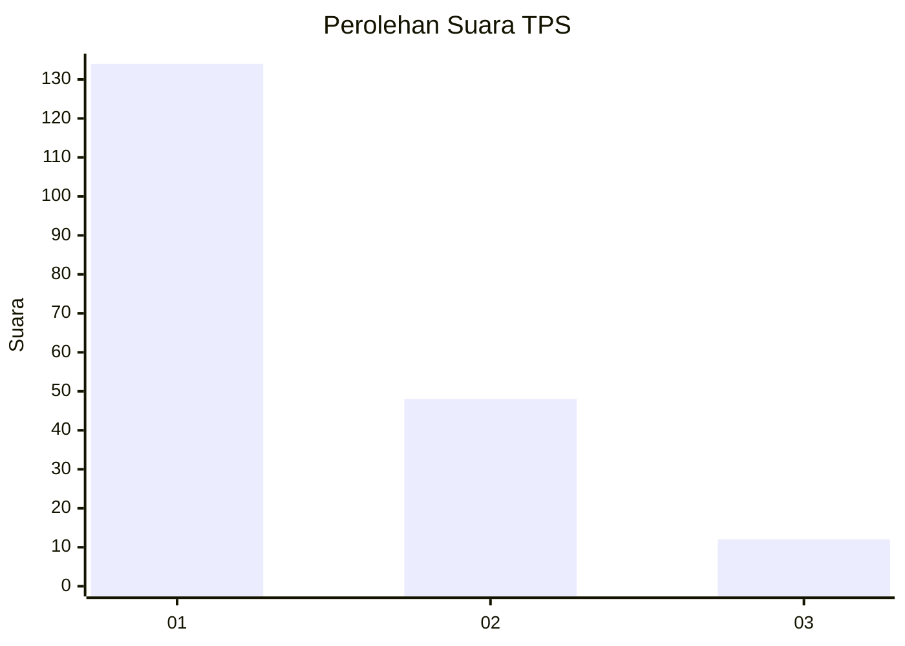
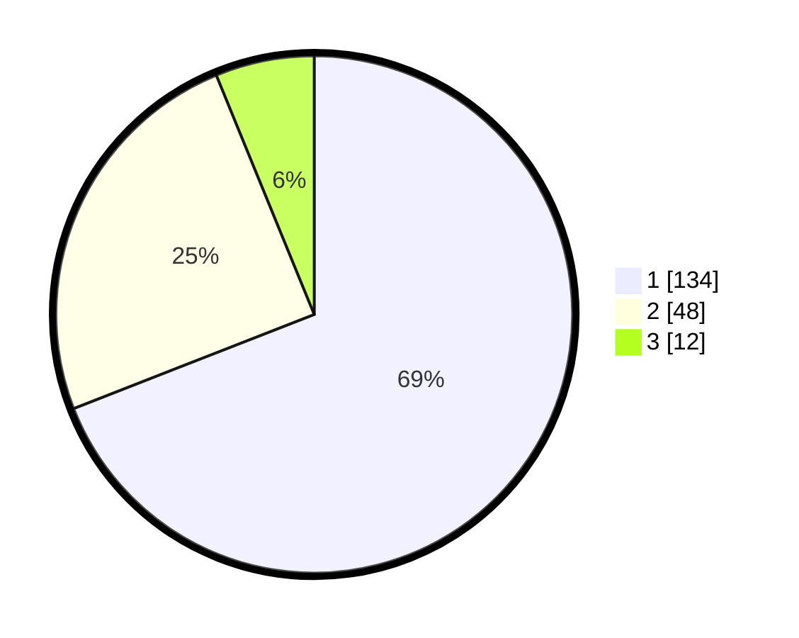

# Hasil

## Grafik

## Tabel

| No. | Nama Paslon    | Suara | Suara (raw) | Persentase |
|:--- |:-------------- | -----:| -----------:| ----------:|
| 1   | ANIES MUHAIMIN | 134   | [134][p-1]  | 69,07      |
| 2   | PRABOWO GIBRAN | 48    | [48][p-2]   | 24,74      |
| 3   | GANJAR MAHFUD  | 12    | [12][p-3]   | 6,19       |

[p-1]: https://github.com/gigit-pemilu/pemilu-2024-12-sumatera-utara/blob/main/pilpres/hitung-suara/sub/12-sumatera-utara/sub/09-asahan/sub/20-kota-kisaran-timur/sub/1003-siumbut-baru/sub/014-tps/sub/paslon-1.txt
[p-2]: https://github.com/gigit-pemilu/pemilu-2024-12-sumatera-utara/blob/main/pilpres/hitung-suara/sub/12-sumatera-utara/sub/09-asahan/sub/20-kota-kisaran-timur/sub/1003-siumbut-baru/sub/014-tps/sub/paslon-2.txt
[p-3]: https://github.com/gigit-pemilu/pemilu-2024-12-sumatera-utara/blob/main/pilpres/hitung-suara/sub/12-sumatera-utara/sub/09-asahan/sub/20-kota-kisaran-timur/sub/1003-siumbut-baru/sub/014-tps/sub/paslon-3.txt

## Foto C Plano

https://sirekap-obj-formc.kpu.go.id/ea50/pemilu/ppwp/12/09/20/10/03/1209201003014-20240214-213145--cf56b3c3-13cf-4212-906d-1c0e0a0c58df.jpg

https://sirekap-obj-formc.kpu.go.id/ea50/pemilu/ppwp/12/09/20/10/03/1209201003014-20240214-212912--428d6574-26d6-4180-b62a-d3e7c1fa3fd2.jpg

https://sirekap-obj-formc.kpu.go.id/ea50/pemilu/ppwp/12/09/20/10/03/1209201003014-20240214-213307--06f87267-de45-429a-8ed9-f843873a2077.jpg

## Metadata

| Key        | Value               |
| ---------- | ------------------- |
| Time Stamp | 2024-02-25 12:00:00 |

