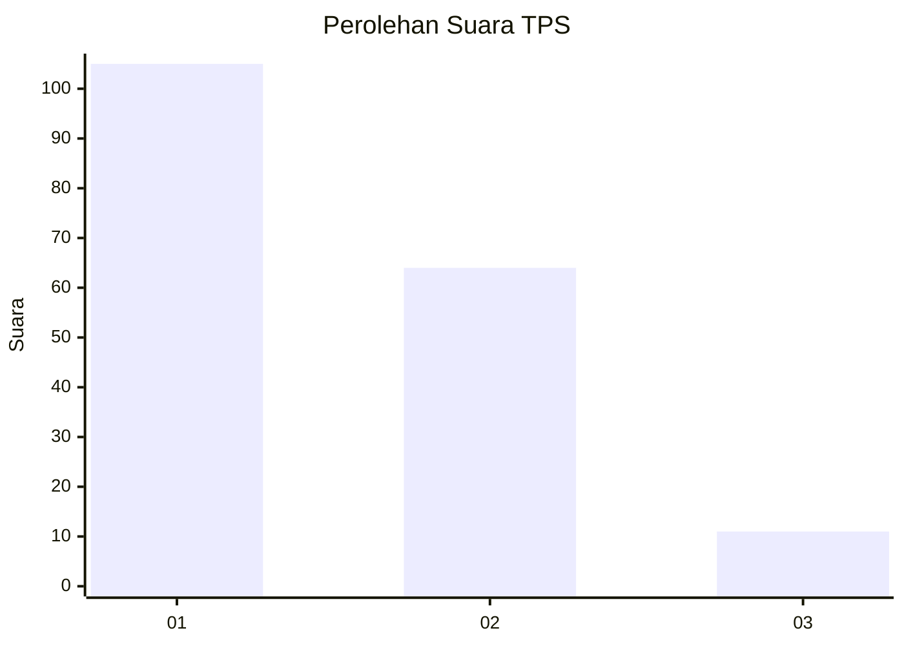
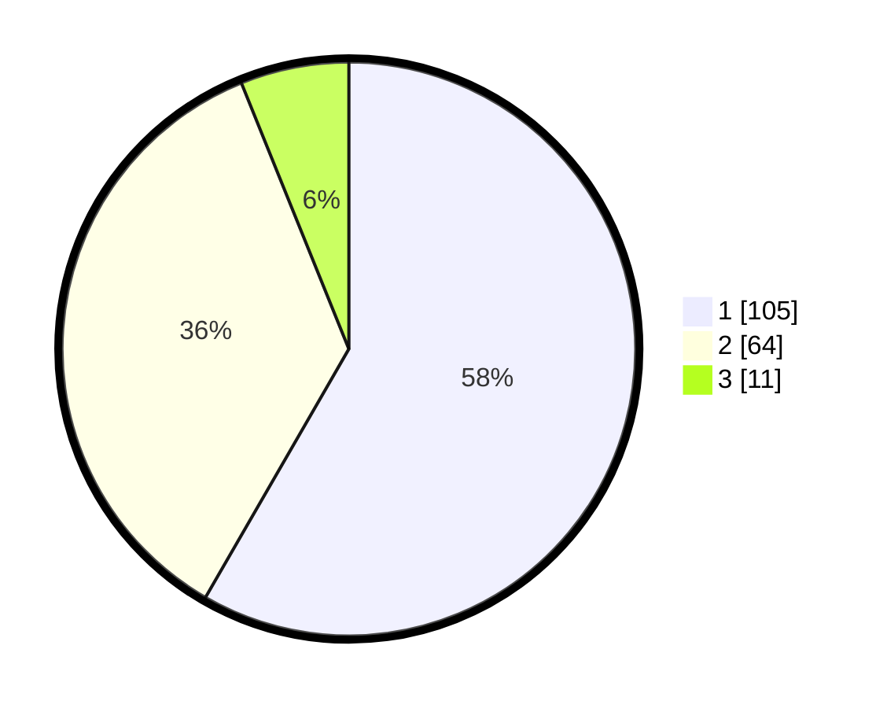

# Hasil

## Grafik

## Tabel

| No. | Nama Paslon    | Suara | Suara (raw) | Persentase |
|:--- |:-------------- | -----:| -----------:| ----------:|
| 1   | ANIES MUHAIMIN | 105   | [105][p-1]  | 58,33      |
| 2   | PRABOWO GIBRAN | 64    | [64][p-2]   | 35,56      |
| 3   | GANJAR MAHFUD  | 11    | [11][p-3]   | 6,11       |

[p-1]: https://github.com/gigit-pemilu/pemilu-2024/blob/main/pilpres/hitung-suara/sub/12-sumatera-utara/sub/09-asahan/sub/20-kota-kisaran-timur/sub/1005-selawan/sub/001-tps/sub/paslon-1.txt
[p-2]: https://github.com/gigit-pemilu/pemilu-2024/blob/main/pilpres/hitung-suara/sub/12-sumatera-utara/sub/09-asahan/sub/20-kota-kisaran-timur/sub/1005-selawan/sub/001-tps/sub/paslon-2.txt
[p-3]: https://github.com/gigit-pemilu/pemilu-2024/blob/main/pilpres/hitung-suara/sub/12-sumatera-utara/sub/09-asahan/sub/20-kota-kisaran-timur/sub/1005-selawan/sub/001-tps/sub/paslon-3.txt

## Foto C Plano

https://sirekap-obj-formc.kpu.go.id/118d/pemilu/ppwp/12/09/20/10/05/1209201005001-20240216-180633--914717f6-c1f3-4f13-8797-ff292e164fe3.jpg

https://sirekap-obj-formc.kpu.go.id/118d/pemilu/ppwp/12/09/20/10/05/1209201005001-20240214-201902--be36575f-6643-481f-b338-11c44dd15805.jpg

https://sirekap-obj-formc.kpu.go.id/118d/pemilu/ppwp/12/09/20/10/05/1209201005001-20240214-224723--bde1025f-42a4-48e1-8fe3-ad7f6bb16bf5.jpg

## Metadata

| Key        | Value               |
| ---------- | ------------------- |
| Time Stamp | 2024-02-24 22:31:28 |

