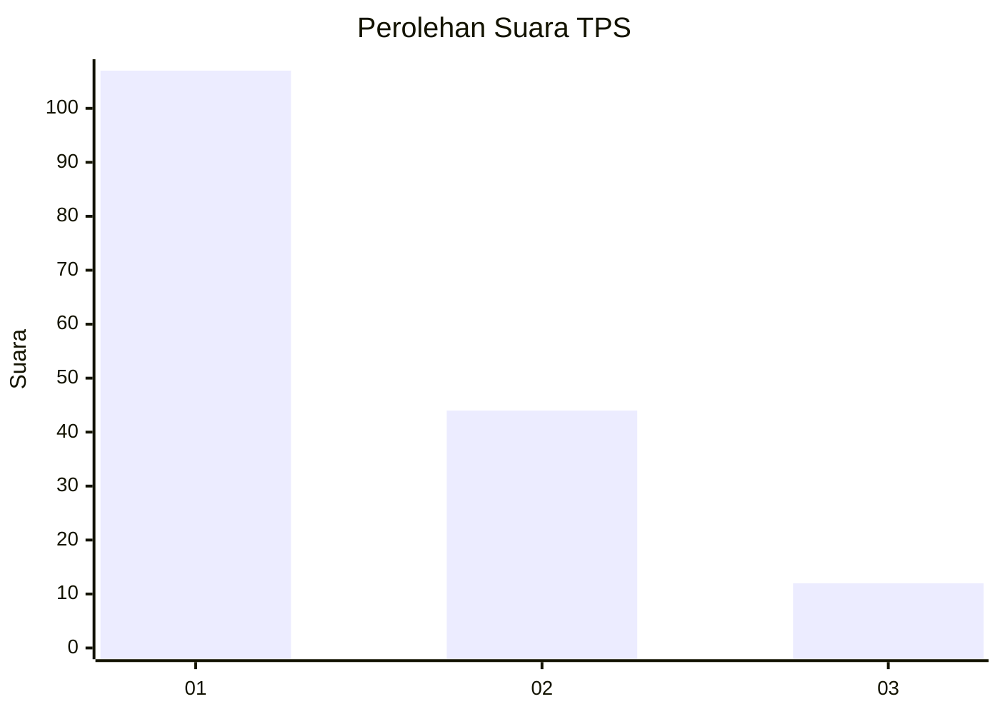
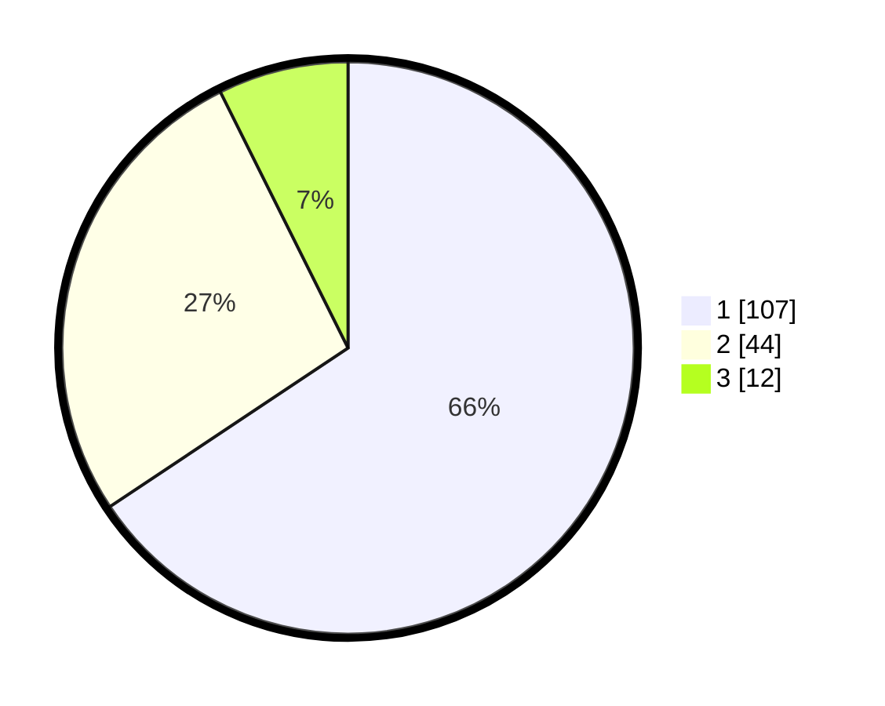

# Hasil

## Grafik

## Tabel

| No. | Nama Paslon    | Suara | Suara (raw) | Persentase |
|:--- |:-------------- | -----:| -----------:| ----------:|
| 1   | ANIES MUHAIMIN | 107   | [107][p-1]  | 65,64      |
| 2   | PRABOWO GIBRAN | 44    | [44][p-2]   | 26,99      |
| 3   | GANJAR MAHFUD  | 12    | [12][p-3]   | 7,36       |

[p-1]: https://github.com/gigit-pemilu/pemilu-2024/blob/main/pilpres/hitung-suara/sub/12-sumatera-utara/sub/09-asahan/sub/20-kota-kisaran-timur/sub/1005-selawan/sub/014-tps/sub/paslon-1.txt
[p-2]: https://github.com/gigit-pemilu/pemilu-2024/blob/main/pilpres/hitung-suara/sub/12-sumatera-utara/sub/09-asahan/sub/20-kota-kisaran-timur/sub/1005-selawan/sub/014-tps/sub/paslon-2.txt
[p-3]: https://github.com/gigit-pemilu/pemilu-2024/blob/main/pilpres/hitung-suara/sub/12-sumatera-utara/sub/09-asahan/sub/20-kota-kisaran-timur/sub/1005-selawan/sub/014-tps/sub/paslon-3.txt

## Foto C Plano

https://sirekap-obj-formc.kpu.go.id/6140/pemilu/ppwp/12/09/20/10/05/1209201005014-20240215-003124--83b159e1-081f-4fdf-9925-cc7f150567a2.jpg

https://sirekap-obj-formc.kpu.go.id/6140/pemilu/ppwp/12/09/20/10/05/1209201005014-20240215-003014--907906c1-df41-455d-955f-d02b4d86f720.jpg

https://sirekap-obj-formc.kpu.go.id/6140/pemilu/ppwp/12/09/20/10/05/1209201005014-20240215-003227--d4670cf5-8bb2-4622-bcfe-5b243a328689.jpg

## Metadata

| Key        | Value               |
| ---------- | ------------------- |
| Time Stamp | 2024-02-25 16:00:00 |

