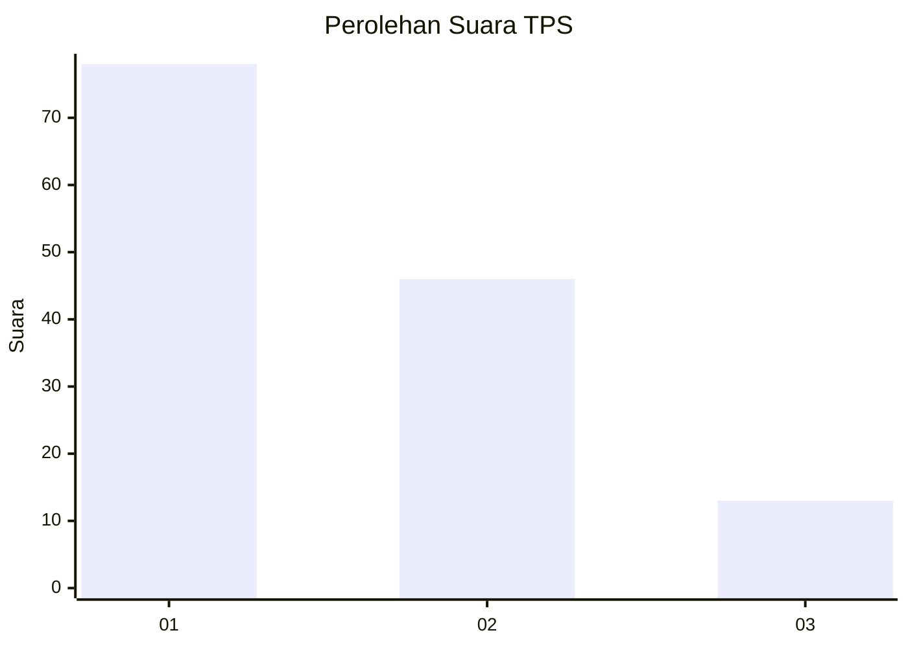
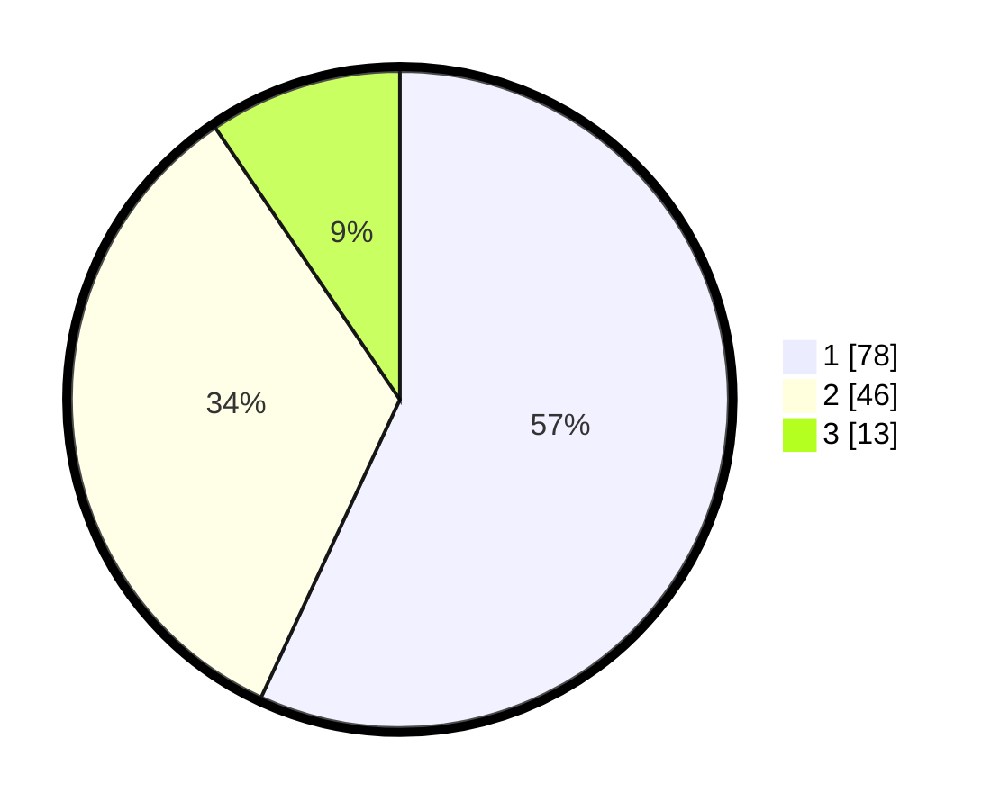

# Hasil

## Grafik

## Tabel

| No. | Nama Paslon    | Suara | Suara (raw) | Persentase |
|:--- |:-------------- | -----:| -----------:| ----------:|
| 1   | ANIES MUHAIMIN | 78    | [78][p-1]   | 56,93      |
| 2   | PRABOWO GIBRAN | 46    | [46][p-2]   | 33,58      |
| 3   | GANJAR MAHFUD  | 13    | [13][p-3]   | 9,49       |

[p-1]: https://github.com/gigit-pemilu/pemilu-2024/blob/main/pilpres/hitung-suara/sub/12-sumatera-utara/sub/09-asahan/sub/20-kota-kisaran-timur/sub/1006-mutiara/sub/005-tps/sub/paslon-1.txt
[p-2]: https://github.com/gigit-pemilu/pemilu-2024/blob/main/pilpres/hitung-suara/sub/12-sumatera-utara/sub/09-asahan/sub/20-kota-kisaran-timur/sub/1006-mutiara/sub/005-tps/sub/paslon-2.txt
[p-3]: https://github.com/gigit-pemilu/pemilu-2024/blob/main/pilpres/hitung-suara/sub/12-sumatera-utara/sub/09-asahan/sub/20-kota-kisaran-timur/sub/1006-mutiara/sub/005-tps/sub/paslon-3.txt

## Foto C Plano

https://sirekap-obj-formc.kpu.go.id/84a7/pemilu/ppwp/12/09/20/10/06/1209201006005-20240214-204237--abbe31c9-3734-41e7-9b7e-dd4474b0992b.jpg

https://sirekap-obj-formc.kpu.go.id/84a7/pemilu/ppwp/12/09/20/10/06/1209201006005-20240214-204257--9c26b05a-55ff-414d-9e48-c5fc33428e62.jpg

https://sirekap-obj-formc.kpu.go.id/84a7/pemilu/ppwp/12/09/20/10/06/1209201006005-20240214-204410--f7618c80-fa1f-47d8-a42e-749f6fd25fbc.jpg

## Metadata

| Key        | Value               |
| ---------- | ------------------- |
| Time Stamp | 2024-02-25 11:00:00 |

