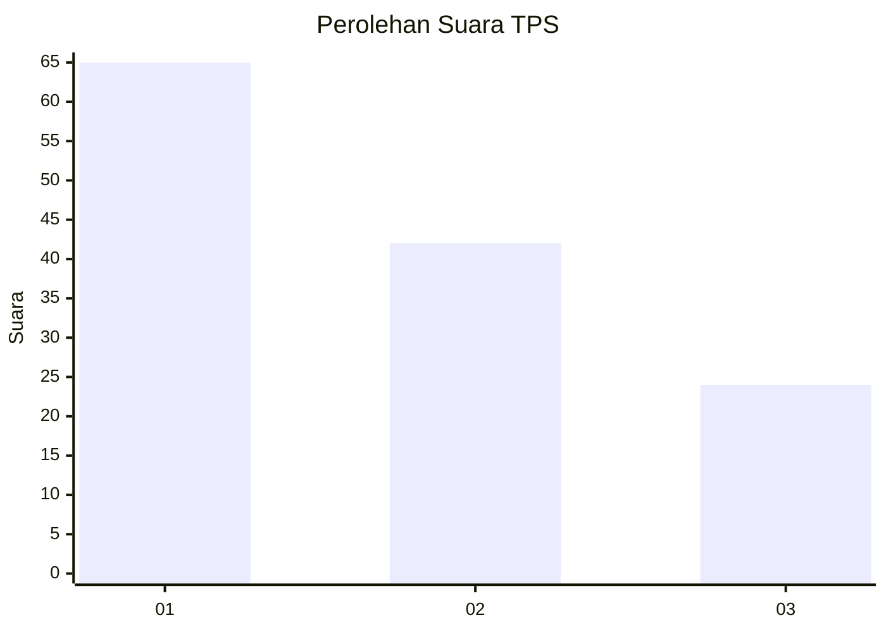
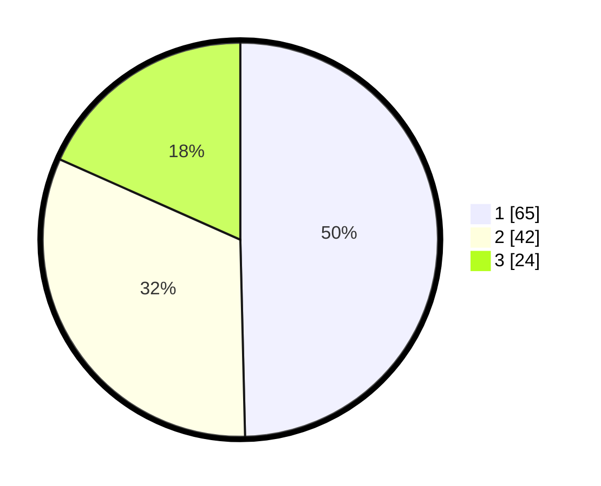

# Hasil

## Grafik

## Tabel

| No. | Nama Paslon    | Suara | Suara (raw) | Persentase |
|:--- |:-------------- | -----:| -----------:| ----------:|
| 1   | ANIES MUHAIMIN | 65    | [65][p-1]   | 49,62      |
| 2   | PRABOWO GIBRAN | 42    | [42][p-2]   | 32,06      |
| 3   | GANJAR MAHFUD  | 24    | [24][p-3]   | 18,32      |

[p-1]: https://github.com/gigit-pemilu/pemilu-2024/blob/main/pilpres/hitung-suara/sub/12-sumatera-utara/sub/09-asahan/sub/20-kota-kisaran-timur/sub/1009-kisaran-naga/sub/016-tps/sub/paslon-1.txt
[p-2]: https://github.com/gigit-pemilu/pemilu-2024/blob/main/pilpres/hitung-suara/sub/12-sumatera-utara/sub/09-asahan/sub/20-kota-kisaran-timur/sub/1009-kisaran-naga/sub/016-tps/sub/paslon-2.txt
[p-3]: https://github.com/gigit-pemilu/pemilu-2024/blob/main/pilpres/hitung-suara/sub/12-sumatera-utara/sub/09-asahan/sub/20-kota-kisaran-timur/sub/1009-kisaran-naga/sub/016-tps/sub/paslon-3.txt

## Foto C Plano

https://sirekap-obj-formc.kpu.go.id/9df0/pemilu/ppwp/12/09/20/10/09/1209201009016-20240214-235227--e4c5a8fc-db50-4a4e-b138-48afe9cf8bd9.jpg

https://sirekap-obj-formc.kpu.go.id/9df0/pemilu/ppwp/12/09/20/10/09/1209201009016-20240214-235533--35a1ab78-f2ff-4684-9a7f-e910d6ed1a82.jpg

https://sirekap-obj-formc.kpu.go.id/9df0/pemilu/ppwp/12/09/20/10/09/1209201009016-20240214-235729--0c188ece-7000-4c05-97fd-736911544e6f.jpg

## Metadata

| Key        | Value               |
| ---------- | ------------------- |
| Time Stamp | 2024-02-25 14:00:00 |

