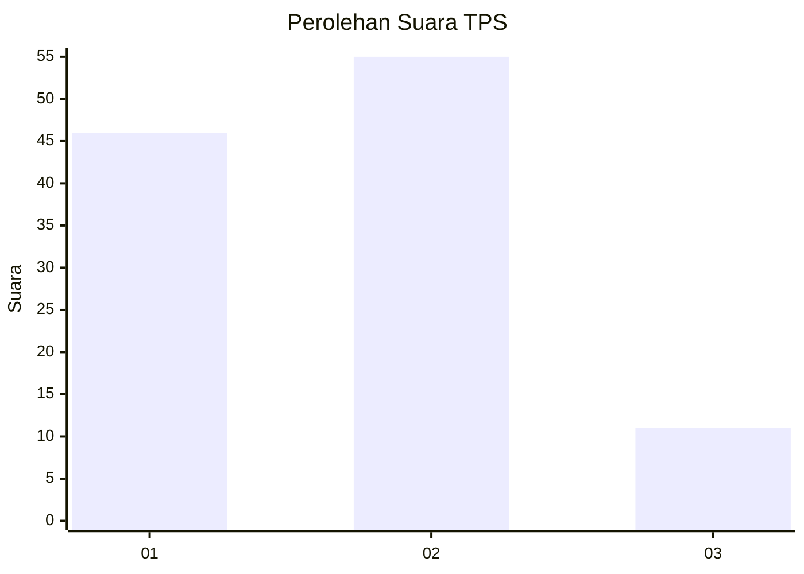
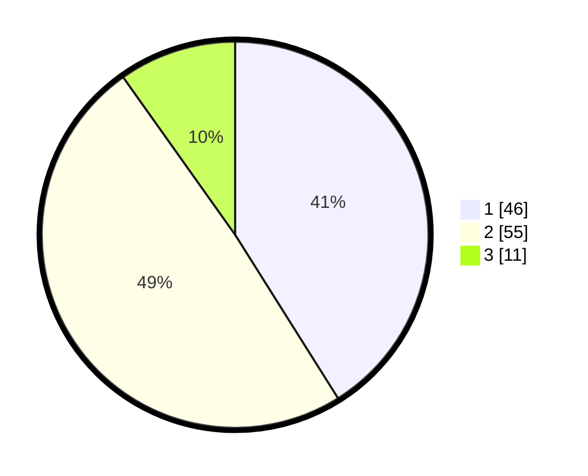

# Hasil

## Grafik

## Tabel

| No. | Nama Paslon    | Suara | Suara (raw) | Persentase |
|:--- |:-------------- | -----:| -----------:| ----------:|
| 1   | ANIES MUHAIMIN | 46    | [46][p-1]   | 41,07      |
| 2   | PRABOWO GIBRAN | 55    | [55][p-2]   | 49,11      |
| 3   | GANJAR MAHFUD  | 11    | [11][p-3]   | 9,82       |

[p-1]: https://github.com/gigit-pemilu/pemilu-2024-12-sumatera-utara/blob/main/pilpres/hitung-suara/sub/12-sumatera-utara/sub/09-asahan/sub/21-aek-songsongan/sub/2001-aek-songsongan/sub/017-tps/sub/paslon-1.txt
[p-2]: https://github.com/gigit-pemilu/pemilu-2024-12-sumatera-utara/blob/main/pilpres/hitung-suara/sub/12-sumatera-utara/sub/09-asahan/sub/21-aek-songsongan/sub/2001-aek-songsongan/sub/017-tps/sub/paslon-2.txt
[p-3]: https://github.com/gigit-pemilu/pemilu-2024-12-sumatera-utara/blob/main/pilpres/hitung-suara/sub/12-sumatera-utara/sub/09-asahan/sub/21-aek-songsongan/sub/2001-aek-songsongan/sub/017-tps/sub/paslon-3.txt

## Foto C Plano

https://sirekap-obj-formc.kpu.go.id/66f7/pemilu/ppwp/12/09/21/20/01/1209212001017-20240218-053446--e210fc65-c58c-4ac6-bc05-25e9f0546b8d.jpg

https://sirekap-obj-formc.kpu.go.id/66f7/pemilu/ppwp/12/09/21/20/01/1209212001017-20240214-225402--5d0cd743-3e28-4cbe-bfd3-6cb814bfe051.jpg

https://sirekap-obj-formc.kpu.go.id/66f7/pemilu/ppwp/12/09/21/20/01/1209212001017-20240214-204329--cde6ae1d-3664-41f1-9ffe-a8ca1d514a97.jpg

## Metadata

| Key        | Value               |
| ---------- | ------------------- |
| Time Stamp | 2024-02-19 06:16:00 |

