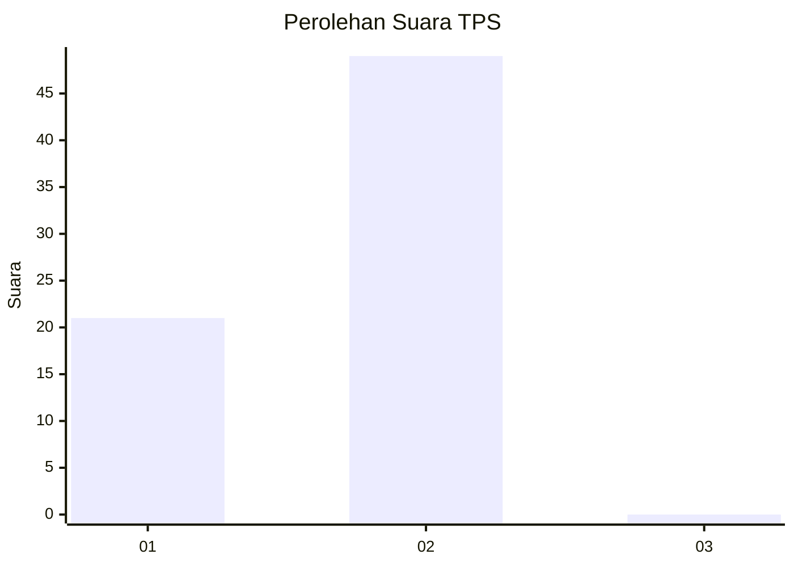
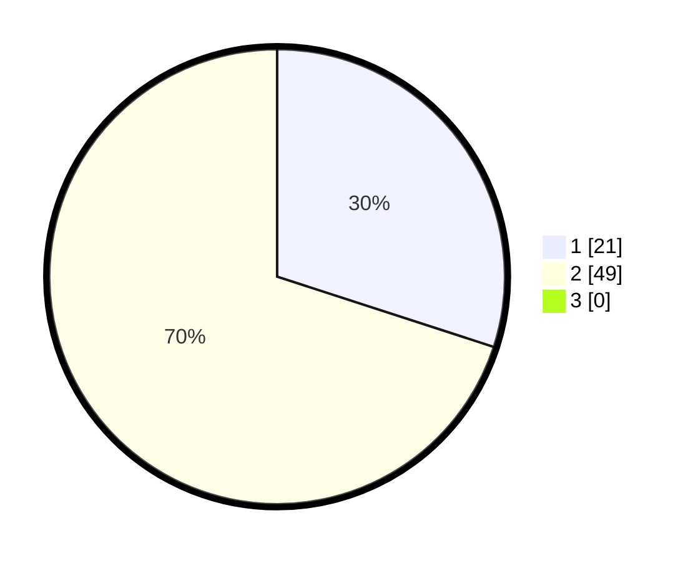

# Hasil

## Grafik

## Tabel

| No. | Nama Paslon    | Suara | Suara (raw) | Persentase |
|:--- |:-------------- | -----:| -----------:| ----------:|
| 1   | ANIES MUHAIMIN | 21    | [21][p-1]   | 30,00      |
| 2   | PRABOWO GIBRAN | 49    | [49][p-2]   | 70,00      |
| 3   | GANJAR MAHFUD  | 0     | [0][p-3]    | 0,00       |

[p-1]: https://github.com/gigit-pemilu/pemilu-2024-12-sumatera-utara/blob/main/pilpres/hitung-suara/sub/12-sumatera-utara/sub/09-asahan/sub/21-aek-songsongan/sub/2002-perkebunan-bandar-selamat/sub/002-tps/sub/paslon-1.txt
[p-2]: https://github.com/gigit-pemilu/pemilu-2024-12-sumatera-utara/blob/main/pilpres/hitung-suara/sub/12-sumatera-utara/sub/09-asahan/sub/21-aek-songsongan/sub/2002-perkebunan-bandar-selamat/sub/002-tps/sub/paslon-2.txt
[p-3]: https://github.com/gigit-pemilu/pemilu-2024-12-sumatera-utara/blob/main/pilpres/hitung-suara/sub/12-sumatera-utara/sub/09-asahan/sub/21-aek-songsongan/sub/2002-perkebunan-bandar-selamat/sub/002-tps/sub/paslon-3.txt

## Foto C Plano

https://sirekap-obj-formc.kpu.go.id/80a4/pemilu/ppwp/12/09/21/20/02/1209212002002-20240215-194307--6138f047-c797-4e9e-941f-aed7525db7da.jpg

https://sirekap-obj-formc.kpu.go.id/80a4/pemilu/ppwp/12/09/21/20/02/1209212002002-20240215-194338--d12e03b9-ce30-45ea-9bbc-0c25ff98ad14.jpg

https://sirekap-obj-formc.kpu.go.id/80a4/pemilu/ppwp/12/09/21/20/02/1209212002002-20240215-194420--cf29e0fb-8b44-489e-b710-90c75c31359e.jpg

## Metadata

| Key        | Value               |
| ---------- | ------------------- |
| Time Stamp | 2024-02-26 14:00:00 |

