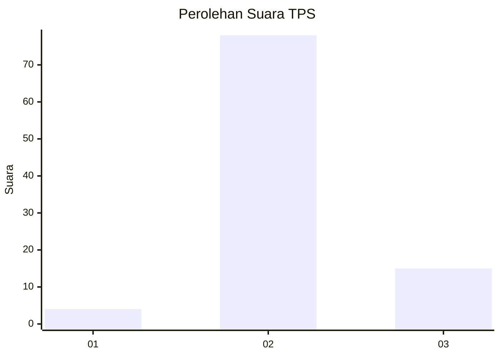
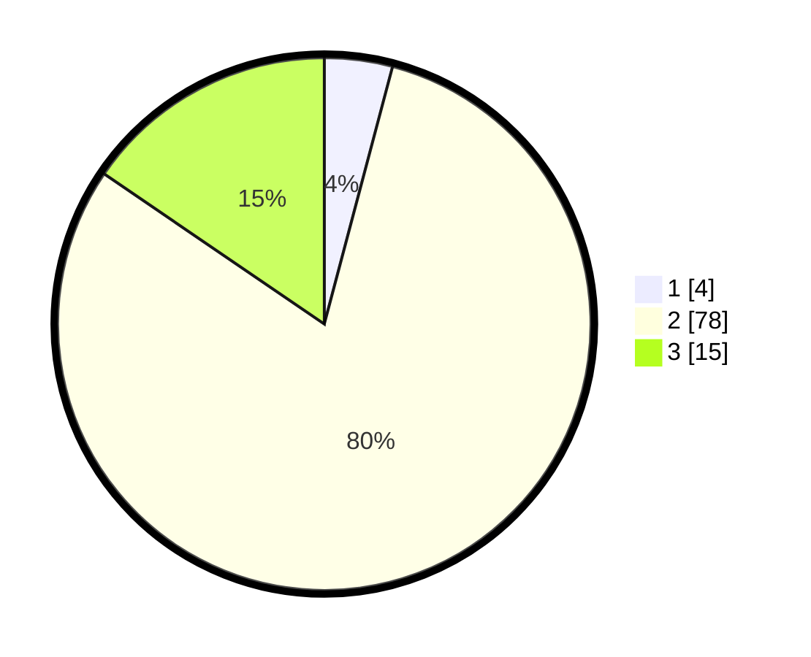

# Hasil

## Grafik

## Tabel

| No. | Nama Paslon    | Suara | Suara (raw) | Persentase |
|:--- |:-------------- | -----:| -----------:| ----------:|
| 1   | ANIES MUHAIMIN | 4     | [4][p-1]    | 4,12       |
| 2   | PRABOWO GIBRAN | 78    | [78][p-2]   | 80,41      |
| 3   | GANJAR MAHFUD  | 15    | [15][p-3]   | 15,46      |

[p-1]: https://github.com/gigit-pemilu/pemilu-2024/blob/main/pilpres/hitung-suara/sub/12-sumatera-utara/sub/09-asahan/sub/21-aek-songsongan/sub/2009-mekar-marjanji/sub/003-tps/sub/paslon-1.txt
[p-2]: https://github.com/gigit-pemilu/pemilu-2024/blob/main/pilpres/hitung-suara/sub/12-sumatera-utara/sub/09-asahan/sub/21-aek-songsongan/sub/2009-mekar-marjanji/sub/003-tps/sub/paslon-2.txt
[p-3]: https://github.com/gigit-pemilu/pemilu-2024/blob/main/pilpres/hitung-suara/sub/12-sumatera-utara/sub/09-asahan/sub/21-aek-songsongan/sub/2009-mekar-marjanji/sub/003-tps/sub/paslon-3.txt

## Foto C Plano

https://sirekap-obj-formc.kpu.go.id/bee1/pemilu/ppwp/12/09/21/20/09/1209212009003-20240219-233232--124c26e1-a244-4756-a72e-1a2c7afa11eb.jpg

https://sirekap-obj-formc.kpu.go.id/bee1/pemilu/ppwp/12/09/21/20/09/1209212009003-20240218-193716--3cb19907-304f-41a7-a453-c545fafa3f6d.jpg

https://sirekap-obj-formc.kpu.go.id/bee1/pemilu/ppwp/12/09/21/20/09/1209212009003-20240218-191642--3398958d-59ae-4c3d-a173-5ef792c8366e.jpg

## Metadata

| Key        | Value               |
| ---------- | ------------------- |
| Time Stamp | 2024-02-20 00:00:00 |

