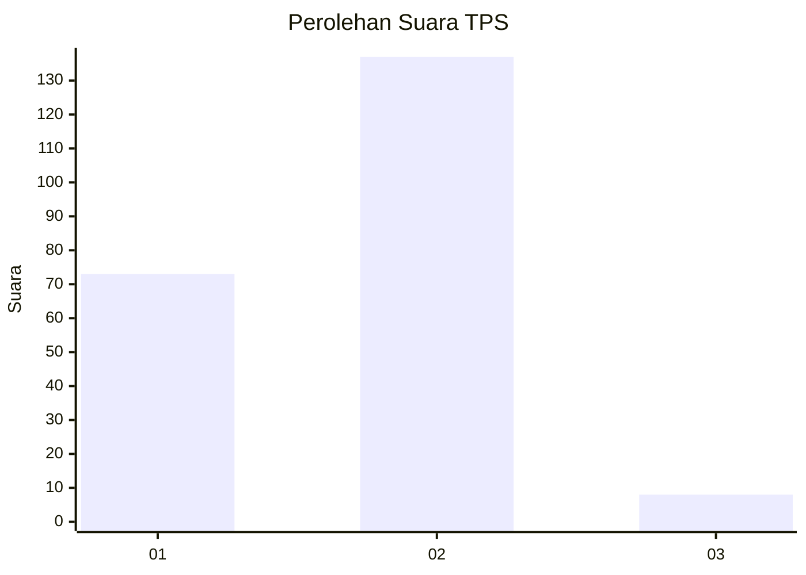
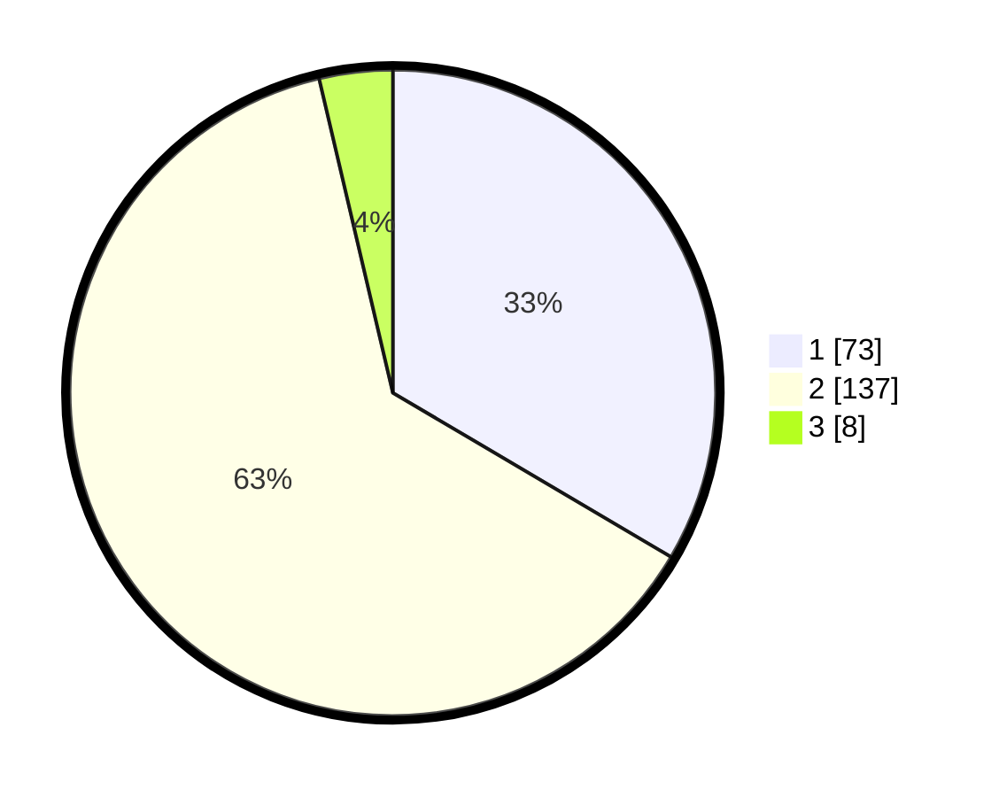

# Hasil

## Grafik

## Tabel

| No. | Nama Paslon    | Suara | Suara (raw) | Persentase |
|:--- |:-------------- | -----:| -----------:| ----------:|
| 1   | ANIES MUHAIMIN | 73    | [73][p-1]   | 33,49      |
| 2   | PRABOWO GIBRAN | 137   | [137][p-2]  | 62,84      |
| 3   | GANJAR MAHFUD  | 8     | [8][p-3]    | 3,67       |

[p-1]: https://github.com/gigit-pemilu/pemilu-2024-12-sumatera-utara/blob/main/pilpres/hitung-suara/sub/12-sumatera-utara/sub/09-asahan/sub/22-rahuning/sub/2001-rahuning/sub/002-tps/sub/paslon-1.txt
[p-2]: https://github.com/gigit-pemilu/pemilu-2024-12-sumatera-utara/blob/main/pilpres/hitung-suara/sub/12-sumatera-utara/sub/09-asahan/sub/22-rahuning/sub/2001-rahuning/sub/002-tps/sub/paslon-2.txt
[p-3]: https://github.com/gigit-pemilu/pemilu-2024-12-sumatera-utara/blob/main/pilpres/hitung-suara/sub/12-sumatera-utara/sub/09-asahan/sub/22-rahuning/sub/2001-rahuning/sub/002-tps/sub/paslon-3.txt

## Foto C Plano

https://sirekap-obj-formc.kpu.go.id/43f8/pemilu/ppwp/12/09/22/20/01/1209222001002-20240215-001308--7c1509b8-186f-44d1-8e2f-cfc2806d8f83.jpg

https://sirekap-obj-formc.kpu.go.id/43f8/pemilu/ppwp/12/09/22/20/01/1209222001002-20240215-192745--d985b8d0-bd51-4680-b5c2-3a0dabec35c6.jpg

https://sirekap-obj-formc.kpu.go.id/43f8/pemilu/ppwp/12/09/22/20/01/1209222001002-20240215-001733--c707008e-a272-42f5-90eb-79186c8b45ae.jpg

## Metadata

| Key        | Value               |
| ---------- | ------------------- |
| Time Stamp | 2024-02-25 22:00:00 |

