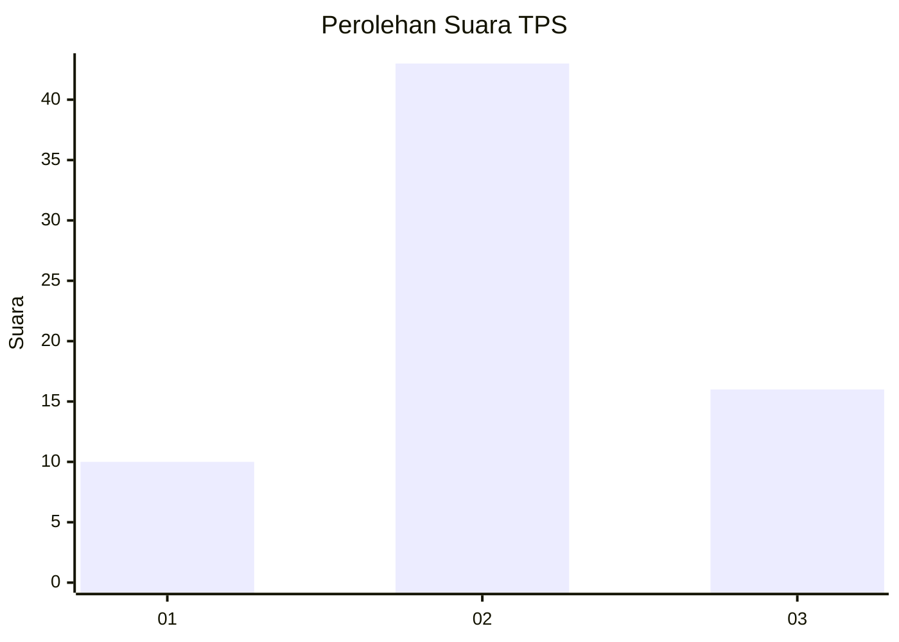
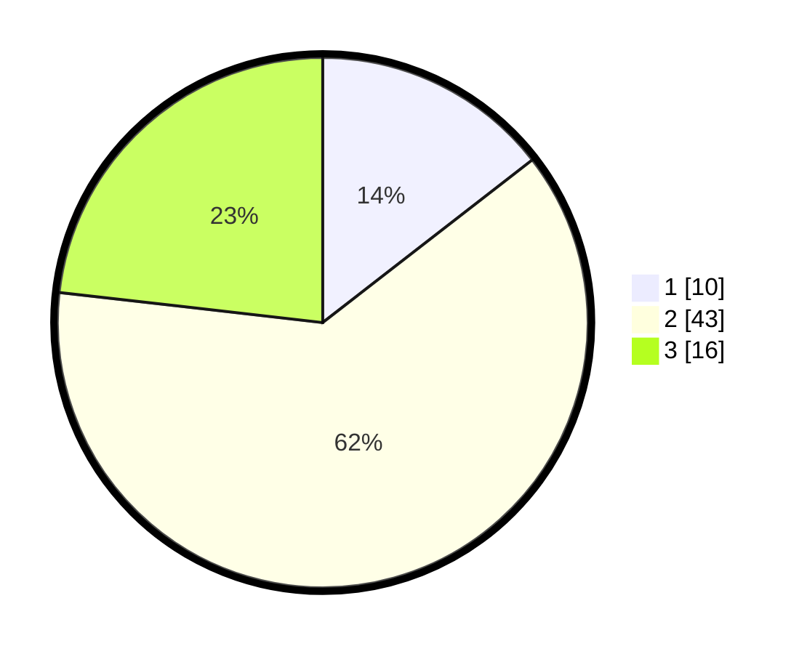

# Hasil

## Grafik

## Tabel

| No. | Nama Paslon    | Suara | Suara (raw) | Persentase |
|:--- |:-------------- | -----:| -----------:| ----------:|
| 1   | ANIES MUHAIMIN | 10    | [10][p-1]   | 14,49      |
| 2   | PRABOWO GIBRAN | 43    | [43][p-2]   | 62,32      |
| 3   | GANJAR MAHFUD  | 16    | [16][p-3]   | 23,19      |

[p-1]: https://github.com/gigit-pemilu/pemilu-2024-12-sumatera-utara/blob/main/pilpres/hitung-suara/sub/12-sumatera-utara/sub/09-asahan/sub/22-rahuning/sub/2004-batu-anam/sub/011-tps/sub/paslon-1.txt
[p-2]: https://github.com/gigit-pemilu/pemilu-2024-12-sumatera-utara/blob/main/pilpres/hitung-suara/sub/12-sumatera-utara/sub/09-asahan/sub/22-rahuning/sub/2004-batu-anam/sub/011-tps/sub/paslon-2.txt
[p-3]: https://github.com/gigit-pemilu/pemilu-2024-12-sumatera-utara/blob/main/pilpres/hitung-suara/sub/12-sumatera-utara/sub/09-asahan/sub/22-rahuning/sub/2004-batu-anam/sub/011-tps/sub/paslon-3.txt

## Foto C Plano

https://sirekap-obj-formc.kpu.go.id/e6f7/pemilu/ppwp/12/09/22/20/04/1209222004011-20240214-200827--bf7564c8-98c1-4d09-9a5c-51740e113add.jpg

https://sirekap-obj-formc.kpu.go.id/e6f7/pemilu/ppwp/12/09/22/20/04/1209222004011-20240214-203612--e98c8f66-4e25-4524-b9aa-3874bf45368a.jpg

https://sirekap-obj-formc.kpu.go.id/e6f7/pemilu/ppwp/12/09/22/20/04/1209222004011-20240214-212151--b39fbc4c-c969-413e-ad73-a1c2a9f18aab.jpg

## Metadata

| Key        | Value               |
| ---------- | ------------------- |
| Time Stamp | 2024-02-25 22:00:00 |

