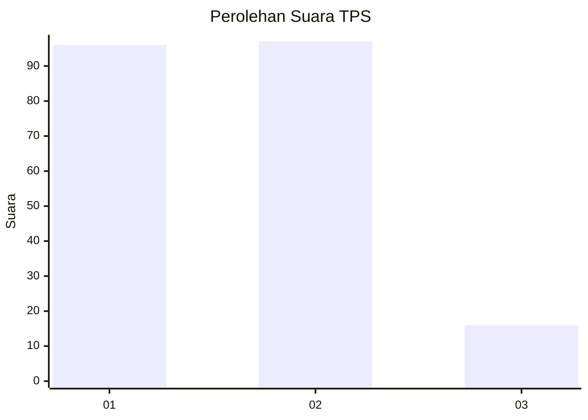
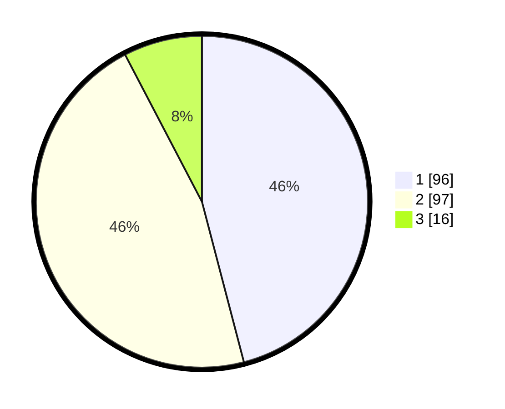

# Hasil

## Grafik

## Tabel

| No. | Nama Paslon    | Suara | Suara (raw) | Persentase |
|:--- |:-------------- | -----:| -----------:| ----------:|
| 1   | ANIES MUHAIMIN | 96    | [96][p-1]   | 45,93      |
| 2   | PRABOWO GIBRAN | 97    | [97][p-2]   | 46,41      |
| 3   | GANJAR MAHFUD  | 16    | [16][p-3]   | 7,66       |

[p-1]: https://github.com/gigit-pemilu/pemilu-2024-12-sumatera-utara/blob/main/pilpres/hitung-suara/sub/12-sumatera-utara/sub/09-asahan/sub/22-rahuning/sub/2005-perkebunan-aek-nagaga/sub/001-tps/sub/paslon-1.txt
[p-2]: https://github.com/gigit-pemilu/pemilu-2024-12-sumatera-utara/blob/main/pilpres/hitung-suara/sub/12-sumatera-utara/sub/09-asahan/sub/22-rahuning/sub/2005-perkebunan-aek-nagaga/sub/001-tps/sub/paslon-2.txt
[p-3]: https://github.com/gigit-pemilu/pemilu-2024-12-sumatera-utara/blob/main/pilpres/hitung-suara/sub/12-sumatera-utara/sub/09-asahan/sub/22-rahuning/sub/2005-perkebunan-aek-nagaga/sub/001-tps/sub/paslon-3.txt

## Foto C Plano

https://sirekap-obj-formc.kpu.go.id/71be/pemilu/ppwp/12/09/22/20/05/1209222005001-20240215-024557--19f7171b-9c35-40de-a7c5-384ec23a1448.jpg

https://sirekap-obj-formc.kpu.go.id/71be/pemilu/ppwp/12/09/22/20/05/1209222005001-20240217-225722--69d45096-8f4f-4c3a-a3e3-a0a858cc0dfc.jpg

https://sirekap-obj-formc.kpu.go.id/71be/pemilu/ppwp/12/09/22/20/05/1209222005001-20240215-024812--7688e43e-7adb-4ff6-bd5e-864a78fdfc3e.jpg

## Metadata

| Key        | Value               |
| ---------- | ------------------- |
| Time Stamp | 2024-02-21 20:00:00 |

