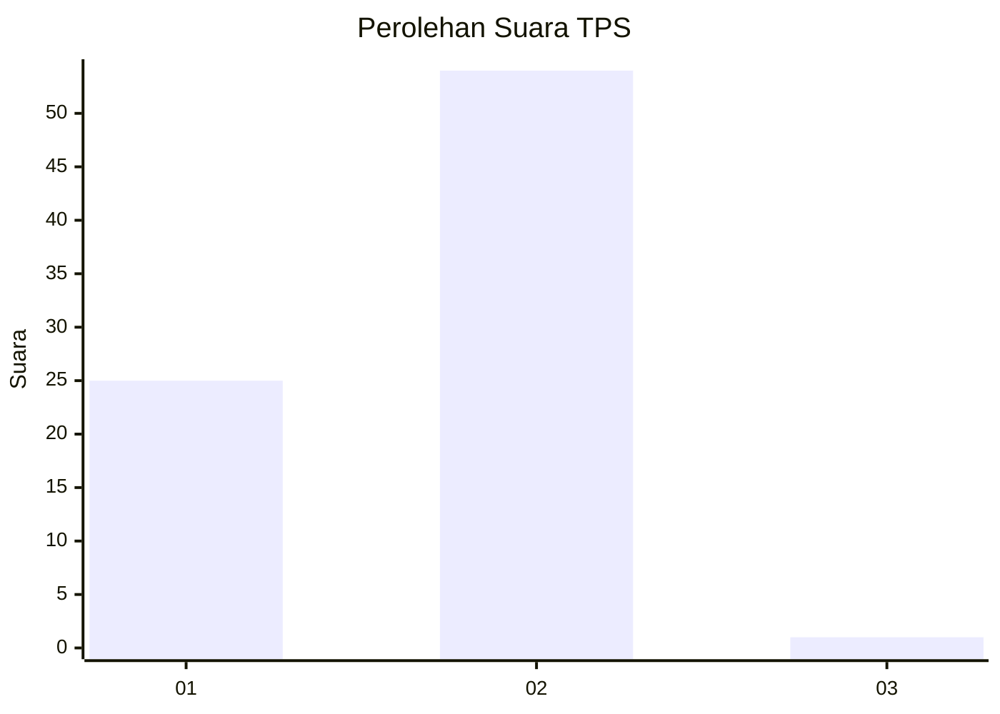
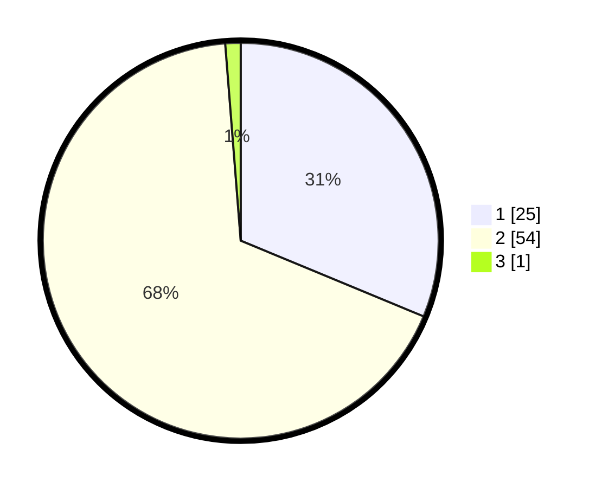

# Hasil

## Grafik

## Tabel

| No. | Nama Paslon    | Suara | Suara (raw) | Persentase |
|:--- |:-------------- | -----:| -----------:| ----------:|
| 1   | ANIES MUHAIMIN | 25    | [25][p-1]   | 31,25      |
| 2   | PRABOWO GIBRAN | 54    | [54][p-2]   | 67,50      |
| 3   | GANJAR MAHFUD  | 1     | [1][p-3]    | 1,25       |

[p-1]: https://github.com/gigit-pemilu/pemilu-2024/blob/main/pilpres/hitung-suara/sub/12-sumatera-utara/sub/09-asahan/sub/23-sei-dadap/sub/2004-sei-kamah-i/sub/009-tps/sub/paslon-1.txt
[p-2]: https://github.com/gigit-pemilu/pemilu-2024/blob/main/pilpres/hitung-suara/sub/12-sumatera-utara/sub/09-asahan/sub/23-sei-dadap/sub/2004-sei-kamah-i/sub/009-tps/sub/paslon-2.txt
[p-3]: https://github.com/gigit-pemilu/pemilu-2024/blob/main/pilpres/hitung-suara/sub/12-sumatera-utara/sub/09-asahan/sub/23-sei-dadap/sub/2004-sei-kamah-i/sub/009-tps/sub/paslon-3.txt

## Foto C Plano

https://sirekap-obj-formc.kpu.go.id/c167/pemilu/ppwp/12/09/23/20/04/1209232004009-20240214-220330--5c057e20-ec9d-4ce7-89c5-fc270fa0450f.jpg

https://sirekap-obj-formc.kpu.go.id/c167/pemilu/ppwp/12/09/23/20/04/1209232004009-20240217-114730--a9cb3515-9dbd-42f7-ac23-5e7e46fe6386.jpg

https://sirekap-obj-formc.kpu.go.id/c167/pemilu/ppwp/12/09/23/20/04/1209232004009-20240217-115825--13094e8f-4a13-45a1-ba6c-0873fa18b43e.jpg

## Metadata

| Key        | Value               |
| ---------- | ------------------- |
| Time Stamp | 2024-02-17 12:00:00 |

