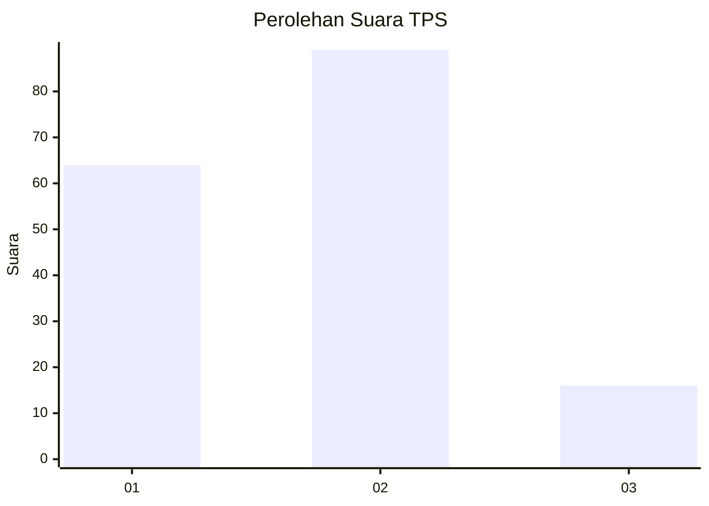

# Hasil

## Grafik

## Tabel

| No. | Nama Paslon    | Suara | Suara (raw) | Persentase |
|:--- |:-------------- | -----:| -----------:| ----------:|
| 1   | ANIES MUHAIMIN | 64    | [64][p-1]   | 37,87      |
| 2   | PRABOWO GIBRAN | 89    | [89][p-2]   | 52,66      |
| 3   | GANJAR MAHFUD  | 16    | [16][p-3]   | 9,47       |

[p-1]: https://github.com/gigit-pemilu/pemilu-2024/blob/main/pilpres/hitung-suara/sub/12-sumatera-utara/sub/09-asahan/sub/23-sei-dadap/sub/2007-sei-alim-hasak/sub/001-tps/sub/paslon-1.txt
[p-2]: https://github.com/gigit-pemilu/pemilu-2024/blob/main/pilpres/hitung-suara/sub/12-sumatera-utara/sub/09-asahan/sub/23-sei-dadap/sub/2007-sei-alim-hasak/sub/001-tps/sub/paslon-2.txt
[p-3]: https://github.com/gigit-pemilu/pemilu-2024/blob/main/pilpres/hitung-suara/sub/12-sumatera-utara/sub/09-asahan/sub/23-sei-dadap/sub/2007-sei-alim-hasak/sub/001-tps/sub/paslon-3.txt

## Foto C Plano

https://sirekap-obj-formc.kpu.go.id/06d4/pemilu/ppwp/12/09/23/20/07/1209232007001-20240215-040025--ac763755-d770-42cb-9a53-2fd3c22a29dc.jpg

https://sirekap-obj-formc.kpu.go.id/06d4/pemilu/ppwp/12/09/23/20/07/1209232007001-20240215-040708--f095e989-3033-4eaa-854a-491fdf4a8533.jpg

https://sirekap-obj-formc.kpu.go.id/06d4/pemilu/ppwp/12/09/23/20/07/1209232007001-20240215-040855--30421db1-b9d1-49fd-9e2d-c97b412c8e5f.jpg

## Metadata

| Key        | Value               |
| ---------- | ------------------- |
| Time Stamp | 2024-02-25 16:00:00 |

