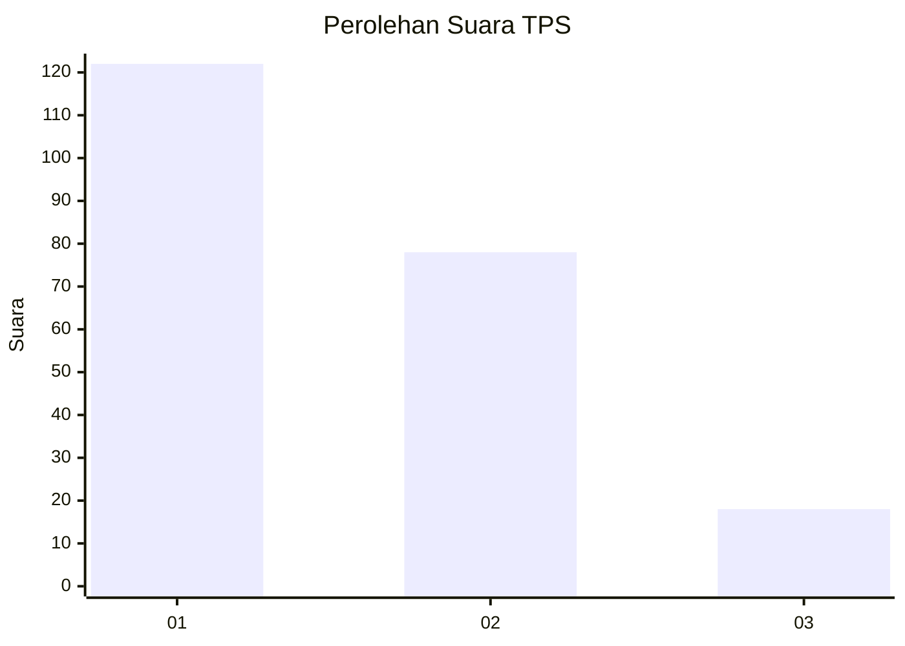
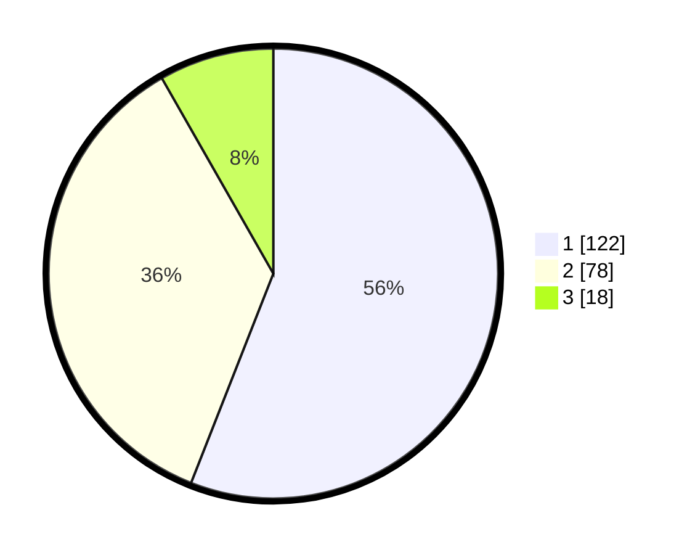

# Hasil

## Grafik

## Tabel

| No. | Nama Paslon    | Suara | Suara (raw) | Persentase |
|:--- |:-------------- | -----:| -----------:| ----------:|
| 1   | ANIES MUHAIMIN | 122   | [122][p-1]  | 55,96      |
| 2   | PRABOWO GIBRAN | 78    | [78][p-2]   | 35,78      |
| 3   | GANJAR MAHFUD  | 18    | [18][p-3]   | 8,26       |

[p-1]: https://github.com/gigit-pemilu/pemilu-2024/blob/main/pilpres/hitung-suara/sub/12-sumatera-utara/sub/09-asahan/sub/23-sei-dadap/sub/2007-sei-alim-hasak/sub/005-tps/sub/paslon-1.txt
[p-2]: https://github.com/gigit-pemilu/pemilu-2024/blob/main/pilpres/hitung-suara/sub/12-sumatera-utara/sub/09-asahan/sub/23-sei-dadap/sub/2007-sei-alim-hasak/sub/005-tps/sub/paslon-2.txt
[p-3]: https://github.com/gigit-pemilu/pemilu-2024/blob/main/pilpres/hitung-suara/sub/12-sumatera-utara/sub/09-asahan/sub/23-sei-dadap/sub/2007-sei-alim-hasak/sub/005-tps/sub/paslon-3.txt

## Foto C Plano

https://sirekap-obj-formc.kpu.go.id/3f91/pemilu/ppwp/12/09/23/20/07/1209232007005-20240214-224723--4e8c439b-0c0c-464c-a30f-d37fe7216454.jpg

https://sirekap-obj-formc.kpu.go.id/3f91/pemilu/ppwp/12/09/23/20/07/1209232007005-20240214-195759--bde25993-9bf8-4e1d-92be-3386e2fbf194.jpg

https://sirekap-obj-formc.kpu.go.id/3f91/pemilu/ppwp/12/09/23/20/07/1209232007005-20240214-195836--31bb23a3-0c54-44de-a10a-dd11f14cd915.jpg

## Metadata

| Key        | Value               |
| ---------- | ------------------- |
| Time Stamp | 2024-02-15 16:00:26 |

