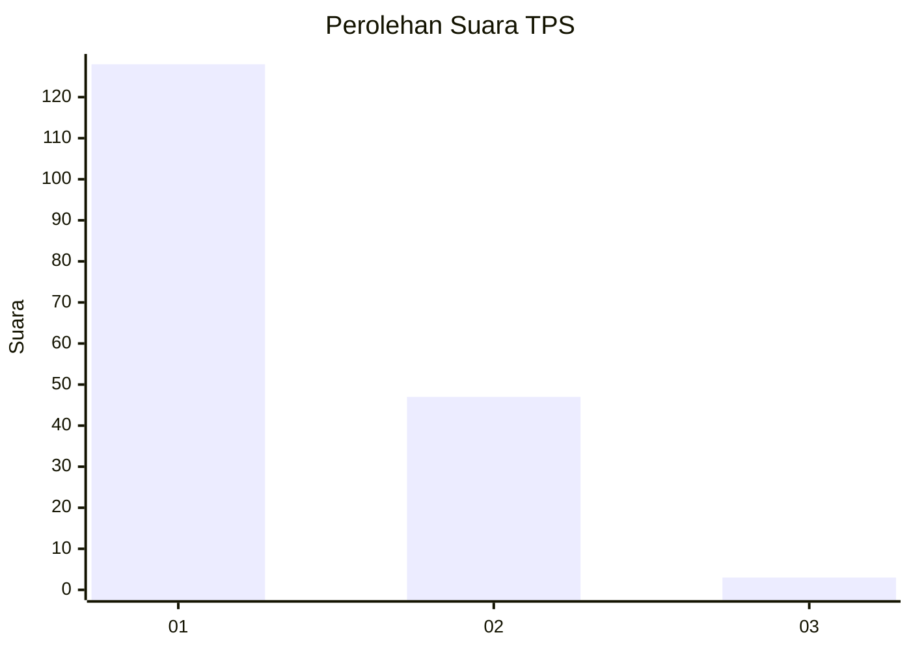
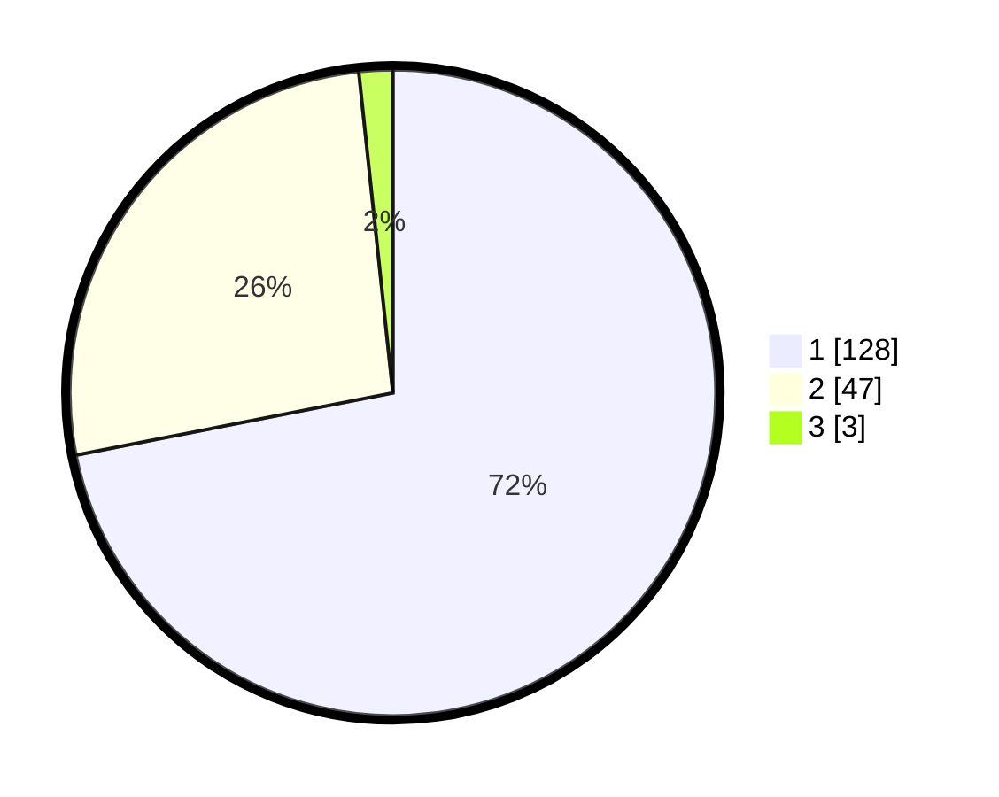

# Hasil

## Grafik

## Tabel

| No. | Nama Paslon    | Suara | Suara (raw) | Persentase |
|:--- |:-------------- | -----:| -----------:| ----------:|
| 1   | ANIES MUHAIMIN | 128   | [128][p-1]  | 71,91      |
| 2   | PRABOWO GIBRAN | 47    | [47][p-2]   | 26,40      |
| 3   | GANJAR MAHFUD  | 3     | [3][p-3]    | 1,69       |

[p-1]: https://github.com/gigit-pemilu/pemilu-2024/blob/main/pilpres/hitung-suara/sub/12-sumatera-utara/sub/09-asahan/sub/24-sei-kepayang-barat/sub/2002-sei-jawi-jawi/sub/007-tps/sub/paslon-1.txt
[p-2]: https://github.com/gigit-pemilu/pemilu-2024/blob/main/pilpres/hitung-suara/sub/12-sumatera-utara/sub/09-asahan/sub/24-sei-kepayang-barat/sub/2002-sei-jawi-jawi/sub/007-tps/sub/paslon-2.txt
[p-3]: https://github.com/gigit-pemilu/pemilu-2024/blob/main/pilpres/hitung-suara/sub/12-sumatera-utara/sub/09-asahan/sub/24-sei-kepayang-barat/sub/2002-sei-jawi-jawi/sub/007-tps/sub/paslon-3.txt

## Foto C Plano

https://sirekap-obj-formc.kpu.go.id/6c7c/pemilu/ppwp/12/09/24/20/02/1209242002007-20240216-205444--9ace878c-515a-4efb-ac51-6a2f1020a995.jpg

https://sirekap-obj-formc.kpu.go.id/6c7c/pemilu/ppwp/12/09/24/20/02/1209242002007-20240216-205727--126f35b2-f201-42bd-873e-99b376cce9fb.jpg

https://sirekap-obj-formc.kpu.go.id/6c7c/pemilu/ppwp/12/09/24/20/02/1209242002007-20240216-210226--06b65761-701f-4f0c-8833-58f072b9c720.jpg

## Metadata

| Key        | Value               |
| ---------- | ------------------- |
| Time Stamp | 2024-02-16 22:01:00 |

## DATA PEMILIH TETAP

Jumlah pemilih dalam DPT: **250**.
 * L: **822**.
 * P: **628**.

## DATA PENGGUNA HAK PILIH

Jumlah pengguna hak pilih dalam DPT: **682**.
 * L: **875**.
 * P: **805**.

Jumlah pengguna hak pilih dalam DPTb: **0**.
 * L: **88**.
 * P: **80**.

Jumlah pengguna hak pilih dalam DPK: **0**.
 * L: **0**.
 * P: **0**.

Jumlah pengguna hak pilih: **222**.
 * L: **75**.
 * P: **105**.

## JUMLAH SUARA SAH DAN TIDAK SAH

JUMLAH SELURUH SUARA SAH: **179**.

JUMLAH SUARA TIDAK SAH: **4**.

JUMLAH SELURUH SUARA SAH DAN SUARA TIDAK SAH: **182**.

