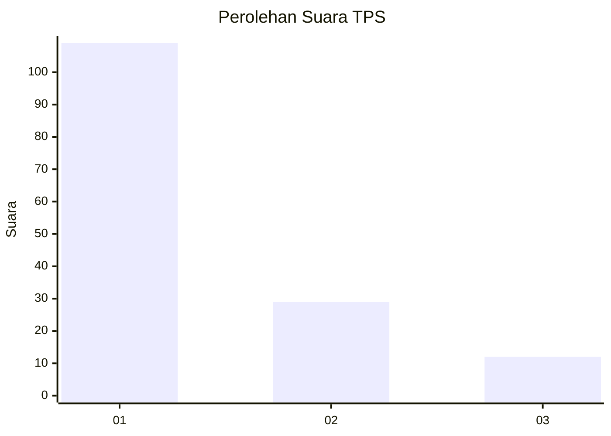
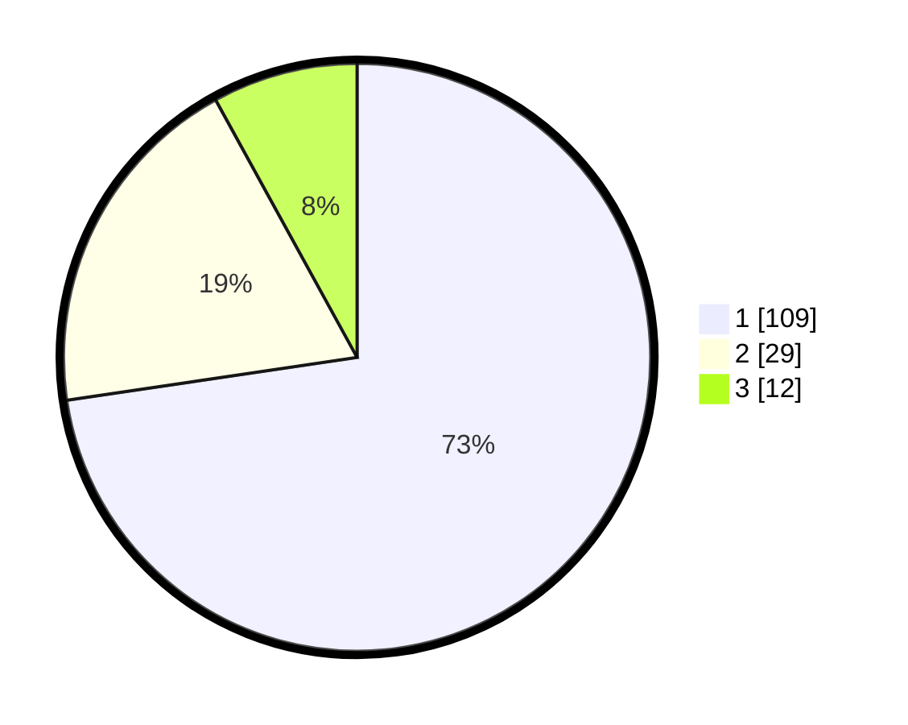

# Hasil

## Grafik

## Tabel

| No. | Nama Paslon    | Suara | Suara (raw) | Persentase |
|:--- |:-------------- | -----:| -----------:| ----------:|
| 1   | ANIES MUHAIMIN | 109   | [109][p-1]  | 72,67      |
| 2   | PRABOWO GIBRAN | 29    | [29][p-2]   | 19,33      |
| 3   | GANJAR MAHFUD  | 12    | [12][p-3]   | 8,00       |

[p-1]: https://github.com/gigit-pemilu/pemilu-2024/blob/main/pilpres/hitung-suara/sub/12-sumatera-utara/sub/09-asahan/sub/25-sei-kepayang-timur/sub/2005-sei-sembilang/sub/001-tps/sub/paslon-1.txt
[p-2]: https://github.com/gigit-pemilu/pemilu-2024/blob/main/pilpres/hitung-suara/sub/12-sumatera-utara/sub/09-asahan/sub/25-sei-kepayang-timur/sub/2005-sei-sembilang/sub/001-tps/sub/paslon-2.txt
[p-3]: https://github.com/gigit-pemilu/pemilu-2024/blob/main/pilpres/hitung-suara/sub/12-sumatera-utara/sub/09-asahan/sub/25-sei-kepayang-timur/sub/2005-sei-sembilang/sub/001-tps/sub/paslon-3.txt

## Foto C Plano

https://sirekap-obj-formc.kpu.go.id/f754/pemilu/ppwp/12/09/25/20/05/1209252005001-20240215-002827--20068fe3-5b02-4bba-8da2-73490601d908.jpg

https://sirekap-obj-formc.kpu.go.id/f754/pemilu/ppwp/12/09/25/20/05/1209252005001-20240215-003016--f5c00c17-0d5c-4f07-a054-45b30143a1a2.jpg

https://sirekap-obj-formc.kpu.go.id/f754/pemilu/ppwp/12/09/25/20/05/1209252005001-20240215-003212--330cf2e3-a24a-4769-8f42-cd8da969e617.jpg

## Metadata

| Key        | Value               |
| ---------- | ------------------- |
| Time Stamp | 2024-02-25 18:00:00 |

