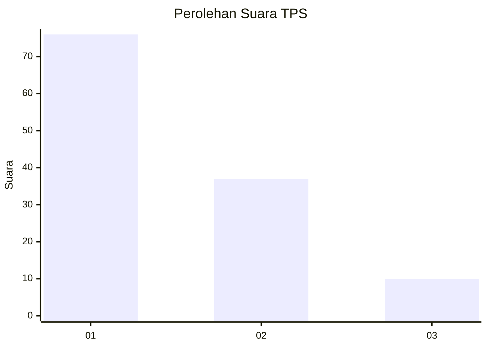
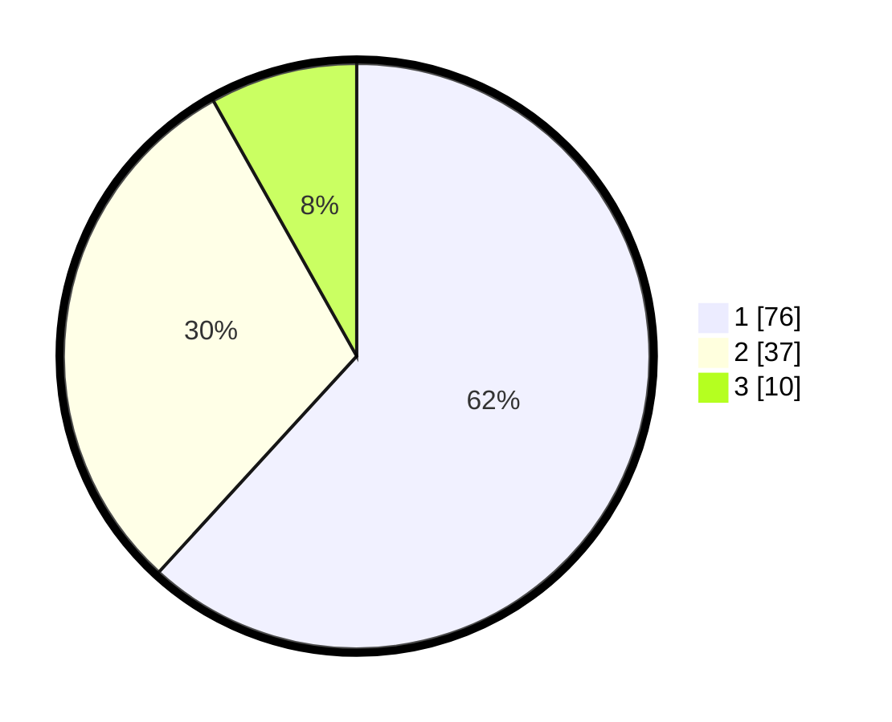

# Hasil

## Grafik

## Tabel

| No. | Nama Paslon    | Suara | Suara (raw) | Persentase |
|:--- |:-------------- | -----:| -----------:| ----------:|
| 1   | ANIES MUHAIMIN | 76    | [76][p-1]   | 61,79      |
| 2   | PRABOWO GIBRAN | 37    | [37][p-2]   | 30,08      |
| 3   | GANJAR MAHFUD  | 10    | [10][p-3]   | 8,13       |

[p-1]: https://github.com/gigit-pemilu/pemilu-2024/blob/main/pilpres/hitung-suara/sub/12-sumatera-utara/sub/09-asahan/sub/26-tinggi-raja/sub/2001-tinggi-raja/sub/002-tps/sub/paslon-1.txt
[p-2]: https://github.com/gigit-pemilu/pemilu-2024/blob/main/pilpres/hitung-suara/sub/12-sumatera-utara/sub/09-asahan/sub/26-tinggi-raja/sub/2001-tinggi-raja/sub/002-tps/sub/paslon-2.txt
[p-3]: https://github.com/gigit-pemilu/pemilu-2024/blob/main/pilpres/hitung-suara/sub/12-sumatera-utara/sub/09-asahan/sub/26-tinggi-raja/sub/2001-tinggi-raja/sub/002-tps/sub/paslon-3.txt

## Foto C Plano

https://sirekap-obj-formc.kpu.go.id/6314/pemilu/ppwp/12/09/26/20/01/1209262001002-20240214-224135--a7e76781-80a7-49ac-a040-622cf0c0970a.jpg

https://sirekap-obj-formc.kpu.go.id/6314/pemilu/ppwp/12/09/26/20/01/1209262001002-20240214-223441--e406e1d8-bb70-4711-92d6-12753a4ff99f.jpg

https://sirekap-obj-formc.kpu.go.id/6314/pemilu/ppwp/12/09/26/20/01/1209262001002-20240215-172714--b0c03fa3-ac27-4f34-925f-8926ca40f7c5.jpg

## Metadata

| Key        | Value               |
| ---------- | ------------------- |
| Time Stamp | 2024-02-15 17:30:25 |

