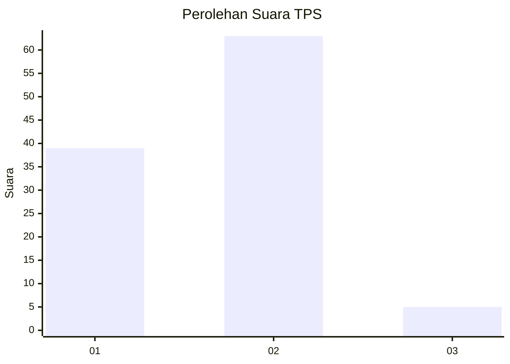
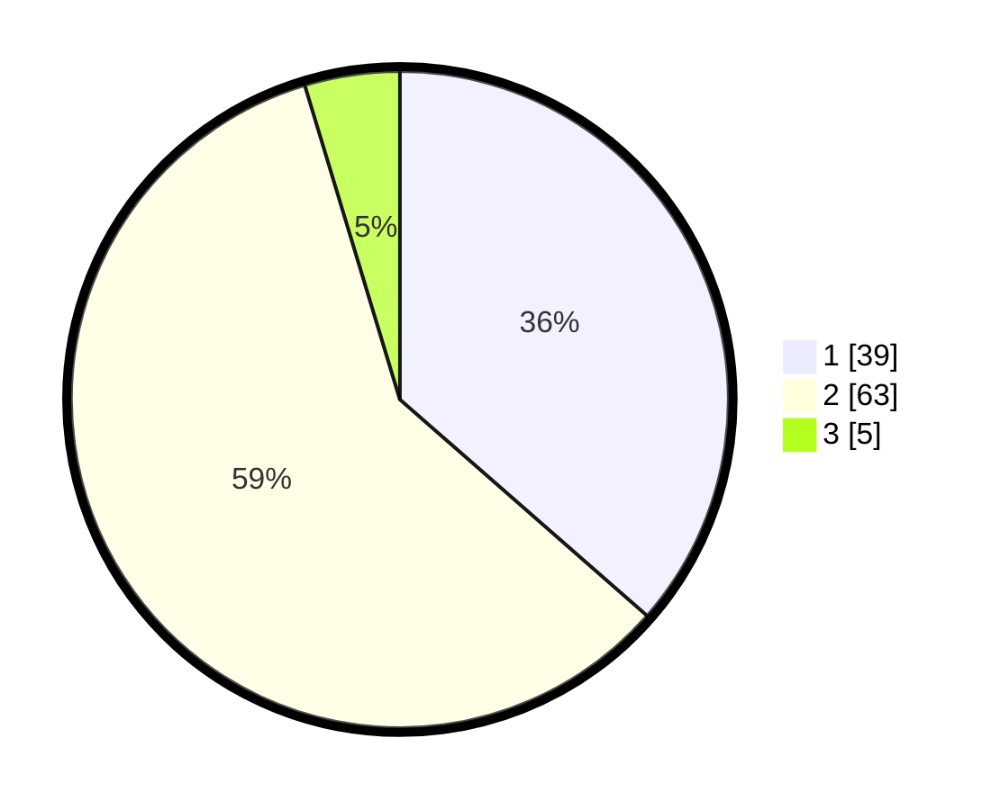

# Hasil

## Grafik

## Tabel

| No. | Nama Paslon    | Suara | Suara (raw) | Persentase |
|:--- |:-------------- | -----:| -----------:| ----------:|
| 1   | ANIES MUHAIMIN | 39    | [39][p-1]   | 36,45      |
| 2   | PRABOWO GIBRAN | 63    | [63][p-2]   | 58,88      |
| 3   | GANJAR MAHFUD  | 5     | [5][p-3]    | 4,67       |

[p-1]: https://github.com/gigit-pemilu/pemilu-2024-12-sumatera-utara/blob/main/pilpres/hitung-suara/sub/12-sumatera-utara/sub/09-asahan/sub/26-tinggi-raja/sub/2002-sumber-harapan/sub/007-tps/sub/paslon-1.txt
[p-2]: https://github.com/gigit-pemilu/pemilu-2024-12-sumatera-utara/blob/main/pilpres/hitung-suara/sub/12-sumatera-utara/sub/09-asahan/sub/26-tinggi-raja/sub/2002-sumber-harapan/sub/007-tps/sub/paslon-2.txt
[p-3]: https://github.com/gigit-pemilu/pemilu-2024-12-sumatera-utara/blob/main/pilpres/hitung-suara/sub/12-sumatera-utara/sub/09-asahan/sub/26-tinggi-raja/sub/2002-sumber-harapan/sub/007-tps/sub/paslon-3.txt

## Foto C Plano

https://sirekap-obj-formc.kpu.go.id/8a26/pemilu/ppwp/12/09/26/20/02/1209262002007-20240215-035551--f101ac23-8a00-4c19-8e9e-c7a9fe0af58c.jpg

https://sirekap-obj-formc.kpu.go.id/8a26/pemilu/ppwp/12/09/26/20/02/1209262002007-20240215-035850--30b2dca6-cbd9-463f-babc-4ba3b3f7ac21.jpg

https://sirekap-obj-formc.kpu.go.id/8a26/pemilu/ppwp/12/09/26/20/02/1209262002007-20240215-040357--47b798fb-86a4-4294-94a3-9fa029957281.jpg

## Metadata

| Key        | Value               |
| ---------- | ------------------- |
| Time Stamp | 2024-02-25 12:00:00 |

