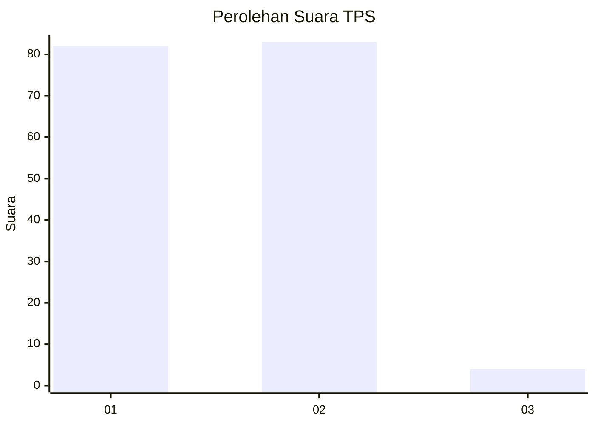
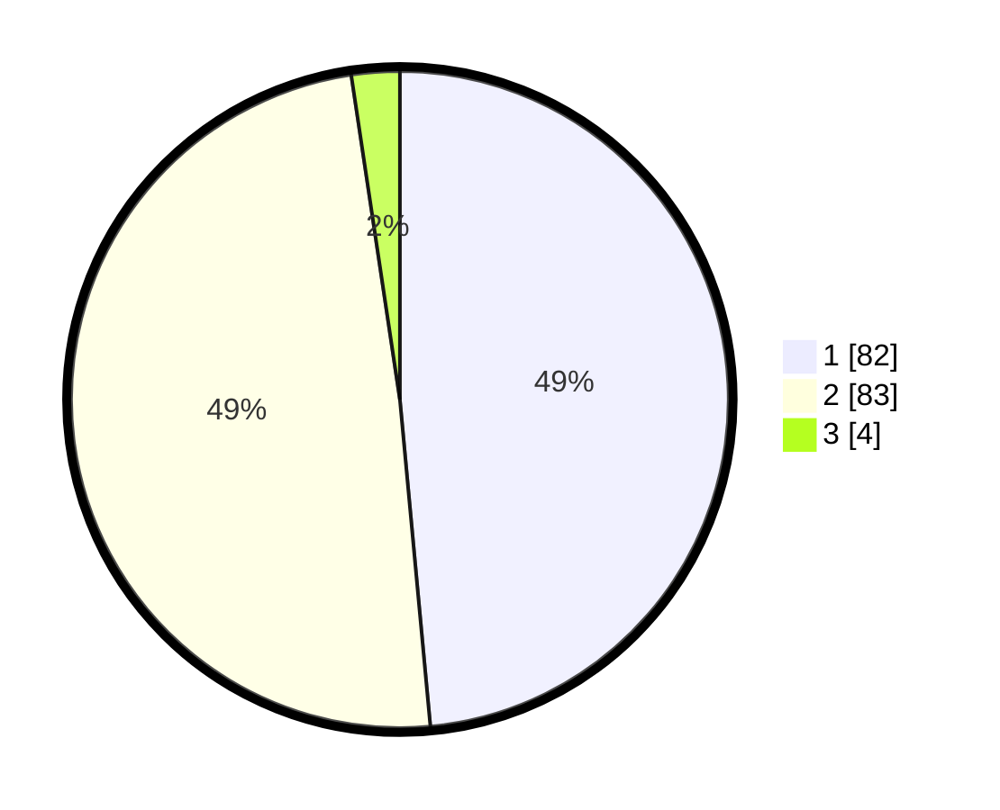

# Hasil

## Grafik

## Tabel

| No. | Nama Paslon    | Suara | Suara (raw) | Persentase |
|:--- |:-------------- | -----:| -----------:| ----------:|
| 1   | ANIES MUHAIMIN | 82    | [82][p-1]   | 48,52      |
| 2   | PRABOWO GIBRAN | 83    | [83][p-2]   | 49,11      |
| 3   | GANJAR MAHFUD  | 4     | [4][p-3]    | 2,37       |

[p-1]: https://github.com/gigit-pemilu/pemilu-2024-12-sumatera-utara/blob/main/pilpres/hitung-suara/sub/12-sumatera-utara/sub/09-asahan/sub/28-silau-laut/sub/2001-silo-baru/sub/005-tps/sub/paslon-1.txt
[p-2]: https://github.com/gigit-pemilu/pemilu-2024-12-sumatera-utara/blob/main/pilpres/hitung-suara/sub/12-sumatera-utara/sub/09-asahan/sub/28-silau-laut/sub/2001-silo-baru/sub/005-tps/sub/paslon-2.txt
[p-3]: https://github.com/gigit-pemilu/pemilu-2024-12-sumatera-utara/blob/main/pilpres/hitung-suara/sub/12-sumatera-utara/sub/09-asahan/sub/28-silau-laut/sub/2001-silo-baru/sub/005-tps/sub/paslon-3.txt

## Foto C Plano

https://sirekap-obj-formc.kpu.go.id/c1db/pemilu/ppwp/12/09/28/20/01/1209282001005-20240214-191323--89b866f0-727b-401b-8f1b-3792abacc365.jpg

https://sirekap-obj-formc.kpu.go.id/c1db/pemilu/ppwp/12/09/28/20/01/1209282001005-20240214-191509--8cee6ff7-87a5-43e5-937d-a70596ec03a0.jpg

https://sirekap-obj-formc.kpu.go.id/c1db/pemilu/ppwp/12/09/28/20/01/1209282001005-20240214-191650--dd542607-dbdf-4ba7-ac0d-42f445e8c817.jpg

## Metadata

| Key        | Value               |
| ---------- | ------------------- |
| Time Stamp | 2024-02-25 18:00:00 |

