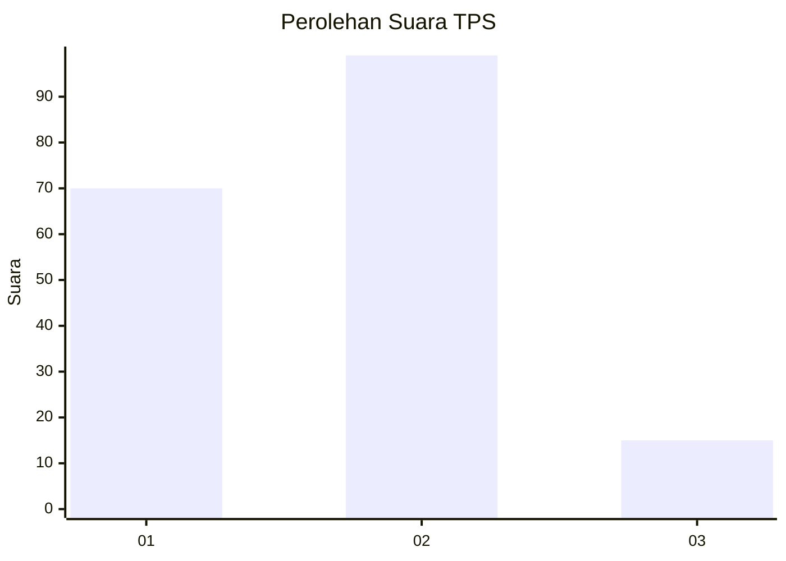
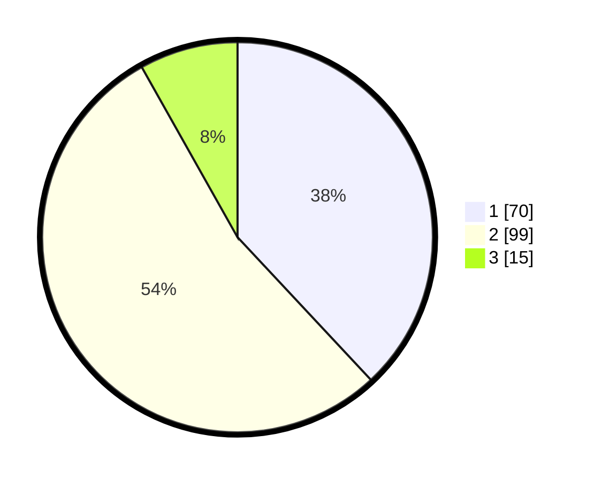

# Hasil

## Grafik

## Tabel

| No. | Nama Paslon    | Suara | Suara (raw) | Persentase |
|:--- |:-------------- | -----:| -----------:| ----------:|
| 1   | ANIES MUHAIMIN | 70    | [70][p-1]   | 38,04      |
| 2   | PRABOWO GIBRAN | 99    | [99][p-2]   | 53,80      |
| 3   | GANJAR MAHFUD  | 15    | [15][p-3]   | 8,15       |

[p-1]: https://github.com/gigit-pemilu/pemilu-2024/blob/main/pilpres/hitung-suara/sub/12-sumatera-utara/sub/09-asahan/sub/28-silau-laut/sub/2001-silo-baru/sub/006-tps/sub/paslon-1.txt
[p-2]: https://github.com/gigit-pemilu/pemilu-2024/blob/main/pilpres/hitung-suara/sub/12-sumatera-utara/sub/09-asahan/sub/28-silau-laut/sub/2001-silo-baru/sub/006-tps/sub/paslon-2.txt
[p-3]: https://github.com/gigit-pemilu/pemilu-2024/blob/main/pilpres/hitung-suara/sub/12-sumatera-utara/sub/09-asahan/sub/28-silau-laut/sub/2001-silo-baru/sub/006-tps/sub/paslon-3.txt

## Foto C Plano

https://sirekap-obj-formc.kpu.go.id/616c/pemilu/ppwp/12/09/28/20/01/1209282001006-20240215-010524--6fa69fb0-4226-4ea9-b5b5-161641de460e.jpg

https://sirekap-obj-formc.kpu.go.id/616c/pemilu/ppwp/12/09/28/20/01/1209282001006-20240215-010542--34940689-e496-4f7f-b482-bf54f2ea88b1.jpg

https://sirekap-obj-formc.kpu.go.id/616c/pemilu/ppwp/12/09/28/20/01/1209282001006-20240215-024618--0678d2ca-845a-417b-9e6b-9cc78815dc20.jpg

## Metadata

| Key        | Value               |
| ---------- | ------------------- |
| Time Stamp | 2024-02-25 16:00:00 |

