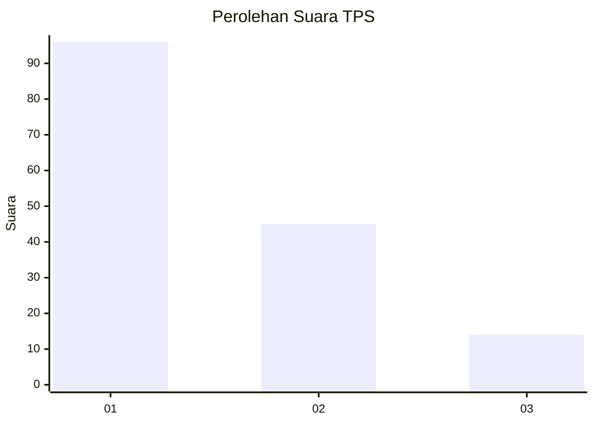
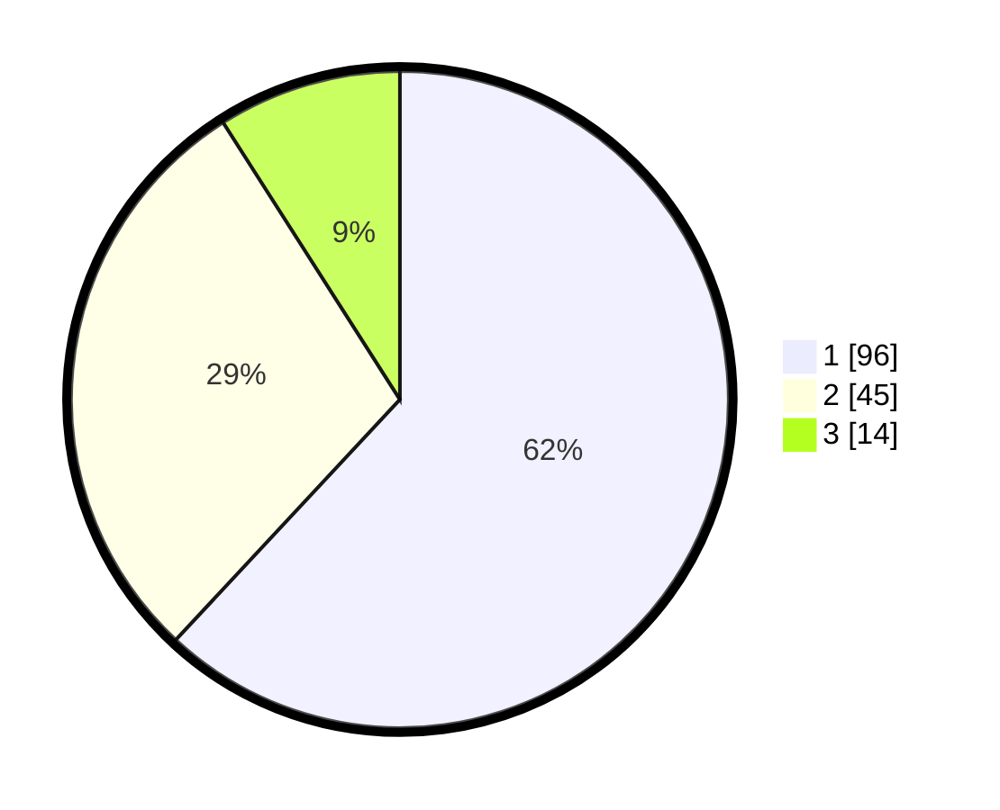

# Hasil

## Grafik

## Tabel

| No. | Nama Paslon    | Suara | Suara (raw) | Persentase |
|:--- |:-------------- | -----:| -----------:| ----------:|
| 1   | ANIES MUHAIMIN | 96    | [96][p-1]   | 61,94      |
| 2   | PRABOWO GIBRAN | 45    | [45][p-2]   | 29,03      |
| 3   | GANJAR MAHFUD  | 14    | [14][p-3]   | 9,03       |

[p-1]: https://github.com/gigit-pemilu/pemilu-2024/blob/main/pilpres/hitung-suara/sub/12-sumatera-utara/sub/09-asahan/sub/28-silau-laut/sub/2002-silo-lama/sub/011-tps/sub/paslon-1.txt
[p-2]: https://github.com/gigit-pemilu/pemilu-2024/blob/main/pilpres/hitung-suara/sub/12-sumatera-utara/sub/09-asahan/sub/28-silau-laut/sub/2002-silo-lama/sub/011-tps/sub/paslon-2.txt
[p-3]: https://github.com/gigit-pemilu/pemilu-2024/blob/main/pilpres/hitung-suara/sub/12-sumatera-utara/sub/09-asahan/sub/28-silau-laut/sub/2002-silo-lama/sub/011-tps/sub/paslon-3.txt

## Foto C Plano

https://sirekap-obj-formc.kpu.go.id/4161/pemilu/ppwp/12/09/28/20/02/1209282002011-20240215-044859--cae7b53d-11f8-48af-b1cc-955be3f93eab.jpg

https://sirekap-obj-formc.kpu.go.id/4161/pemilu/ppwp/12/09/28/20/02/1209282002011-20240214-220902--d091caba-6dbf-48f2-a385-8b7fc18e3062.jpg

https://sirekap-obj-formc.kpu.go.id/4161/pemilu/ppwp/12/09/28/20/02/1209282002011-20240214-221037--2a01d8d1-040e-43c3-b857-f4004e6c536f.jpg

## Metadata

| Key        | Value               |
| ---------- | ------------------- |
| Time Stamp | 2024-02-27 22:00:00 |

