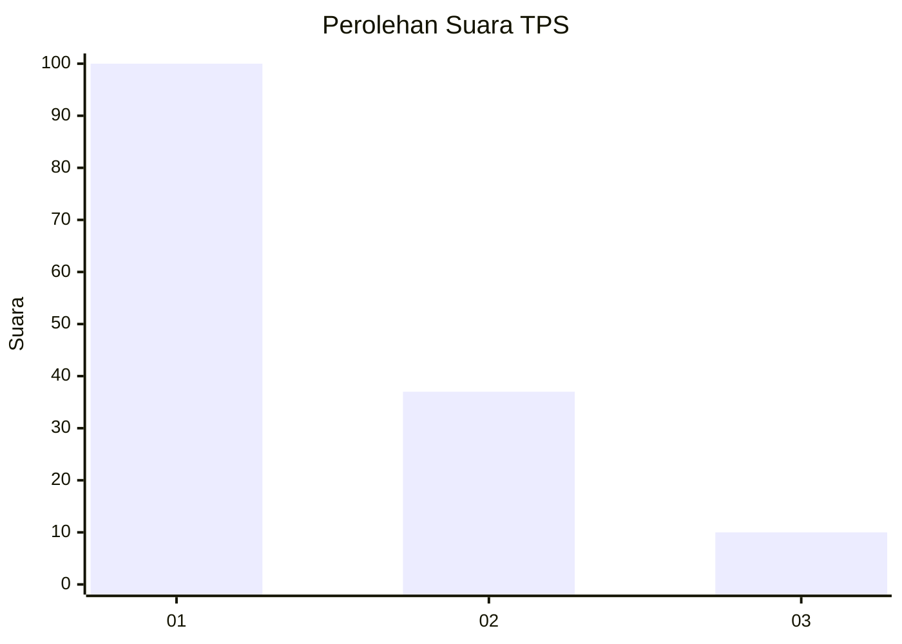
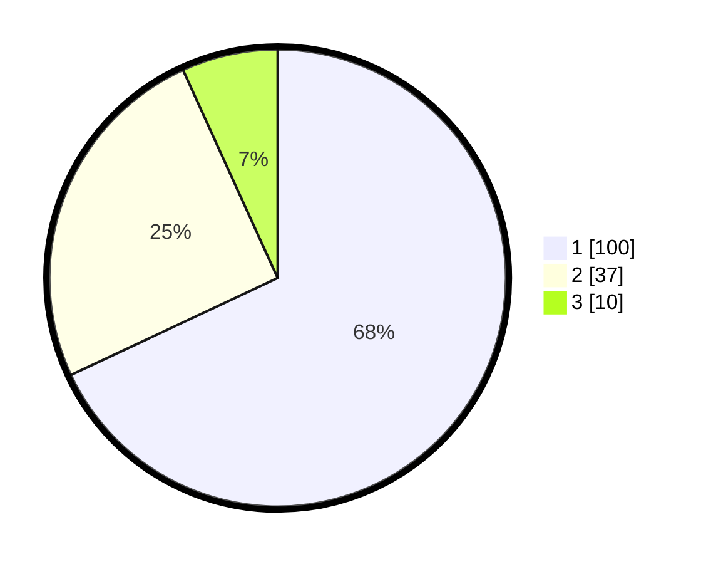

# Hasil

## Grafik

## Tabel

| No. | Nama Paslon    | Suara | Suara (raw) | Persentase |
|:--- |:-------------- | -----:| -----------:| ----------:|
| 1   | ANIES MUHAIMIN | 100   | [100][p-1]  | 68,03      |
| 2   | PRABOWO GIBRAN | 37    | [37][p-2]   | 25,17      |
| 3   | GANJAR MAHFUD  | 10    | [10][p-3]   | 6,80       |

[p-1]: https://github.com/gigit-pemilu/pemilu-2024-12-sumatera-utara/blob/main/pilpres/hitung-suara/sub/12-sumatera-utara/sub/09-asahan/sub/28-silau-laut/sub/2004-lubuk-palas/sub/012-tps/sub/paslon-1.txt
[p-2]: https://github.com/gigit-pemilu/pemilu-2024-12-sumatera-utara/blob/main/pilpres/hitung-suara/sub/12-sumatera-utara/sub/09-asahan/sub/28-silau-laut/sub/2004-lubuk-palas/sub/012-tps/sub/paslon-2.txt
[p-3]: https://github.com/gigit-pemilu/pemilu-2024-12-sumatera-utara/blob/main/pilpres/hitung-suara/sub/12-sumatera-utara/sub/09-asahan/sub/28-silau-laut/sub/2004-lubuk-palas/sub/012-tps/sub/paslon-3.txt

## Foto C Plano

https://sirekap-obj-formc.kpu.go.id/21ec/pemilu/ppwp/12/09/28/20/04/1209282004012-20240214-201826--5ae3d719-2069-44c9-8dcd-9ef395075ea2.jpg

https://sirekap-obj-formc.kpu.go.id/21ec/pemilu/ppwp/12/09/28/20/04/1209282004012-20240214-201901--3e4e52ab-ccfd-429c-8365-2ca2134853a4.jpg

https://sirekap-obj-formc.kpu.go.id/21ec/pemilu/ppwp/12/09/28/20/04/1209282004012-20240214-201934--d320c80b-6b20-4d2d-a68d-63cb944ee4d2.jpg

## Metadata

| Key        | Value               |
| ---------- | ------------------- |
| Time Stamp | 2024-02-25 16:00:00 |

