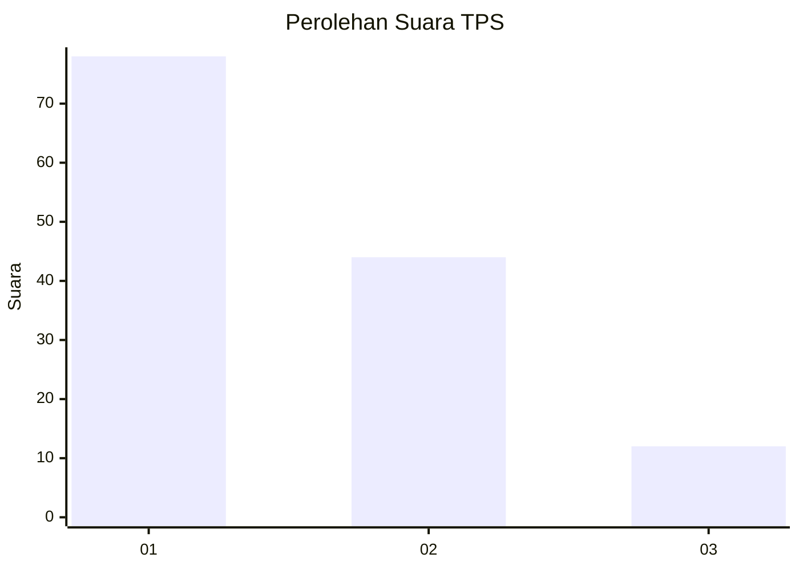
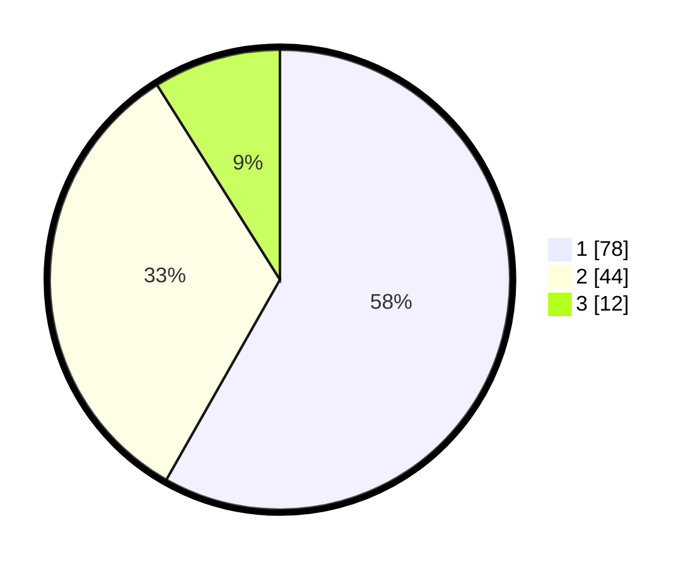

# Hasil

## Grafik

## Tabel

| No. | Nama Paslon    | Suara | Suara (raw) | Persentase |
|:--- |:-------------- | -----:| -----------:| ----------:|
| 1   | ANIES MUHAIMIN | 78    | [78][p-1]   | 58,21      |
| 2   | PRABOWO GIBRAN | 44    | [44][p-2]   | 32,84      |
| 3   | GANJAR MAHFUD  | 12    | [12][p-3]   | 8,96       |

[p-1]: https://github.com/gigit-pemilu/pemilu-2024-12-sumatera-utara/blob/main/pilpres/hitung-suara/sub/12-sumatera-utara/sub/09-asahan/sub/28-silau-laut/sub/2004-lubuk-palas/sub/020-tps/sub/paslon-1.txt
[p-2]: https://github.com/gigit-pemilu/pemilu-2024-12-sumatera-utara/blob/main/pilpres/hitung-suara/sub/12-sumatera-utara/sub/09-asahan/sub/28-silau-laut/sub/2004-lubuk-palas/sub/020-tps/sub/paslon-2.txt
[p-3]: https://github.com/gigit-pemilu/pemilu-2024-12-sumatera-utara/blob/main/pilpres/hitung-suara/sub/12-sumatera-utara/sub/09-asahan/sub/28-silau-laut/sub/2004-lubuk-palas/sub/020-tps/sub/paslon-3.txt

## Foto C Plano

https://sirekap-obj-formc.kpu.go.id/3c4e/pemilu/ppwp/12/09/28/20/04/1209282004020-20240219-120505--2c8d823c-4ffb-4505-824a-1f71b33b3b3a.jpg

https://sirekap-obj-formc.kpu.go.id/3c4e/pemilu/ppwp/12/09/28/20/04/1209282004020-20240219-120704--b809d245-0b89-4272-89a5-9a6aa5e3e1be.jpg

https://sirekap-obj-formc.kpu.go.id/3c4e/pemilu/ppwp/12/09/28/20/04/1209282004020-20240215-001231--be23e767-dc65-41e8-b5e2-345381458108.jpg

## Metadata

| Key        | Value               |
| ---------- | ------------------- |
| Time Stamp | 2024-02-25 01:00:00 |

