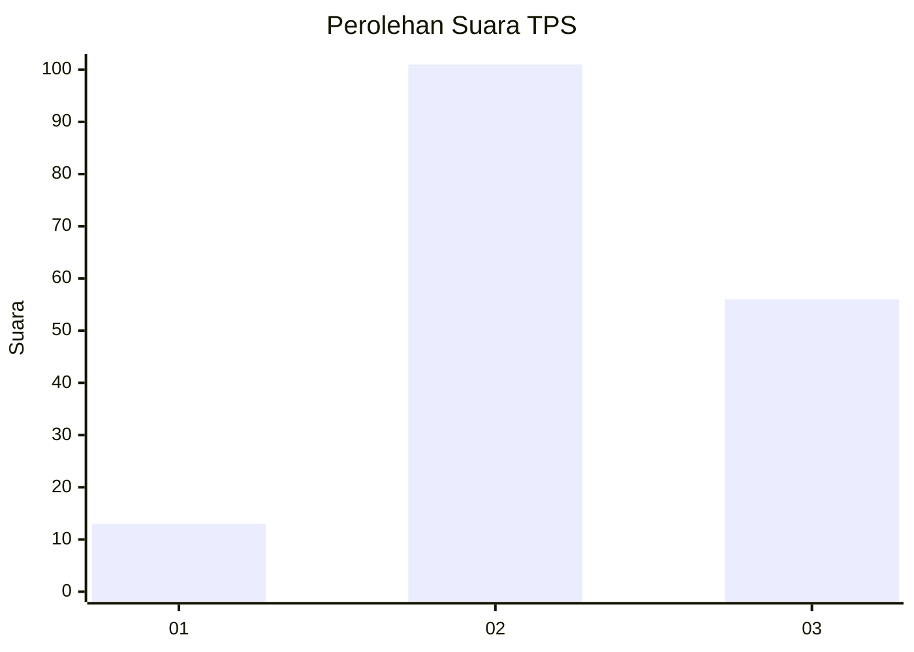
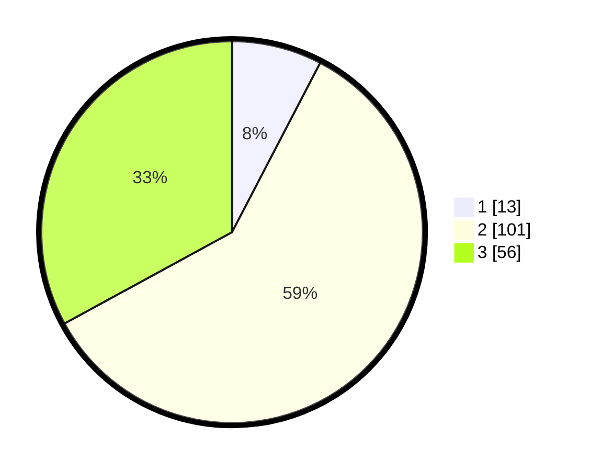

# Hasil

## Grafik

## Tabel

| No. | Nama Paslon    | Suara | Suara (raw) | Persentase |
|:--- |:-------------- | -----:| -----------:| ----------:|
| 1   | ANIES MUHAIMIN | 13    | [13][p-1]   | 7,65       |
| 2   | PRABOWO GIBRAN | 101   | [101][p-2]  | 59,41      |
| 3   | GANJAR MAHFUD  | 56    | [56][p-3]   | 32,94      |

[p-1]: https://github.com/gigit-pemilu/pemilu-2024-12-sumatera-utara/blob/main/pilpres/hitung-suara/sub/12-sumatera-utara/sub/09-asahan/sub/29-rawang-panca-arga/sub/2001-rawang-lama/sub/001-tps/sub/paslon-1.txt
[p-2]: https://github.com/gigit-pemilu/pemilu-2024-12-sumatera-utara/blob/main/pilpres/hitung-suara/sub/12-sumatera-utara/sub/09-asahan/sub/29-rawang-panca-arga/sub/2001-rawang-lama/sub/001-tps/sub/paslon-2.txt
[p-3]: https://github.com/gigit-pemilu/pemilu-2024-12-sumatera-utara/blob/main/pilpres/hitung-suara/sub/12-sumatera-utara/sub/09-asahan/sub/29-rawang-panca-arga/sub/2001-rawang-lama/sub/001-tps/sub/paslon-3.txt

## Foto C Plano

https://sirekap-obj-formc.kpu.go.id/4748/pemilu/ppwp/12/09/29/20/01/1209292001001-20240214-141609--33c472e7-6519-42dc-8e4c-72cb3f946010.jpg

https://sirekap-obj-formc.kpu.go.id/4748/pemilu/ppwp/12/09/29/20/01/1209292001001-20240214-141759--46f866d8-527f-4c28-9730-0fd1a5aea0e9.jpg

https://sirekap-obj-formc.kpu.go.id/4748/pemilu/ppwp/12/09/29/20/01/1209292001001-20240214-141910--409d0f0e-5318-424b-b705-dbd0fc7c8f3b.jpg

## Metadata

| Key        | Value               |
| ---------- | ------------------- |
| Time Stamp | 2024-02-25 12:00:00 |

