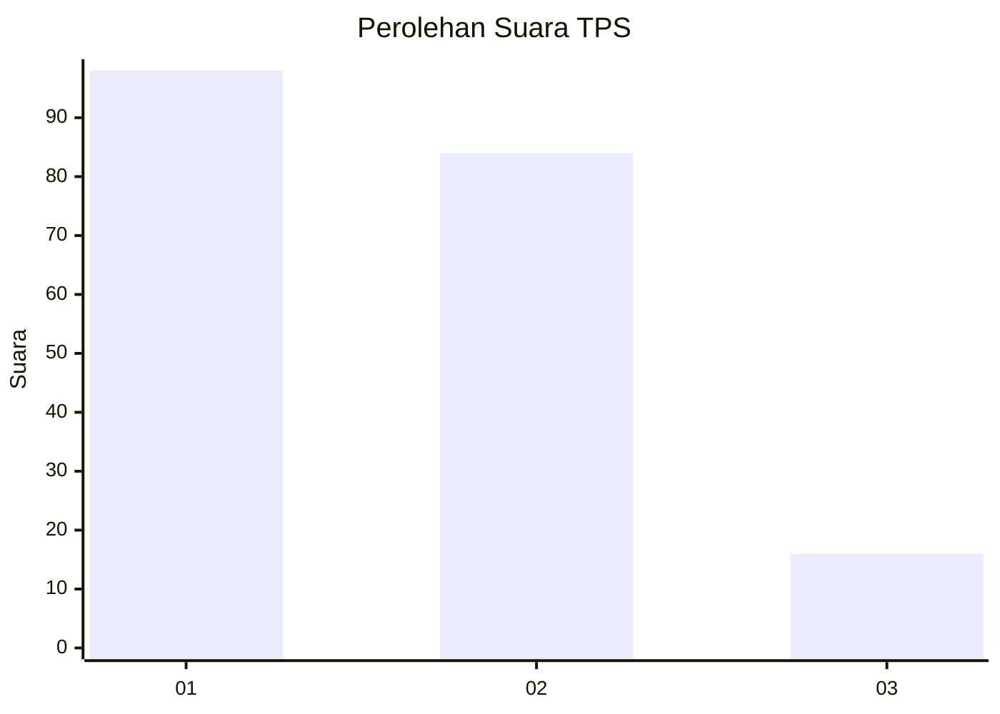
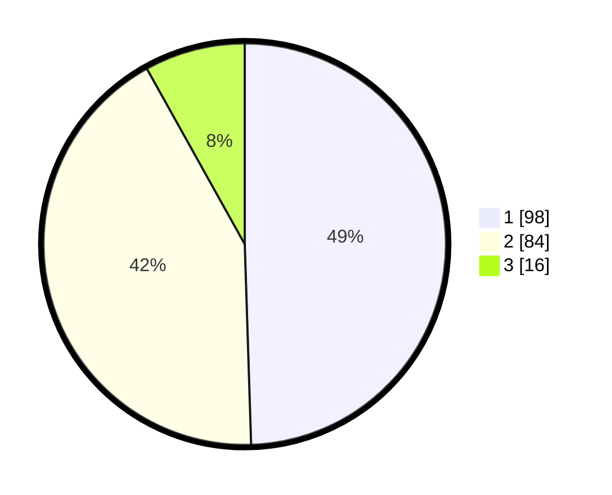

# Hasil

## Grafik

## Tabel

| No. | Nama Paslon    | Suara | Suara (raw) | Persentase |
|:--- |:-------------- | -----:| -----------:| ----------:|
| 1   | ANIES MUHAIMIN | 98    | [98][p-1]   | 49,49      |
| 2   | PRABOWO GIBRAN | 84    | [84][p-2]   | 42,42      |
| 3   | GANJAR MAHFUD  | 16    | [16][p-3]   | 8,08       |

[p-1]: https://github.com/gigit-pemilu/pemilu-2024/blob/main/pilpres/hitung-suara/sub/12-sumatera-utara/sub/09-asahan/sub/29-rawang-panca-arga/sub/2001-rawang-lama/sub/003-tps/sub/paslon-1.txt
[p-2]: https://github.com/gigit-pemilu/pemilu-2024/blob/main/pilpres/hitung-suara/sub/12-sumatera-utara/sub/09-asahan/sub/29-rawang-panca-arga/sub/2001-rawang-lama/sub/003-tps/sub/paslon-2.txt
[p-3]: https://github.com/gigit-pemilu/pemilu-2024/blob/main/pilpres/hitung-suara/sub/12-sumatera-utara/sub/09-asahan/sub/29-rawang-panca-arga/sub/2001-rawang-lama/sub/003-tps/sub/paslon-3.txt

## Foto C Plano

https://sirekap-obj-formc.kpu.go.id/e45d/pemilu/ppwp/12/09/29/20/01/1209292001003-20240214-225315--29de6d7a-b9e3-4b7f-a76f-d5c07c419074.jpg

https://sirekap-obj-formc.kpu.go.id/e45d/pemilu/ppwp/12/09/29/20/01/1209292001003-20240214-225144--19ffa577-05bf-4e68-a55c-de453c43988f.jpg

https://sirekap-obj-formc.kpu.go.id/e45d/pemilu/ppwp/12/09/29/20/01/1209292001003-20240214-225654--85481683-8315-4225-b830-66e47597cf02.jpg

## Metadata

| Key        | Value               |
| ---------- | ------------------- |
| Time Stamp | 2024-02-24 22:31:28 |

