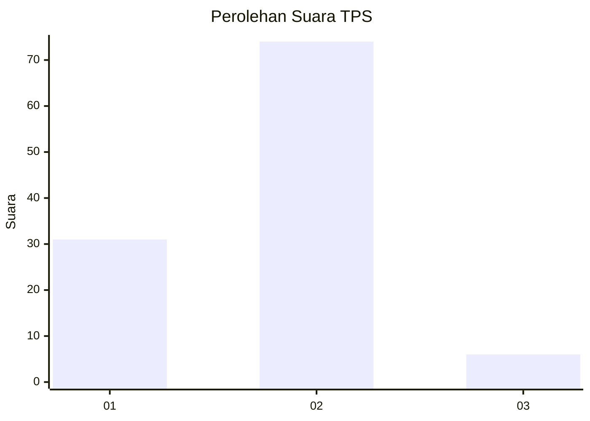
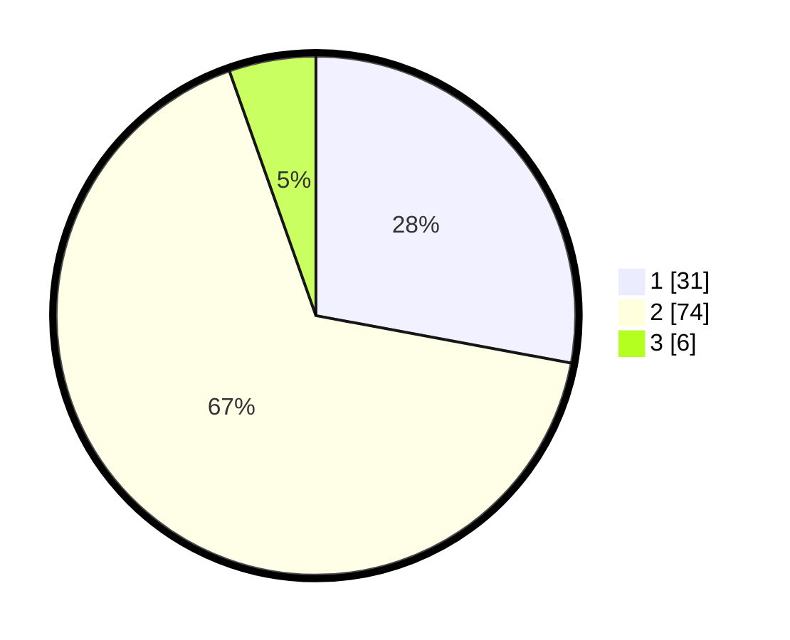

# Hasil

## Grafik

## Tabel

| No. | Nama Paslon    | Suara | Suara (raw) | Persentase |
|:--- |:-------------- | -----:| -----------:| ----------:|
| 1   | ANIES MUHAIMIN | 31    | [31][p-1]   | 27,93      |
| 2   | PRABOWO GIBRAN | 74    | [74][p-2]   | 66,67      |
| 3   | GANJAR MAHFUD  | 6     | [6][p-3]    | 5,41       |

[p-1]: https://github.com/gigit-pemilu/pemilu-2024/blob/main/pilpres/hitung-suara/sub/12-sumatera-utara/sub/09-asahan/sub/29-rawang-panca-arga/sub/2001-rawang-lama/sub/006-tps/sub/paslon-1.txt
[p-2]: https://github.com/gigit-pemilu/pemilu-2024/blob/main/pilpres/hitung-suara/sub/12-sumatera-utara/sub/09-asahan/sub/29-rawang-panca-arga/sub/2001-rawang-lama/sub/006-tps/sub/paslon-2.txt
[p-3]: https://github.com/gigit-pemilu/pemilu-2024/blob/main/pilpres/hitung-suara/sub/12-sumatera-utara/sub/09-asahan/sub/29-rawang-panca-arga/sub/2001-rawang-lama/sub/006-tps/sub/paslon-3.txt

## Foto C Plano

https://sirekap-obj-formc.kpu.go.id/48de/pemilu/ppwp/12/09/29/20/01/1209292001006-20240215-000808--8a9b8dce-0acd-44e6-9b8d-7b1249cdf76c.jpg

https://sirekap-obj-formc.kpu.go.id/48de/pemilu/ppwp/12/09/29/20/01/1209292001006-20240215-000844--ac19482d-995c-4ca6-8efd-ee7484ea9b9e.jpg

https://sirekap-obj-formc.kpu.go.id/48de/pemilu/ppwp/12/09/29/20/01/1209292001006-20240215-000907--3037cc9a-59c8-4024-aa49-85861513a8a5.jpg

## Metadata

| Key        | Value               |
| ---------- | ------------------- |
| Time Stamp | 2024-02-25 16:00:00 |

