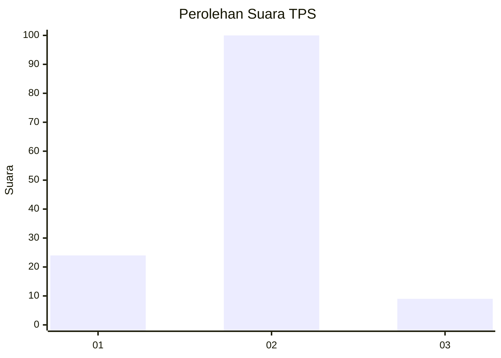
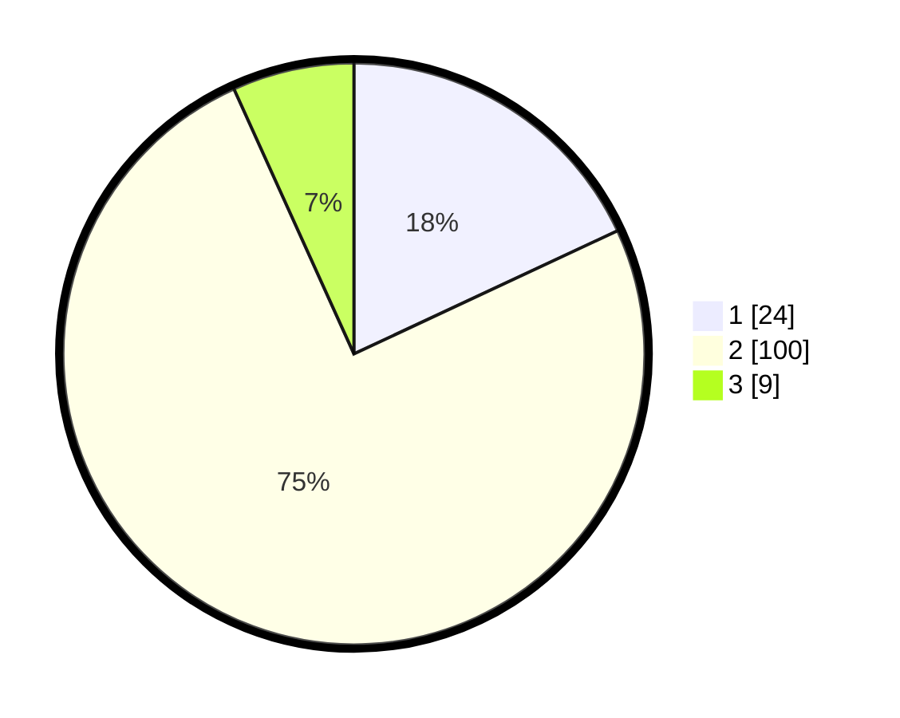

# Hasil

## Grafik

## Tabel

| No. | Nama Paslon    | Suara | Suara (raw) | Persentase |
|:--- |:-------------- | -----:| -----------:| ----------:|
| 1   | ANIES MUHAIMIN | 24    | [24][p-1]   | 18,05      |
| 2   | PRABOWO GIBRAN | 100   | [100][p-2]  | 75,19      |
| 3   | GANJAR MAHFUD  | 9     | [9][p-3]    | 6,77       |

[p-1]: https://github.com/gigit-pemilu/pemilu-2024-12-sumatera-utara/blob/main/pilpres/hitung-suara/sub/12-sumatera-utara/sub/09-asahan/sub/29-rawang-panca-arga/sub/2001-rawang-lama/sub/007-tps/sub/paslon-1.txt
[p-2]: https://github.com/gigit-pemilu/pemilu-2024-12-sumatera-utara/blob/main/pilpres/hitung-suara/sub/12-sumatera-utara/sub/09-asahan/sub/29-rawang-panca-arga/sub/2001-rawang-lama/sub/007-tps/sub/paslon-2.txt
[p-3]: https://github.com/gigit-pemilu/pemilu-2024-12-sumatera-utara/blob/main/pilpres/hitung-suara/sub/12-sumatera-utara/sub/09-asahan/sub/29-rawang-panca-arga/sub/2001-rawang-lama/sub/007-tps/sub/paslon-3.txt

## Foto C Plano

https://sirekap-obj-formc.kpu.go.id/c164/pemilu/ppwp/12/09/29/20/01/1209292001007-20240214-194651--ffb105a4-f765-4479-ac9f-e6f23c2ab7f1.jpg

https://sirekap-obj-formc.kpu.go.id/c164/pemilu/ppwp/12/09/29/20/01/1209292001007-20240215-021945--cc3312a7-b925-43bc-8f45-f1f88190ff28.jpg

https://sirekap-obj-formc.kpu.go.id/c164/pemilu/ppwp/12/09/29/20/01/1209292001007-20240215-022108--8aa360ec-fe93-4bba-9d83-beb4cf734e53.jpg

## Metadata

| Key        | Value               |
| ---------- | ------------------- |
| Time Stamp | 2024-02-24 22:31:28 |

