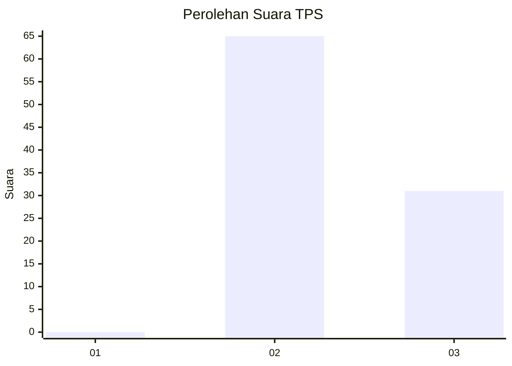
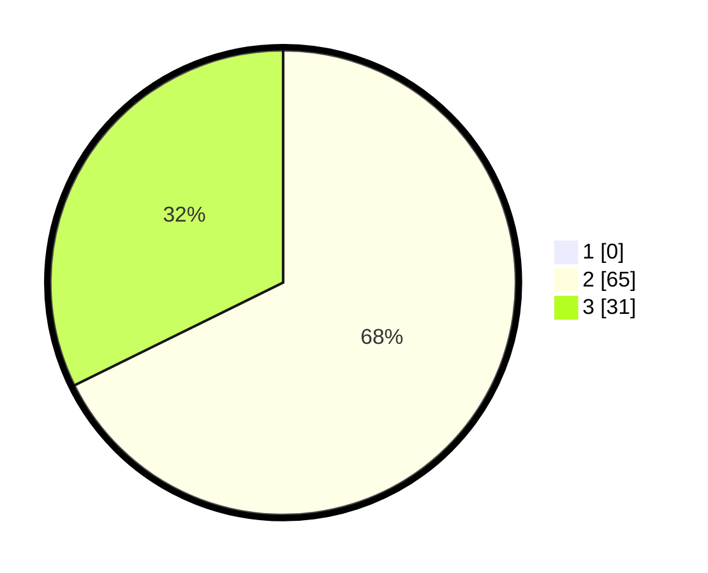

# Hasil

## Grafik

## Tabel

| No. | Nama Paslon    | Suara | Suara (raw) | Persentase |
|:--- |:-------------- | -----:| -----------:| ----------:|
| 1   | ANIES MUHAIMIN | 0     | [0][p-1]    | 0,00       |
| 2   | PRABOWO GIBRAN | 65    | [65][p-2]   | 67,71      |
| 3   | GANJAR MAHFUD  | 31    | [31][p-3]   | 32,29      |

[p-1]: https://github.com/gigit-pemilu/pemilu-2024/blob/main/pilpres/hitung-suara/sub/12-sumatera-utara/sub/09-asahan/sub/29-rawang-panca-arga/sub/2002-rawang-baru/sub/009-tps/sub/paslon-1.txt
[p-2]: https://github.com/gigit-pemilu/pemilu-2024/blob/main/pilpres/hitung-suara/sub/12-sumatera-utara/sub/09-asahan/sub/29-rawang-panca-arga/sub/2002-rawang-baru/sub/009-tps/sub/paslon-2.txt
[p-3]: https://github.com/gigit-pemilu/pemilu-2024/blob/main/pilpres/hitung-suara/sub/12-sumatera-utara/sub/09-asahan/sub/29-rawang-panca-arga/sub/2002-rawang-baru/sub/009-tps/sub/paslon-3.txt

## Foto C Plano

https://sirekap-obj-formc.kpu.go.id/e5fc/pemilu/ppwp/12/09/29/20/02/1209292002009-20240216-212609--5644cb37-acad-42ec-bea2-2905f2a17452.jpg

https://sirekap-obj-formc.kpu.go.id/e5fc/pemilu/ppwp/12/09/29/20/02/1209292002009-20240216-212244--b3f02bbf-70ea-464a-be52-462aaaacbfd2.jpg

https://sirekap-obj-formc.kpu.go.id/e5fc/pemilu/ppwp/12/09/29/20/02/1209292002009-20240216-212541--1796073d-8d50-41dd-a5cc-8c89eb8a96d4.jpg

## Metadata

| Key        | Value               |
| ---------- | ------------------- |
| Time Stamp | 2024-02-25 13:00:00 |

