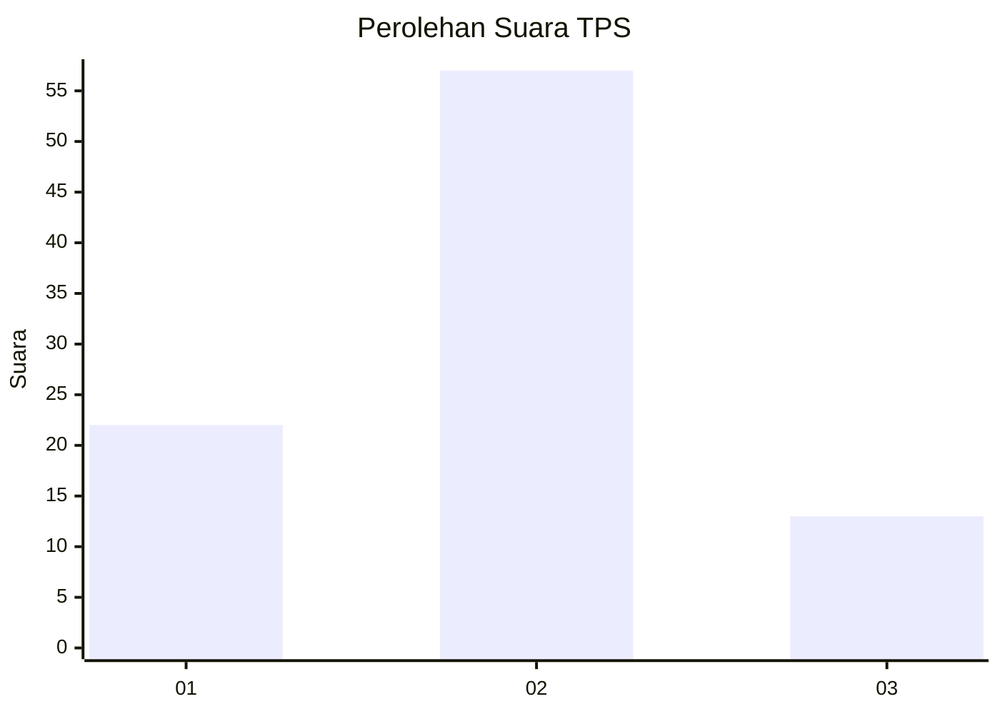
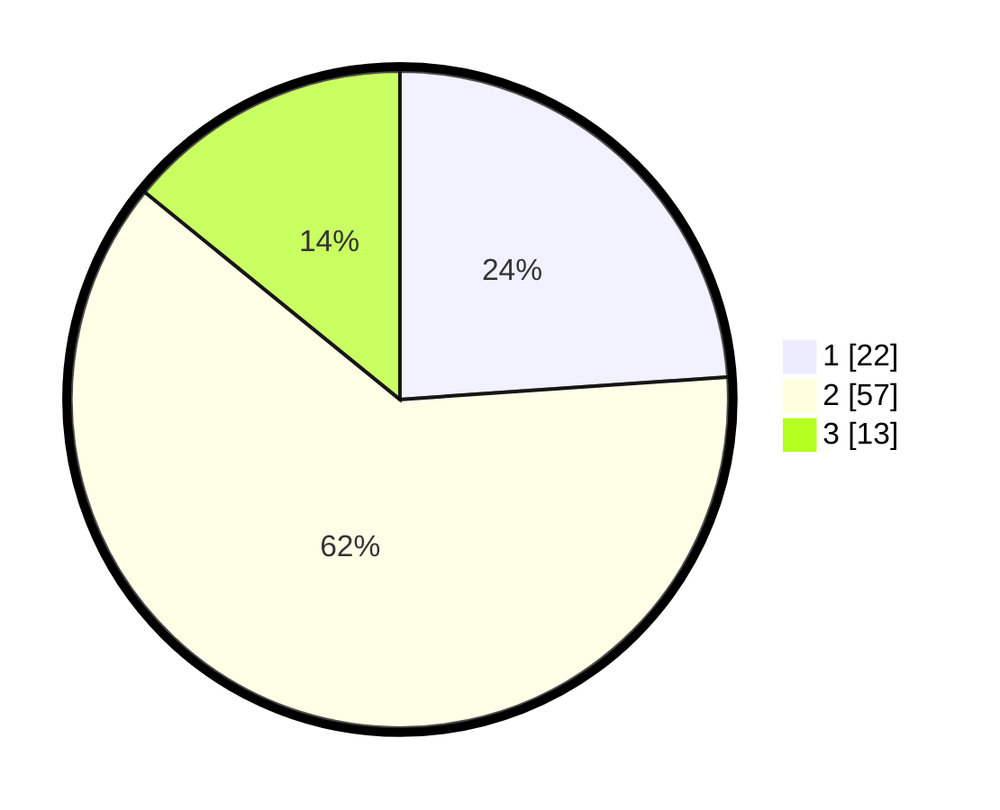

# Hasil

## Grafik

## Tabel

| No. | Nama Paslon    | Suara | Suara (raw) | Persentase |
|:--- |:-------------- | -----:| -----------:| ----------:|
| 1   | ANIES MUHAIMIN | 22    | [22][p-1]   | 23,91      |
| 2   | PRABOWO GIBRAN | 57    | [57][p-2]   | 61,96      |
| 3   | GANJAR MAHFUD  | 13    | [13][p-3]   | 14,13      |

[p-1]: https://github.com/gigit-pemilu/pemilu-2024/blob/main/pilpres/hitung-suara/sub/12-sumatera-utara/sub/09-asahan/sub/29-rawang-panca-arga/sub/2004-rawang-pasar-v/sub/001-tps/sub/paslon-1.txt
[p-2]: https://github.com/gigit-pemilu/pemilu-2024/blob/main/pilpres/hitung-suara/sub/12-sumatera-utara/sub/09-asahan/sub/29-rawang-panca-arga/sub/2004-rawang-pasar-v/sub/001-tps/sub/paslon-2.txt
[p-3]: https://github.com/gigit-pemilu/pemilu-2024/blob/main/pilpres/hitung-suara/sub/12-sumatera-utara/sub/09-asahan/sub/29-rawang-panca-arga/sub/2004-rawang-pasar-v/sub/001-tps/sub/paslon-3.txt

## Foto C Plano

https://sirekap-obj-formc.kpu.go.id/f784/pemilu/ppwp/12/09/29/20/04/1209292004001-20240216-222530--00741c91-0066-4bfe-a946-ac579017ae47.jpg

https://sirekap-obj-formc.kpu.go.id/f784/pemilu/ppwp/12/09/29/20/04/1209292004001-20240216-232439--1f11581b-3a62-432a-896c-e3b52baffec3.jpg

## Metadata

| Key        | Value               |
| ---------- | ------------------- |
| Time Stamp | 2024-02-24 22:31:28 |

