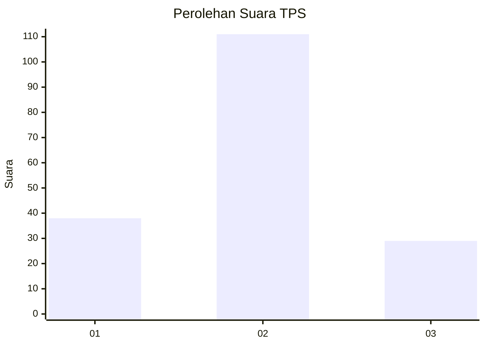

# Hasil

## Grafik

## Tabel

| No. | Nama Paslon    | Suara | Suara (raw) | Persentase |
|:--- |:-------------- | -----:| -----------:| ----------:|
| 1   | ANIES MUHAIMIN | 38    | [38][p-1]   | 21,35      |
| 2   | PRABOWO GIBRAN | 111   | [111][p-2]  | 62,36      |
| 3   | GANJAR MAHFUD  | 29    | [29][p-3]   | 16,29      |

[p-1]: https://github.com/gigit-pemilu/pemilu-2024/blob/main/pilpres/hitung-suara/sub/12-sumatera-utara/sub/09-asahan/sub/29-rawang-panca-arga/sub/2004-rawang-pasar-v/sub/007-tps/sub/paslon-1.txt
[p-2]: https://github.com/gigit-pemilu/pemilu-2024/blob/main/pilpres/hitung-suara/sub/12-sumatera-utara/sub/09-asahan/sub/29-rawang-panca-arga/sub/2004-rawang-pasar-v/sub/007-tps/sub/paslon-2.txt
[p-3]: https://github.com/gigit-pemilu/pemilu-2024/blob/main/pilpres/hitung-suara/sub/12-sumatera-utara/sub/09-asahan/sub/29-rawang-panca-arga/sub/2004-rawang-pasar-v/sub/007-tps/sub/paslon-3.txt

## Foto C Plano

https://sirekap-obj-formc.kpu.go.id/7374/pemilu/ppwp/12/09/29/20/04/1209292004007-20240216-132045--080acf0e-f5a5-42bc-b2fc-f9115b347921.jpg

https://sirekap-obj-formc.kpu.go.id/7374/pemilu/ppwp/12/09/29/20/04/1209292004007-20240216-145559--5e18f356-8513-4441-b892-dd939612664e.jpg

https://sirekap-obj-formc.kpu.go.id/7374/pemilu/ppwp/12/09/29/20/04/1209292004007-20240216-133925--c6270718-d5b7-4d9d-b8c5-ab1ea7b6e02c.jpg

## Metadata

| Key        | Value               |
| ---------- | ------------------- |
| Time Stamp | 2024-02-25 16:00:00 |

