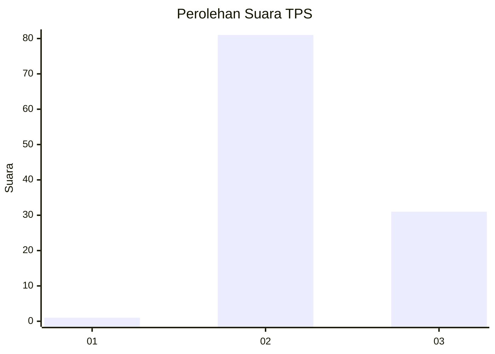
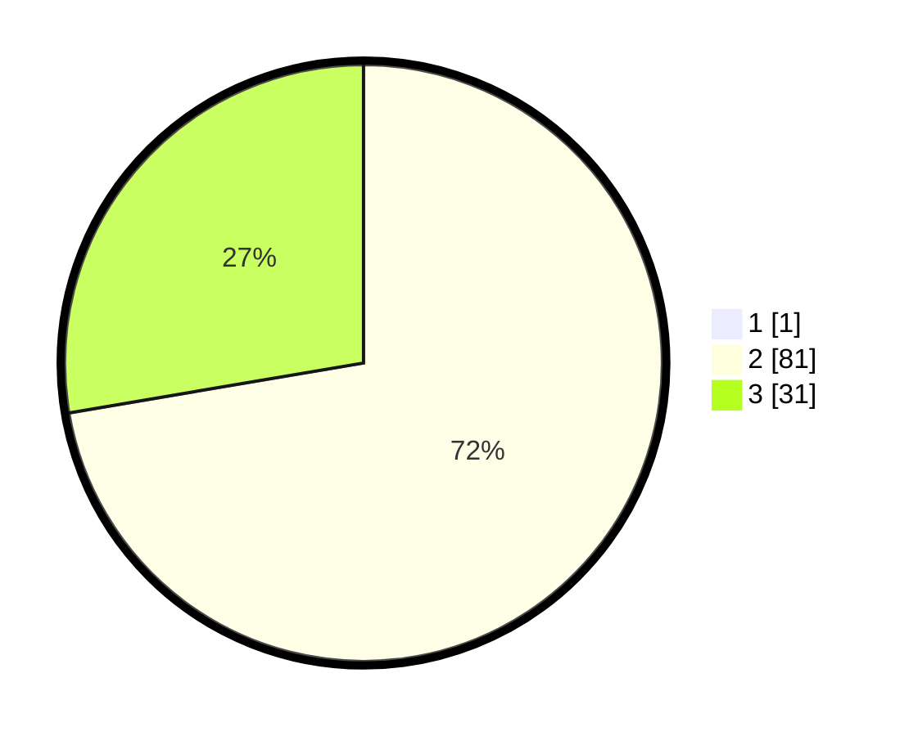

# Hasil

## Grafik

## Tabel

| No. | Nama Paslon    | Suara | Suara (raw) | Persentase |
|:--- |:-------------- | -----:| -----------:| ----------:|
| 1   | ANIES MUHAIMIN | 1     | [1][p-1]    | 0,88       |
| 2   | PRABOWO GIBRAN | 81    | [81][p-2]   | 71,68      |
| 3   | GANJAR MAHFUD  | 31    | [31][p-3]   | 27,43      |

[p-1]: https://github.com/gigit-pemilu/pemilu-2024-12-sumatera-utara/blob/main/pilpres/hitung-suara/sub/12-sumatera-utara/sub/09-asahan/sub/29-rawang-panca-arga/sub/2007-rawang-pasar-vi/sub/005-tps/sub/paslon-1.txt
[p-2]: https://github.com/gigit-pemilu/pemilu-2024-12-sumatera-utara/blob/main/pilpres/hitung-suara/sub/12-sumatera-utara/sub/09-asahan/sub/29-rawang-panca-arga/sub/2007-rawang-pasar-vi/sub/005-tps/sub/paslon-2.txt
[p-3]: https://github.com/gigit-pemilu/pemilu-2024-12-sumatera-utara/blob/main/pilpres/hitung-suara/sub/12-sumatera-utara/sub/09-asahan/sub/29-rawang-panca-arga/sub/2007-rawang-pasar-vi/sub/005-tps/sub/paslon-3.txt

## Foto C Plano

https://sirekap-obj-formc.kpu.go.id/e31b/pemilu/ppwp/12/09/29/20/07/1209292007005-20240216-182442--80ee5702-48dc-4296-8f16-103cfcc9affe.jpg

https://sirekap-obj-formc.kpu.go.id/e31b/pemilu/ppwp/12/09/29/20/07/1209292007005-20240216-184203--3e65dbba-c5c9-4861-bddb-58cda8ea8746.jpg

https://sirekap-obj-formc.kpu.go.id/e31b/pemilu/ppwp/12/09/29/20/07/1209292007005-20240216-190033--b7766b42-f1d2-4142-9b47-045d2e0ac322.jpg

## Metadata

| Key        | Value               |
| ---------- | ------------------- |
| Time Stamp | 2024-02-25 17:00:00 |

