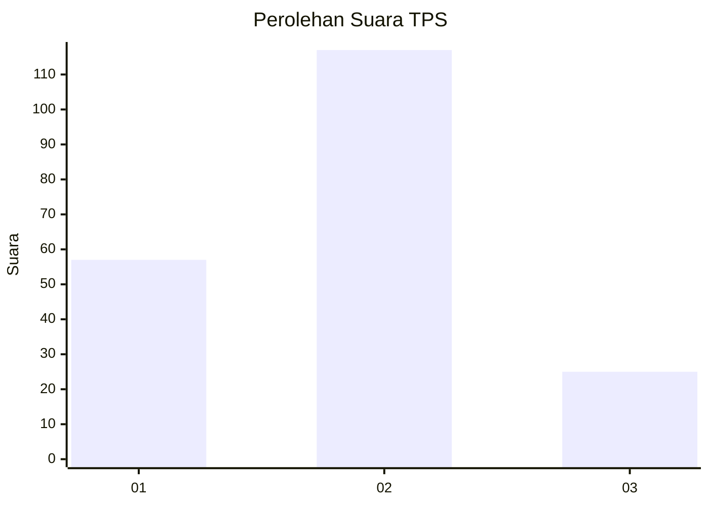
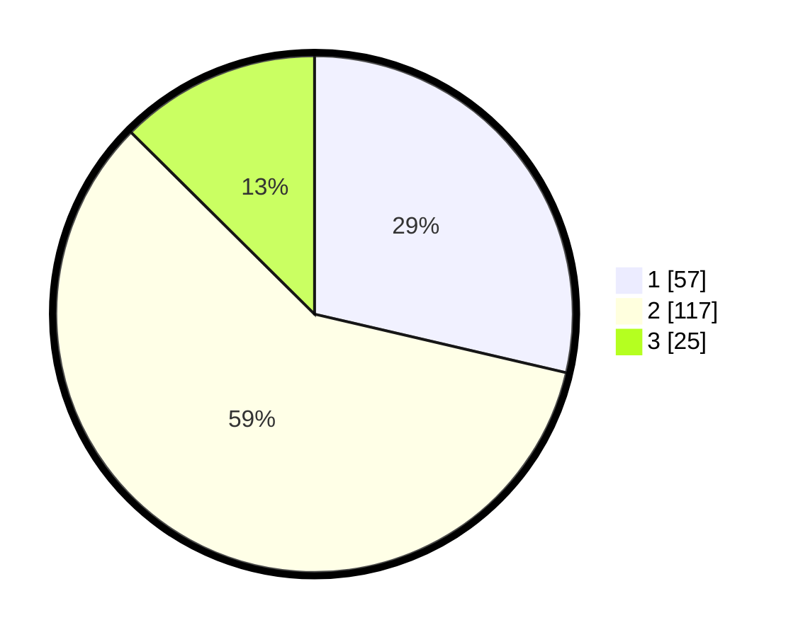

# Hasil

## Grafik

## Tabel

| No. | Nama Paslon    | Suara | Suara (raw) | Persentase |
|:--- |:-------------- | -----:| -----------:| ----------:|
| 1   | ANIES MUHAIMIN | 57    | [57][p-1]   | 28,64      |
| 2   | PRABOWO GIBRAN | 117   | [117][p-2]  | 58,79      |
| 3   | GANJAR MAHFUD  | 25    | [25][p-3]   | 12,56      |

[p-1]: https://github.com/gigit-pemilu/pemilu-2024-12-sumatera-utara/blob/main/pilpres/hitung-suara/sub/12-sumatera-utara/sub/09-asahan/sub/30-pulo-bandring/sub/2001-suka-damai/sub/001-tps/sub/paslon-1.txt
[p-2]: https://github.com/gigit-pemilu/pemilu-2024-12-sumatera-utara/blob/main/pilpres/hitung-suara/sub/12-sumatera-utara/sub/09-asahan/sub/30-pulo-bandring/sub/2001-suka-damai/sub/001-tps/sub/paslon-2.txt
[p-3]: https://github.com/gigit-pemilu/pemilu-2024-12-sumatera-utara/blob/main/pilpres/hitung-suara/sub/12-sumatera-utara/sub/09-asahan/sub/30-pulo-bandring/sub/2001-suka-damai/sub/001-tps/sub/paslon-3.txt

## Foto C Plano

https://sirekap-obj-formc.kpu.go.id/b479/pemilu/ppwp/12/09/30/20/01/1209302001001-20240214-235934--3d79230f-f96f-4e1e-abd7-545dc9e19326.jpg

https://sirekap-obj-formc.kpu.go.id/b479/pemilu/ppwp/12/09/30/20/01/1209302001001-20240215-000009--46e63131-022b-4ccc-a38f-2ef73e9cafc8.jpg

https://sirekap-obj-formc.kpu.go.id/b479/pemilu/ppwp/12/09/30/20/01/1209302001001-20240215-000036--1809921a-236a-4978-906d-96bab06b0f8a.jpg

## Metadata

| Key        | Value               |
| ---------- | ------------------- |
| Time Stamp | 2024-02-24 22:31:28 |

