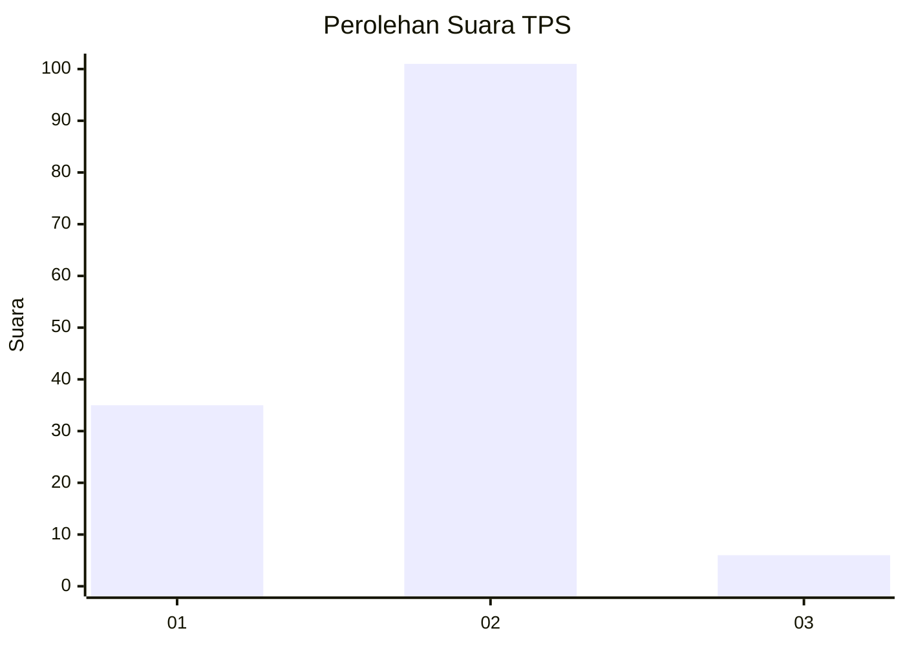
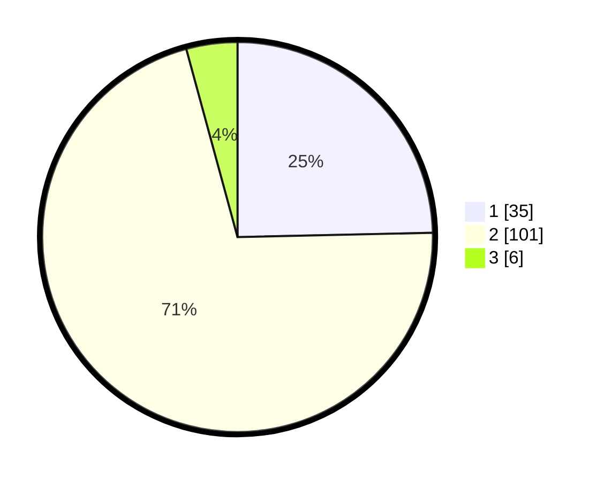

# Hasil

## Grafik

## Tabel

| No. | Nama Paslon    | Suara | Suara (raw) | Persentase |
|:--- |:-------------- | -----:| -----------:| ----------:|
| 1   | ANIES MUHAIMIN | 35    | [35][p-1]   | 24,65      |
| 2   | PRABOWO GIBRAN | 101   | [101][p-2]  | 71,13      |
| 3   | GANJAR MAHFUD  | 6     | [6][p-3]    | 4,23       |

[p-1]: https://github.com/gigit-pemilu/pemilu-2024/blob/main/pilpres/hitung-suara/sub/12-sumatera-utara/sub/09-asahan/sub/30-pulo-bandring/sub/2003-tanah-rakyat/sub/004-tps/sub/paslon-1.txt
[p-2]: https://github.com/gigit-pemilu/pemilu-2024/blob/main/pilpres/hitung-suara/sub/12-sumatera-utara/sub/09-asahan/sub/30-pulo-bandring/sub/2003-tanah-rakyat/sub/004-tps/sub/paslon-2.txt
[p-3]: https://github.com/gigit-pemilu/pemilu-2024/blob/main/pilpres/hitung-suara/sub/12-sumatera-utara/sub/09-asahan/sub/30-pulo-bandring/sub/2003-tanah-rakyat/sub/004-tps/sub/paslon-3.txt

## Foto C Plano

https://sirekap-obj-formc.kpu.go.id/1e71/pemilu/ppwp/12/09/30/20/03/1209302003004-20240214-203515--c692047a-c566-4548-a96a-0771fc7fa0cb.jpg

https://sirekap-obj-formc.kpu.go.id/1e71/pemilu/ppwp/12/09/30/20/03/1209302003004-20240214-141021--ccc2988d-7846-4ef1-a3ba-1c18001801e0.jpg

https://sirekap-obj-formc.kpu.go.id/1e71/pemilu/ppwp/12/09/30/20/03/1209302003004-20240214-141035--96e6833b-f115-460b-bf3f-a3f8ea4eb7e3.jpg

## Metadata

| Key        | Value               |
| ---------- | ------------------- |
| Time Stamp | 2024-02-15 02:10:27 |

