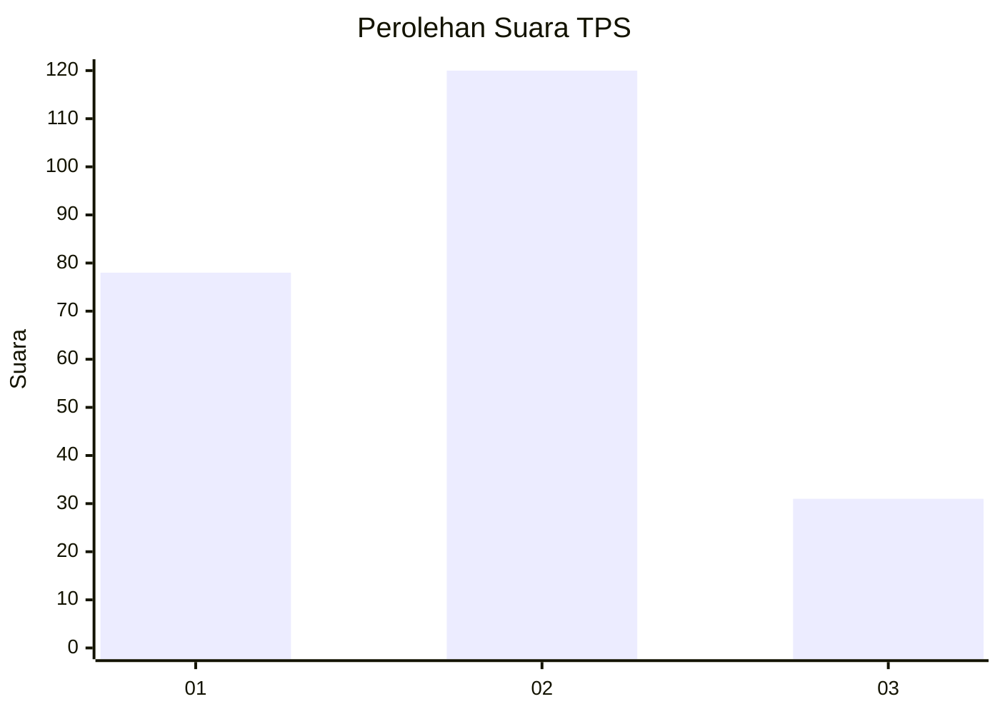
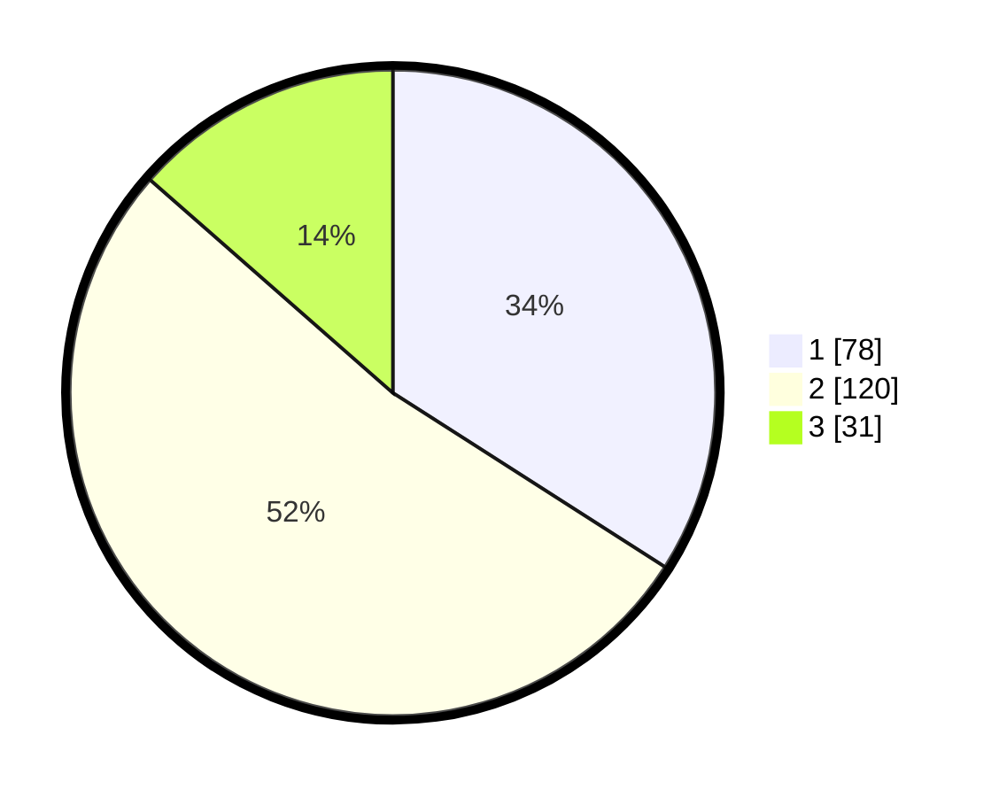

# Hasil

## Grafik

## Tabel

| No. | Nama Paslon    | Suara | Suara (raw) | Persentase |
|:--- |:-------------- | -----:| -----------:| ----------:|
| 1   | ANIES MUHAIMIN | 78    | [78][p-1]   | 34,06      |
| 2   | PRABOWO GIBRAN | 120   | [120][p-2]  | 52,40      |
| 3   | GANJAR MAHFUD  | 31    | [31][p-3]   | 13,54      |

[p-1]: https://github.com/gigit-pemilu/pemilu-2024/blob/main/pilpres/hitung-suara/sub/12-sumatera-utara/sub/09-asahan/sub/30-pulo-bandring/sub/2007-pulo-bandring/sub/001-tps/sub/paslon-1.txt
[p-2]: https://github.com/gigit-pemilu/pemilu-2024/blob/main/pilpres/hitung-suara/sub/12-sumatera-utara/sub/09-asahan/sub/30-pulo-bandring/sub/2007-pulo-bandring/sub/001-tps/sub/paslon-2.txt
[p-3]: https://github.com/gigit-pemilu/pemilu-2024/blob/main/pilpres/hitung-suara/sub/12-sumatera-utara/sub/09-asahan/sub/30-pulo-bandring/sub/2007-pulo-bandring/sub/001-tps/sub/paslon-3.txt

## Foto C Plano

https://sirekap-obj-formc.kpu.go.id/d2a4/pemilu/ppwp/12/09/30/20/07/1209302007001-20240215-024036--6e362c41-bcd4-4b67-89b8-a86a9834c799.jpg

https://sirekap-obj-formc.kpu.go.id/d2a4/pemilu/ppwp/12/09/30/20/07/1209302007001-20240215-024046--1c153186-df69-477d-91ad-7aedcbee8cc5.jpg

https://sirekap-obj-formc.kpu.go.id/d2a4/pemilu/ppwp/12/09/30/20/07/1209302007001-20240215-024055--4acc7d42-5129-4de3-b5f5-81a32e2ca051.jpg

## Metadata

| Key        | Value               |
| ---------- | ------------------- |
| Time Stamp | 2024-02-24 22:31:28 |

