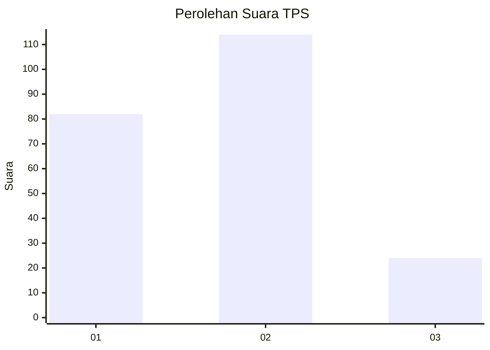
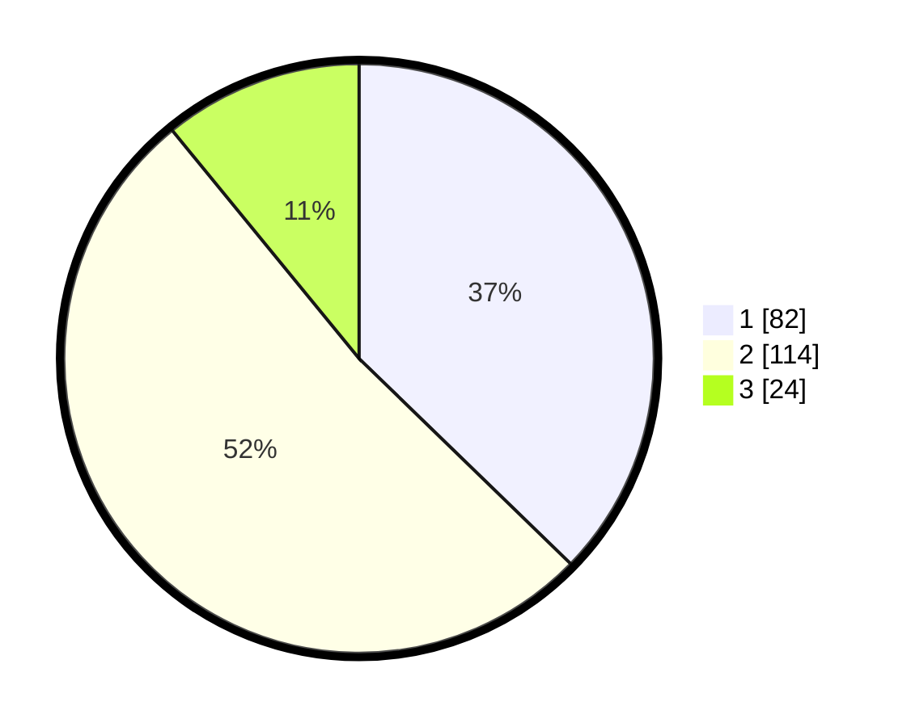

# Hasil

## Grafik

## Tabel

| No. | Nama Paslon    | Suara | Suara (raw) | Persentase |
|:--- |:-------------- | -----:| -----------:| ----------:|
| 1   | ANIES MUHAIMIN | 82    | [82][p-1]   | 37,27      |
| 2   | PRABOWO GIBRAN | 114   | [114][p-2]  | 51,82      |
| 3   | GANJAR MAHFUD  | 24    | [24][p-3]   | 10,91      |

[p-1]: https://github.com/gigit-pemilu/pemilu-2024/blob/main/pilpres/hitung-suara/sub/12-sumatera-utara/sub/09-asahan/sub/30-pulo-bandring/sub/2007-pulo-bandring/sub/003-tps/sub/paslon-1.txt
[p-2]: https://github.com/gigit-pemilu/pemilu-2024/blob/main/pilpres/hitung-suara/sub/12-sumatera-utara/sub/09-asahan/sub/30-pulo-bandring/sub/2007-pulo-bandring/sub/003-tps/sub/paslon-2.txt
[p-3]: https://github.com/gigit-pemilu/pemilu-2024/blob/main/pilpres/hitung-suara/sub/12-sumatera-utara/sub/09-asahan/sub/30-pulo-bandring/sub/2007-pulo-bandring/sub/003-tps/sub/paslon-3.txt

## Foto C Plano

https://sirekap-obj-formc.kpu.go.id/a7da/pemilu/ppwp/12/09/30/20/07/1209302007003-20240215-003239--31fb2ccf-0b5f-4da6-a4ea-989c5db175ad.jpg

https://sirekap-obj-formc.kpu.go.id/a7da/pemilu/ppwp/12/09/30/20/07/1209302007003-20240215-003450--ca7b2e2a-aa08-4ad4-b93f-55727d2a4711.jpg

https://sirekap-obj-formc.kpu.go.id/a7da/pemilu/ppwp/12/09/30/20/07/1209302007003-20240215-004131--eacfd3f3-c216-4143-a1ba-67e6517fde26.jpg

## Metadata

| Key        | Value               |
| ---------- | ------------------- |
| Time Stamp | 2024-02-25 00:00:00 |

