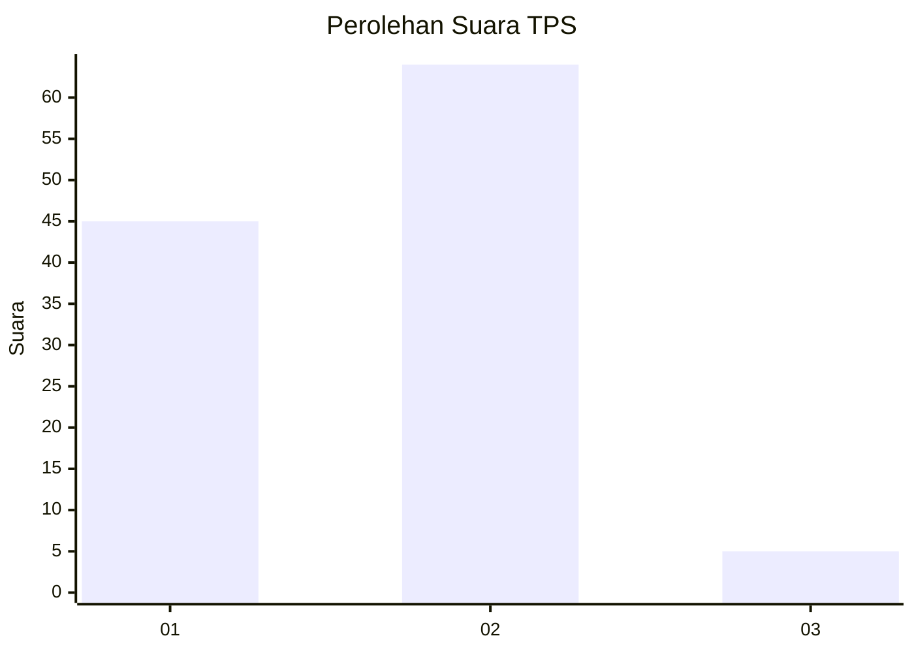
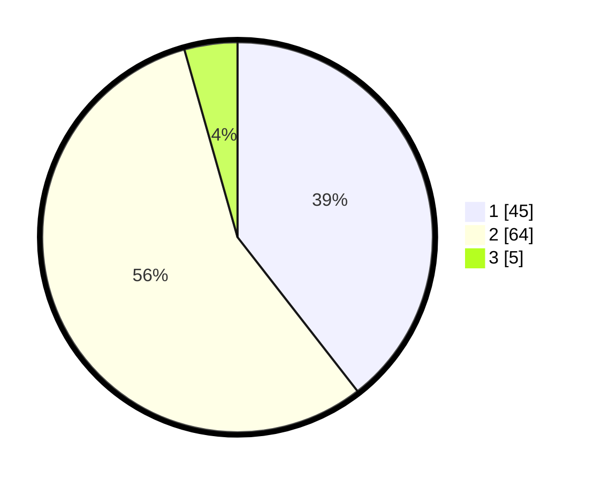

# Hasil

## Grafik

## Tabel

| No. | Nama Paslon    | Suara | Suara (raw) | Persentase |
|:--- |:-------------- | -----:| -----------:| ----------:|
| 1   | ANIES MUHAIMIN | 45    | [45][p-1]   | 39,47      |
| 2   | PRABOWO GIBRAN | 64    | [64][p-2]   | 56,14      |
| 3   | GANJAR MAHFUD  | 5     | [5][p-3]    | 4,39       |

[p-1]: https://github.com/gigit-pemilu/pemilu-2024-12-sumatera-utara/blob/main/pilpres/hitung-suara/sub/12-sumatera-utara/sub/09-asahan/sub/30-pulo-bandring/sub/2009-suka-damai-barat/sub/003-tps/sub/paslon-1.txt
[p-2]: https://github.com/gigit-pemilu/pemilu-2024-12-sumatera-utara/blob/main/pilpres/hitung-suara/sub/12-sumatera-utara/sub/09-asahan/sub/30-pulo-bandring/sub/2009-suka-damai-barat/sub/003-tps/sub/paslon-2.txt
[p-3]: https://github.com/gigit-pemilu/pemilu-2024-12-sumatera-utara/blob/main/pilpres/hitung-suara/sub/12-sumatera-utara/sub/09-asahan/sub/30-pulo-bandring/sub/2009-suka-damai-barat/sub/003-tps/sub/paslon-3.txt

## Foto C Plano

https://sirekap-obj-formc.kpu.go.id/c30b/pemilu/ppwp/12/09/30/20/09/1209302009003-20240214-193351--136351b9-4902-4f23-9538-047e3e94ae1c.jpg

https://sirekap-obj-formc.kpu.go.id/c30b/pemilu/ppwp/12/09/30/20/09/1209302009003-20240214-193412--7e2874e8-dfd0-4436-b6b9-1c7845242c86.jpg

https://sirekap-obj-formc.kpu.go.id/c30b/pemilu/ppwp/12/09/30/20/09/1209302009003-20240214-193433--5755dfb4-1778-43d3-b83b-7b8631561f3c.jpg

## Metadata

| Key        | Value               |
| ---------- | ------------------- |
| Time Stamp | 2024-02-24 22:31:28 |

