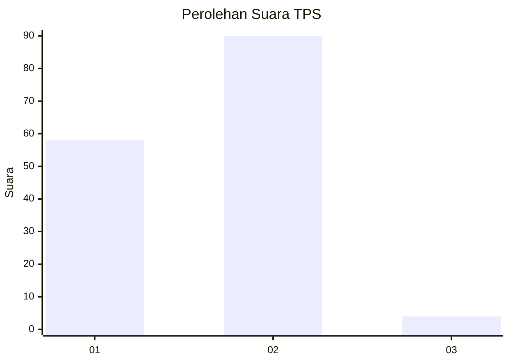
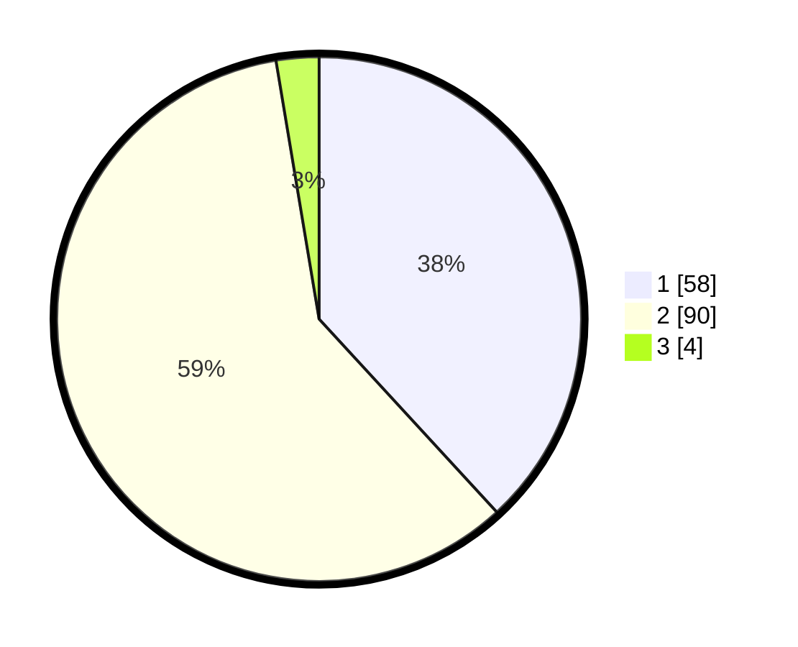

# Hasil

## Grafik

## Tabel

| No. | Nama Paslon    | Suara | Suara (raw) | Persentase |
|:--- |:-------------- | -----:| -----------:| ----------:|
| 1   | ANIES MUHAIMIN | 58    | [58][p-1]   | 38,16      |
| 2   | PRABOWO GIBRAN | 90    | [90][p-2]   | 59,21      |
| 3   | GANJAR MAHFUD  | 4     | [4][p-3]    | 2,63       |

[p-1]: https://github.com/gigit-pemilu/pemilu-2024/blob/main/pilpres/hitung-suara/sub/12-sumatera-utara/sub/09-asahan/sub/31-teluk-dalam/sub/2001-air-teluk-kiri/sub/001-tps/sub/paslon-1.txt
[p-2]: https://github.com/gigit-pemilu/pemilu-2024/blob/main/pilpres/hitung-suara/sub/12-sumatera-utara/sub/09-asahan/sub/31-teluk-dalam/sub/2001-air-teluk-kiri/sub/001-tps/sub/paslon-2.txt
[p-3]: https://github.com/gigit-pemilu/pemilu-2024/blob/main/pilpres/hitung-suara/sub/12-sumatera-utara/sub/09-asahan/sub/31-teluk-dalam/sub/2001-air-teluk-kiri/sub/001-tps/sub/paslon-3.txt

## Foto C Plano

https://sirekap-obj-formc.kpu.go.id/f4d6/pemilu/ppwp/12/09/31/20/01/1209312001001-20240215-011216--81c8c121-9ea0-4bfa-8348-494cb0014c0c.jpg

https://sirekap-obj-formc.kpu.go.id/f4d6/pemilu/ppwp/12/09/31/20/01/1209312001001-20240215-011408--e04f6b6f-fdcb-4ccc-a2c5-d90104d6be7d.jpg

https://sirekap-obj-formc.kpu.go.id/f4d6/pemilu/ppwp/12/09/31/20/01/1209312001001-20240215-011824--db298000-3dd1-4c4b-9b43-aa44af1d771d.jpg

## Metadata

| Key        | Value               |
| ---------- | ------------------- |
| Time Stamp | 2024-02-25 02:00:00 |

