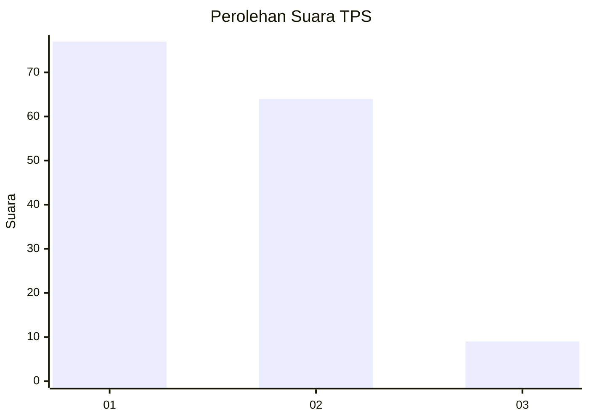
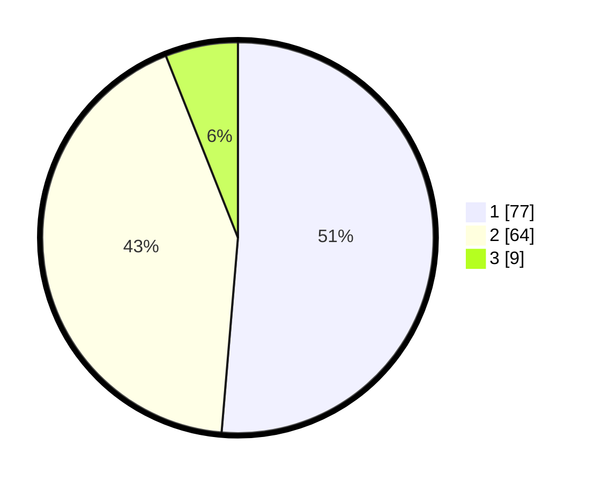

# Hasil

## Grafik

## Tabel

| No. | Nama Paslon    | Suara | Suara (raw) | Persentase |
|:--- |:-------------- | -----:| -----------:| ----------:|
| 1   | ANIES MUHAIMIN | 77    | [77][p-1]   | 51,33      |
| 2   | PRABOWO GIBRAN | 64    | [64][p-2]   | 42,67      |
| 3   | GANJAR MAHFUD  | 9     | [9][p-3]    | 6,00       |

[p-1]: https://github.com/gigit-pemilu/pemilu-2024/blob/main/pilpres/hitung-suara/sub/12-sumatera-utara/sub/09-asahan/sub/31-teluk-dalam/sub/2001-air-teluk-kiri/sub/002-tps/sub/paslon-1.txt
[p-2]: https://github.com/gigit-pemilu/pemilu-2024/blob/main/pilpres/hitung-suara/sub/12-sumatera-utara/sub/09-asahan/sub/31-teluk-dalam/sub/2001-air-teluk-kiri/sub/002-tps/sub/paslon-2.txt
[p-3]: https://github.com/gigit-pemilu/pemilu-2024/blob/main/pilpres/hitung-suara/sub/12-sumatera-utara/sub/09-asahan/sub/31-teluk-dalam/sub/2001-air-teluk-kiri/sub/002-tps/sub/paslon-3.txt

## Foto C Plano

https://sirekap-obj-formc.kpu.go.id/f561/pemilu/ppwp/12/09/31/20/01/1209312001002-20240215-051445--9a807f94-91c5-45ee-a461-a502102bb481.jpg

https://sirekap-obj-formc.kpu.go.id/f561/pemilu/ppwp/12/09/31/20/01/1209312001002-20240215-062902--aae8cb2c-0485-4f7f-ab5d-e4b88e81fa7d.jpg

https://sirekap-obj-formc.kpu.go.id/f561/pemilu/ppwp/12/09/31/20/01/1209312001002-20240215-051706--e38aff2f-155f-4550-8211-90c72eb8c3c3.jpg

## Metadata

| Key        | Value               |
| ---------- | ------------------- |
| Time Stamp | 2024-02-25 16:00:00 |

