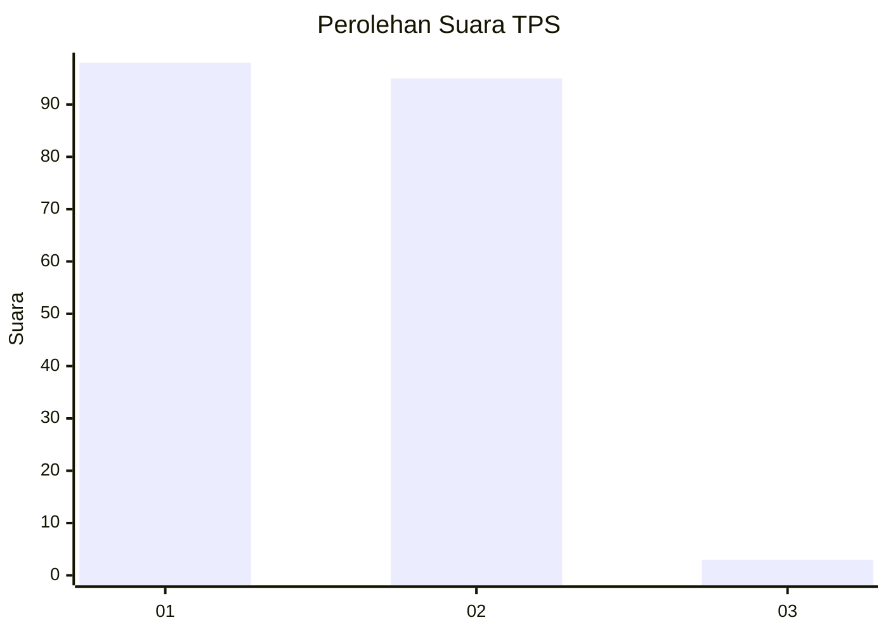
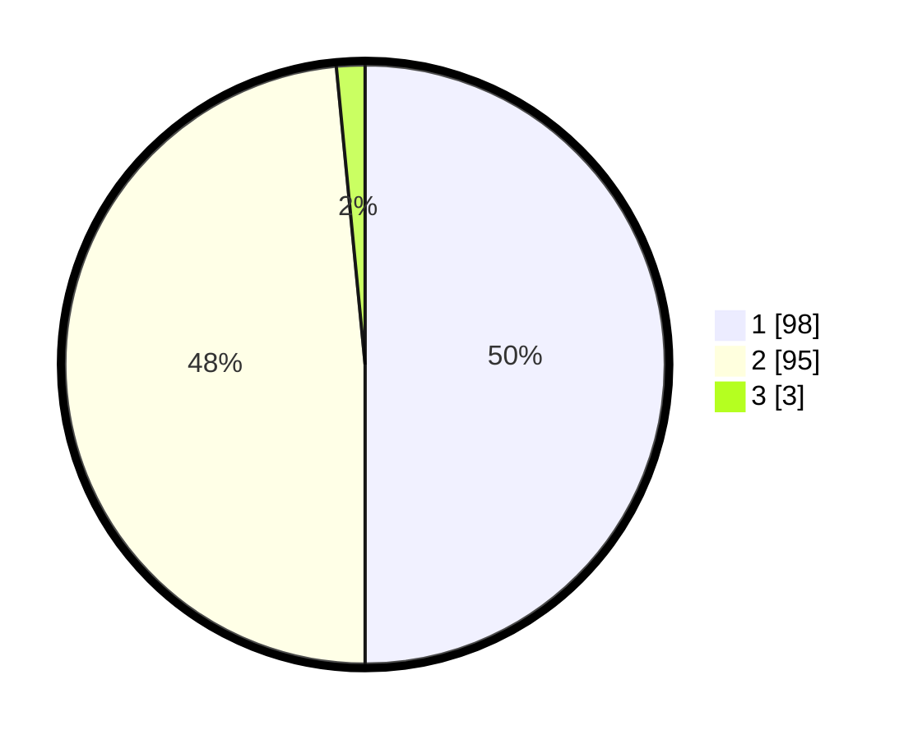

# Hasil

## Grafik

## Tabel

| No. | Nama Paslon    | Suara | Suara (raw) | Persentase |
|:--- |:-------------- | -----:| -----------:| ----------:|
| 1   | ANIES MUHAIMIN | 98    | [98][p-1]   | 50,00      |
| 2   | PRABOWO GIBRAN | 95    | [95][p-2]   | 48,47      |
| 3   | GANJAR MAHFUD  | 3     | [3][p-3]    | 1,53       |

[p-1]: https://github.com/gigit-pemilu/pemilu-2024/blob/main/pilpres/hitung-suara/sub/12-sumatera-utara/sub/09-asahan/sub/31-teluk-dalam/sub/2001-air-teluk-kiri/sub/005-tps/sub/paslon-1.txt
[p-2]: https://github.com/gigit-pemilu/pemilu-2024/blob/main/pilpres/hitung-suara/sub/12-sumatera-utara/sub/09-asahan/sub/31-teluk-dalam/sub/2001-air-teluk-kiri/sub/005-tps/sub/paslon-2.txt
[p-3]: https://github.com/gigit-pemilu/pemilu-2024/blob/main/pilpres/hitung-suara/sub/12-sumatera-utara/sub/09-asahan/sub/31-teluk-dalam/sub/2001-air-teluk-kiri/sub/005-tps/sub/paslon-3.txt

## Foto C Plano

https://sirekap-obj-formc.kpu.go.id/9906/pemilu/ppwp/12/09/31/20/01/1209312001005-20240215-005157--d4275ccf-ad31-40c5-8645-f55419d015ed.jpg

https://sirekap-obj-formc.kpu.go.id/9906/pemilu/ppwp/12/09/31/20/01/1209312001005-20240215-005331--fe9bfc1f-49a1-467e-a283-37796ac08434.jpg

https://sirekap-obj-formc.kpu.go.id/9906/pemilu/ppwp/12/09/31/20/01/1209312001005-20240215-005437--90779b18-4fd0-4833-bd36-571429ca6f96.jpg

## Metadata

| Key        | Value               |
| ---------- | ------------------- |
| Time Stamp | 2024-02-25 13:00:00 |

