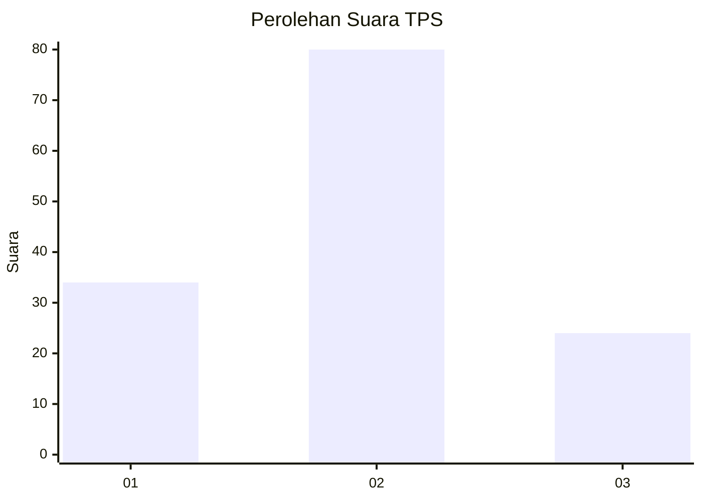
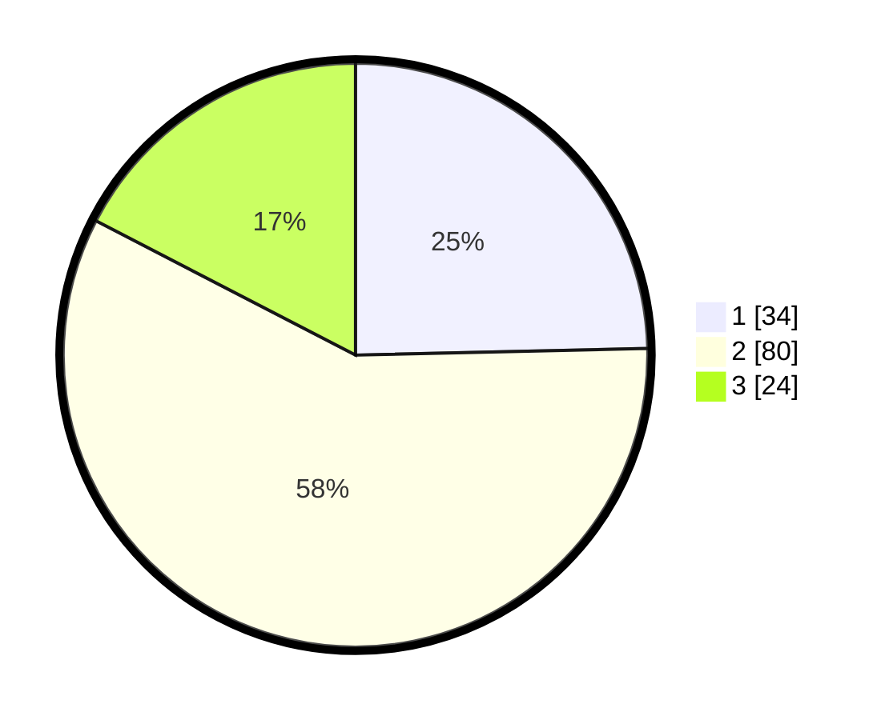

# Hasil

## Grafik

## Tabel

| No. | Nama Paslon    | Suara | Suara (raw) | Persentase |
|:--- |:-------------- | -----:| -----------:| ----------:|
| 1   | ANIES MUHAIMIN | 34    | [34][p-1]   | 24,64      |
| 2   | PRABOWO GIBRAN | 80    | [80][p-2]   | 57,97      |
| 3   | GANJAR MAHFUD  | 24    | [24][p-3]   | 17,39      |

[p-1]: https://github.com/gigit-pemilu/pemilu-2024/blob/main/pilpres/hitung-suara/sub/12-sumatera-utara/sub/09-asahan/sub/31-teluk-dalam/sub/2003-perkebunan-teluk-dalam/sub/003-tps/sub/paslon-1.txt
[p-2]: https://github.com/gigit-pemilu/pemilu-2024/blob/main/pilpres/hitung-suara/sub/12-sumatera-utara/sub/09-asahan/sub/31-teluk-dalam/sub/2003-perkebunan-teluk-dalam/sub/003-tps/sub/paslon-2.txt
[p-3]: https://github.com/gigit-pemilu/pemilu-2024/blob/main/pilpres/hitung-suara/sub/12-sumatera-utara/sub/09-asahan/sub/31-teluk-dalam/sub/2003-perkebunan-teluk-dalam/sub/003-tps/sub/paslon-3.txt

## Foto C Plano

https://sirekap-obj-formc.kpu.go.id/52ee/pemilu/ppwp/12/09/31/20/03/1209312003003-20240215-022916--790cb1ce-a317-4b2f-80c6-c9c901b839a4.jpg

https://sirekap-obj-formc.kpu.go.id/52ee/pemilu/ppwp/12/09/31/20/03/1209312003003-20240215-023315--65779fb9-3de8-4523-a8d2-e6b7486acb88.jpg

https://sirekap-obj-formc.kpu.go.id/52ee/pemilu/ppwp/12/09/31/20/03/1209312003003-20240215-023415--5e93c90f-53b3-4eae-a4fd-a28c3be50b32.jpg

## Metadata

| Key        | Value               |
| ---------- | ------------------- |
| Time Stamp | 2024-02-25 16:00:00 |

