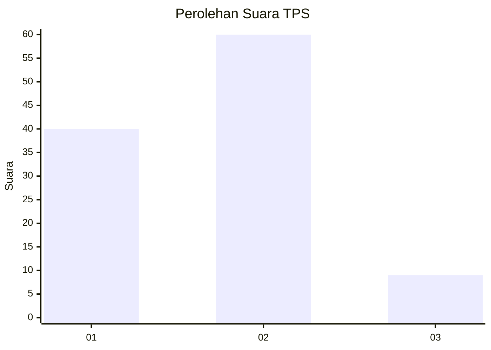

# Hasil

## Grafik

## Tabel

| No. | Nama Paslon    | Suara | Suara (raw) | Persentase |
|:--- |:-------------- | -----:| -----------:| ----------:|
| 1   | ANIES MUHAIMIN | 40    | [40][p-1]   | 36,70      |
| 2   | PRABOWO GIBRAN | 60    | [60][p-2]   | 55,05      |
| 3   | GANJAR MAHFUD  | 9     | [9][p-3]    | 8,26       |

[p-1]: https://github.com/gigit-pemilu/pemilu-2024-12-sumatera-utara/blob/main/pilpres/hitung-suara/sub/12-sumatera-utara/sub/09-asahan/sub/32-aek-ledong/sub/2002-aek-korsik/sub/009-tps/sub/paslon-1.txt
[p-2]: https://github.com/gigit-pemilu/pemilu-2024-12-sumatera-utara/blob/main/pilpres/hitung-suara/sub/12-sumatera-utara/sub/09-asahan/sub/32-aek-ledong/sub/2002-aek-korsik/sub/009-tps/sub/paslon-2.txt
[p-3]: https://github.com/gigit-pemilu/pemilu-2024-12-sumatera-utara/blob/main/pilpres/hitung-suara/sub/12-sumatera-utara/sub/09-asahan/sub/32-aek-ledong/sub/2002-aek-korsik/sub/009-tps/sub/paslon-3.txt

## Foto C Plano

https://sirekap-obj-formc.kpu.go.id/ecb8/pemilu/ppwp/12/09/32/20/02/1209322002009-20240214-141516--a1a9c663-576b-40c8-9b4e-abd43a4e3205.jpg

https://sirekap-obj-formc.kpu.go.id/ecb8/pemilu/ppwp/12/09/32/20/02/1209322002009-20240214-141803--6d49822c-de8b-4ba1-a501-bf84dcbdb4c3.jpg

https://sirekap-obj-formc.kpu.go.id/ecb8/pemilu/ppwp/12/09/32/20/02/1209322002009-20240214-141924--7bbe333b-4f8f-4678-b19e-7d369e800d19.jpg

## Metadata

| Key        | Value               |
| ---------- | ------------------- |
| Time Stamp | 2024-02-14 21:46:01 |

