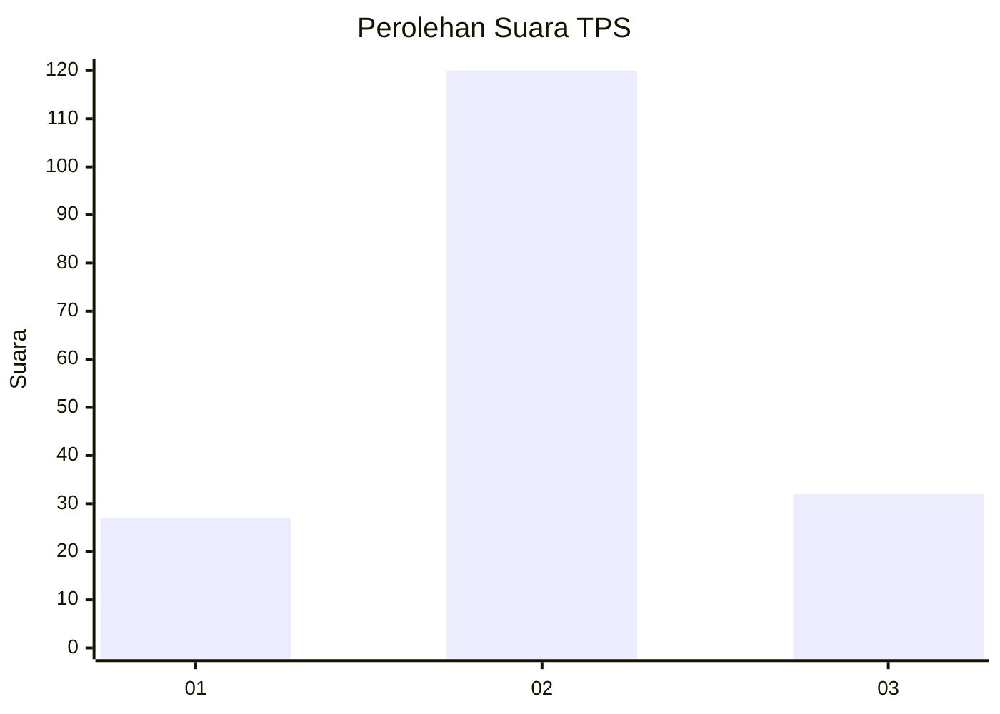
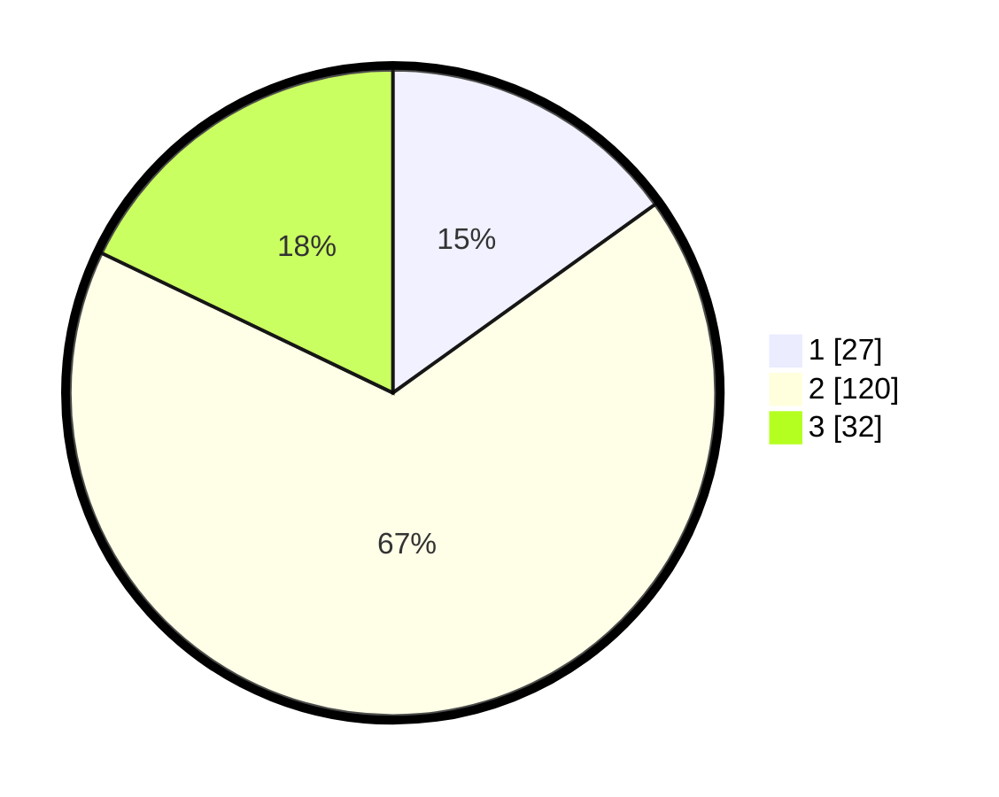

# Hasil

## Grafik

## Tabel

| No. | Nama Paslon    | Suara | Suara (raw) | Persentase |
|:--- |:-------------- | -----:| -----------:| ----------:|
| 1   | ANIES MUHAIMIN | 27    | [27][p-1]   | 15,08      |
| 2   | PRABOWO GIBRAN | 120   | [120][p-2]  | 67,04      |
| 3   | GANJAR MAHFUD  | 32    | [32][p-3]   | 17,88      |

[p-1]: https://github.com/gigit-pemilu/pemilu-2024-12-sumatera-utara/blob/main/pilpres/hitung-suara/sub/12-sumatera-utara/sub/10-labuhanbatu/sub/01-rantau-utara/sub/1001-padang-matinggi/sub/003-tps/sub/paslon-1.txt
[p-2]: https://github.com/gigit-pemilu/pemilu-2024-12-sumatera-utara/blob/main/pilpres/hitung-suara/sub/12-sumatera-utara/sub/10-labuhanbatu/sub/01-rantau-utara/sub/1001-padang-matinggi/sub/003-tps/sub/paslon-2.txt
[p-3]: https://github.com/gigit-pemilu/pemilu-2024-12-sumatera-utara/blob/main/pilpres/hitung-suara/sub/12-sumatera-utara/sub/10-labuhanbatu/sub/01-rantau-utara/sub/1001-padang-matinggi/sub/003-tps/sub/paslon-3.txt

## Foto C Plano

https://sirekap-obj-formc.kpu.go.id/b719/pemilu/ppwp/12/10/01/10/01/1210011001003-20240215-002535--eb5bb1b9-c4b9-4c8c-8bbf-c382ae705634.jpg

https://sirekap-obj-formc.kpu.go.id/b719/pemilu/ppwp/12/10/01/10/01/1210011001003-20240215-003537--e24c5d1c-49cb-4bfa-98a7-6744bd333503.jpg

https://sirekap-obj-formc.kpu.go.id/b719/pemilu/ppwp/12/10/01/10/01/1210011001003-20240215-003843--0d94ed36-a5ff-4d0d-8cde-6f8a24812c24.jpg

## Metadata

| Key        | Value               |
| ---------- | ------------------- |
| Time Stamp | 2024-02-19 17:00:00 |

