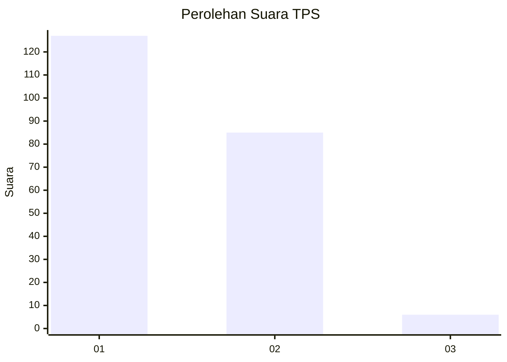
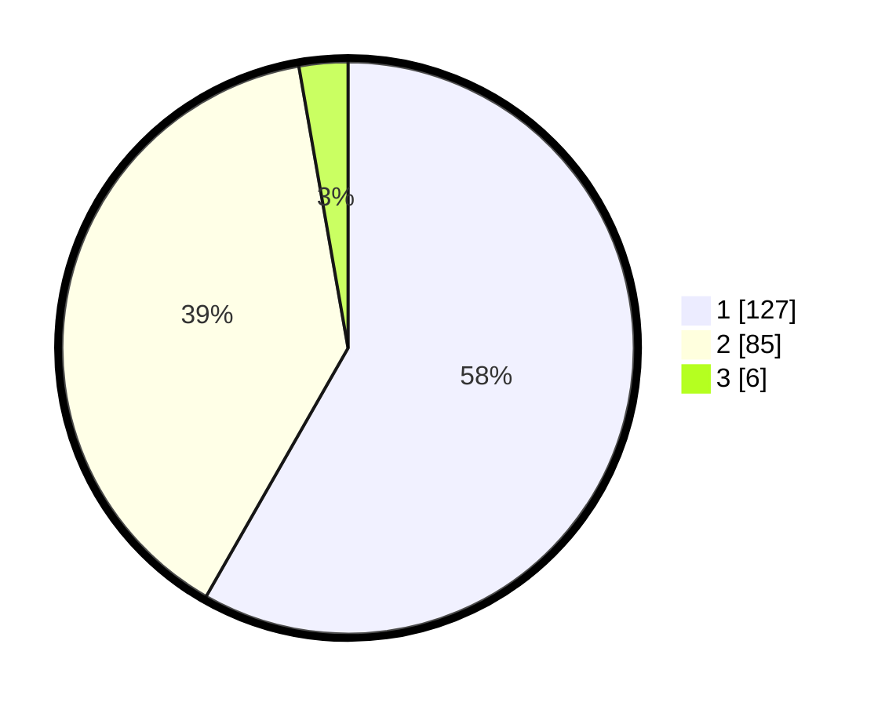

# Hasil

## Grafik

## Tabel

| No. | Nama Paslon    | Suara | Suara (raw) | Persentase |
|:--- |:-------------- | -----:| -----------:| ----------:|
| 1   | ANIES MUHAIMIN | 127   | [127][p-1]  | 58,26      |
| 2   | PRABOWO GIBRAN | 85    | [85][p-2]   | 38,99      |
| 3   | GANJAR MAHFUD  | 6     | [6][p-3]    | 2,75       |

[p-1]: https://github.com/gigit-pemilu/pemilu-2024-12-sumatera-utara/blob/main/pilpres/hitung-suara/sub/12-sumatera-utara/sub/10-labuhanbatu/sub/01-rantau-utara/sub/1001-padang-matinggi/sub/005-tps/sub/paslon-1.txt
[p-2]: https://github.com/gigit-pemilu/pemilu-2024-12-sumatera-utara/blob/main/pilpres/hitung-suara/sub/12-sumatera-utara/sub/10-labuhanbatu/sub/01-rantau-utara/sub/1001-padang-matinggi/sub/005-tps/sub/paslon-2.txt
[p-3]: https://github.com/gigit-pemilu/pemilu-2024-12-sumatera-utara/blob/main/pilpres/hitung-suara/sub/12-sumatera-utara/sub/10-labuhanbatu/sub/01-rantau-utara/sub/1001-padang-matinggi/sub/005-tps/sub/paslon-3.txt

## Foto C Plano

https://sirekap-obj-formc.kpu.go.id/efe8/pemilu/ppwp/12/10/01/10/01/1210011001005-20240215-045822--e3fdb699-2519-4038-ab3d-a104ba9a553b.jpg

https://sirekap-obj-formc.kpu.go.id/efe8/pemilu/ppwp/12/10/01/10/01/1210011001005-20240216-065641--808e7095-9036-48eb-bfb1-43a196b1f539.jpg

https://sirekap-obj-formc.kpu.go.id/efe8/pemilu/ppwp/12/10/01/10/01/1210011001005-20240215-040721--327ccafe-0618-4e21-997c-5879e01cc39b.jpg

## Metadata

| Key        | Value               |
| ---------- | ------------------- |
| Time Stamp | 2024-02-25 13:00:00 |

