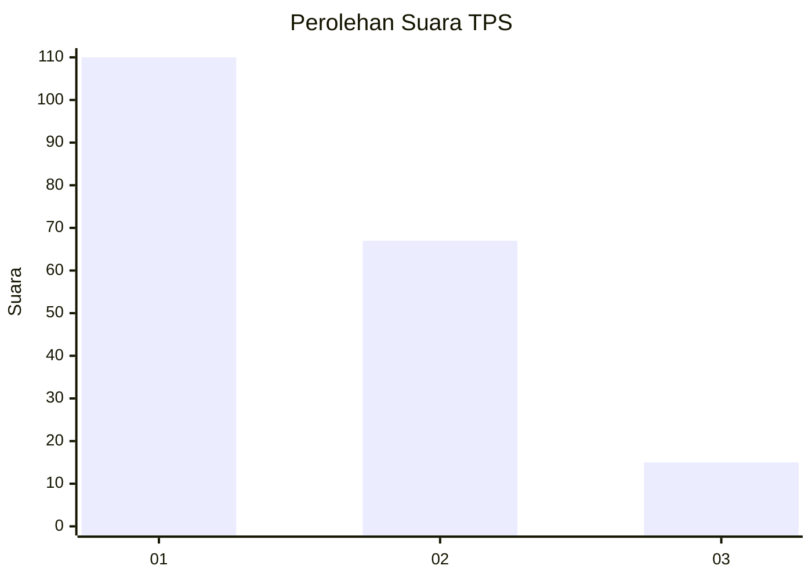
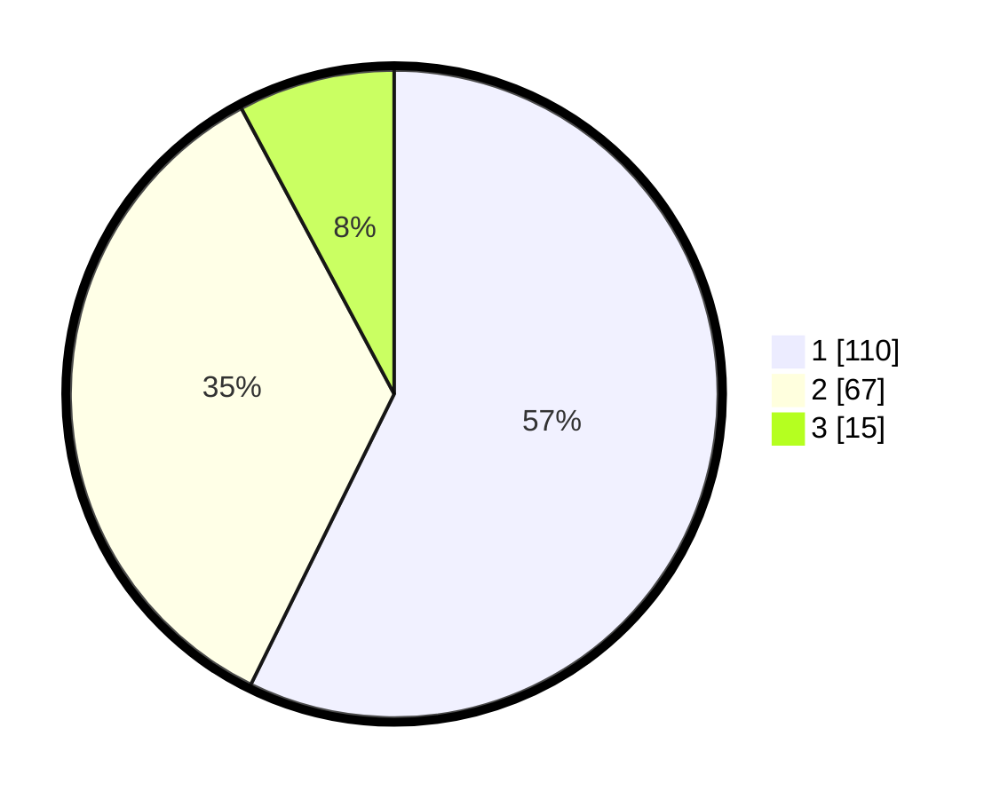

# Hasil

## Grafik

## Tabel

| No. | Nama Paslon    | Suara | Suara (raw) | Persentase |
|:--- |:-------------- | -----:| -----------:| ----------:|
| 1   | ANIES MUHAIMIN | 110   | [110][p-1]  | 57,29      |
| 2   | PRABOWO GIBRAN | 67    | [67][p-2]   | 34,90      |
| 3   | GANJAR MAHFUD  | 15    | [15][p-3]   | 7,81       |

[p-1]: https://github.com/gigit-pemilu/pemilu-2024-12-sumatera-utara/blob/main/pilpres/hitung-suara/sub/12-sumatera-utara/sub/10-labuhanbatu/sub/01-rantau-utara/sub/1001-padang-matinggi/sub/021-tps/sub/paslon-1.txt
[p-2]: https://github.com/gigit-pemilu/pemilu-2024-12-sumatera-utara/blob/main/pilpres/hitung-suara/sub/12-sumatera-utara/sub/10-labuhanbatu/sub/01-rantau-utara/sub/1001-padang-matinggi/sub/021-tps/sub/paslon-2.txt
[p-3]: https://github.com/gigit-pemilu/pemilu-2024-12-sumatera-utara/blob/main/pilpres/hitung-suara/sub/12-sumatera-utara/sub/10-labuhanbatu/sub/01-rantau-utara/sub/1001-padang-matinggi/sub/021-tps/sub/paslon-3.txt

## Foto C Plano

https://sirekap-obj-formc.kpu.go.id/7ce2/pemilu/ppwp/12/10/01/10/01/1210011001021-20240215-031413--0fbbea0f-0e1d-480d-8308-5dfe76221cb8.jpg

https://sirekap-obj-formc.kpu.go.id/7ce2/pemilu/ppwp/12/10/01/10/01/1210011001021-20240215-031535--45f1252c-40b2-4802-a153-318f68ed6b75.jpg

https://sirekap-obj-formc.kpu.go.id/7ce2/pemilu/ppwp/12/10/01/10/01/1210011001021-20240215-031703--75a5bcfd-945c-444a-8161-7035d378c595.jpg

## Metadata

| Key        | Value               |
| ---------- | ------------------- |
| Time Stamp | 2024-02-15 18:00:26 |

