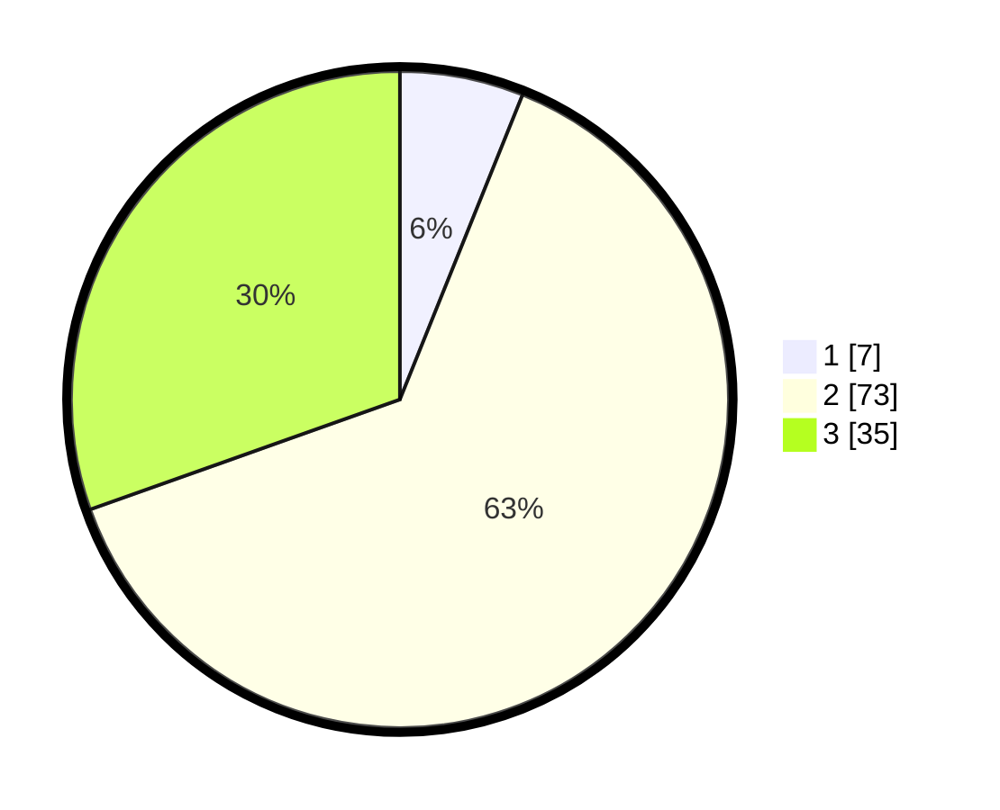

# Hasil

## Grafik

## Tabel

| No. | Nama Paslon    | Suara | Suara (raw) | Persentase |
|:--- |:-------------- | -----:| -----------:| ----------:|
| 1   | ANIES MUHAIMIN | 7     | [7][p-1]    | 6,09       |
| 2   | PRABOWO GIBRAN | 73    | [73][p-2]   | 63,48      |
| 3   | GANJAR MAHFUD  | 35    | [35][p-3]   | 30,43      |

[p-1]: https://github.com/gigit-pemilu/pemilu-2024-12-sumatera-utara/blob/main/pilpres/hitung-suara/sub/12-sumatera-utara/sub/10-labuhanbatu/sub/01-rantau-utara/sub/1002-siringo-ringo/sub/020-tps/sub/paslon-1.txt
[p-2]: https://github.com/gigit-pemilu/pemilu-2024-12-sumatera-utara/blob/main/pilpres/hitung-suara/sub/12-sumatera-utara/sub/10-labuhanbatu/sub/01-rantau-utara/sub/1002-siringo-ringo/sub/020-tps/sub/paslon-2.txt
[p-3]: https://github.com/gigit-pemilu/pemilu-2024-12-sumatera-utara/blob/main/pilpres/hitung-suara/sub/12-sumatera-utara/sub/10-labuhanbatu/sub/01-rantau-utara/sub/1002-siringo-ringo/sub/020-tps/sub/paslon-3.txt

## Foto C Plano

https://sirekap-obj-formc.kpu.go.id/f1bf/pemilu/ppwp/12/10/01/10/02/1210011002020-20240214-214836--580fb2b2-df4c-4bbc-9d23-33bd29b10b54.jpg

https://sirekap-obj-formc.kpu.go.id/f1bf/pemilu/ppwp/12/10/01/10/02/1210011002020-20240214-214850--2c0c4a37-14d9-410d-b213-0aa85f56b8e5.jpg

https://sirekap-obj-formc.kpu.go.id/f1bf/pemilu/ppwp/12/10/01/10/02/1210011002020-20240214-214909--7eb74904-b445-4430-8640-3bb1ca001601.jpg

## Metadata

| Key        | Value               |
| ---------- | ------------------- |
| Time Stamp | 2024-02-15 18:00:26 |

