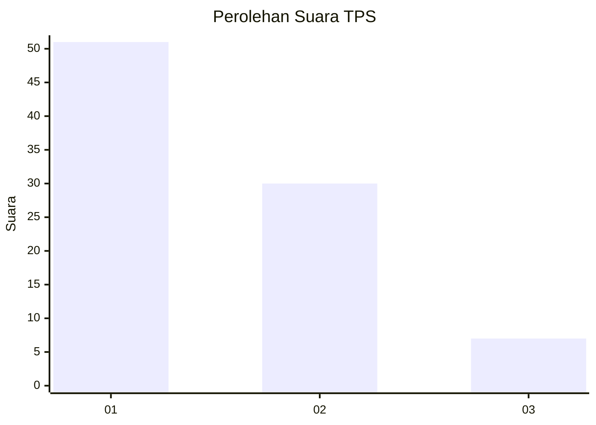
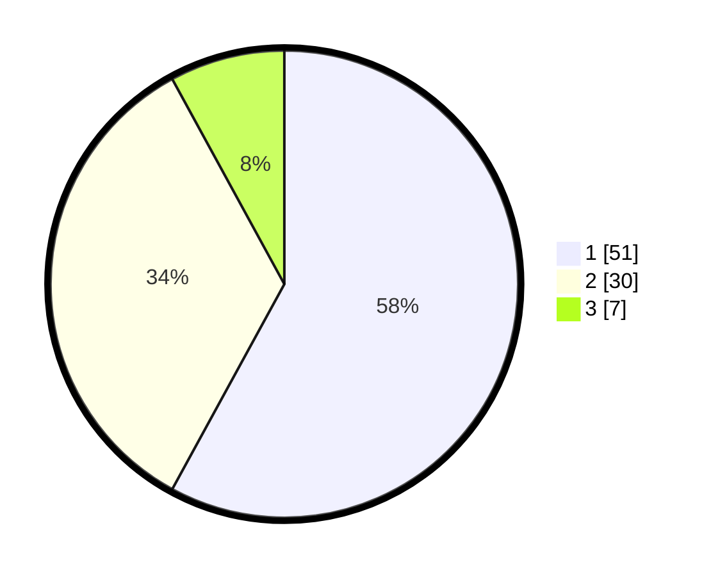

# Hasil

## Grafik

## Tabel

| No. | Nama Paslon    | Suara | Suara (raw) | Persentase |
|:--- |:-------------- | -----:| -----------:| ----------:|
| 1   | ANIES MUHAIMIN | 51    | [51][p-1]   | 57,95      |
| 2   | PRABOWO GIBRAN | 30    | [30][p-2]   | 34,09      |
| 3   | GANJAR MAHFUD  | 7     | [7][p-3]    | 7,95       |

[p-1]: https://github.com/gigit-pemilu/pemilu-2024/blob/main/pilpres/hitung-suara/sub/12-sumatera-utara/sub/10-labuhanbatu/sub/01-rantau-utara/sub/1003-sirandorung/sub/032-tps/sub/paslon-1.txt
[p-2]: https://github.com/gigit-pemilu/pemilu-2024/blob/main/pilpres/hitung-suara/sub/12-sumatera-utara/sub/10-labuhanbatu/sub/01-rantau-utara/sub/1003-sirandorung/sub/032-tps/sub/paslon-2.txt
[p-3]: https://github.com/gigit-pemilu/pemilu-2024/blob/main/pilpres/hitung-suara/sub/12-sumatera-utara/sub/10-labuhanbatu/sub/01-rantau-utara/sub/1003-sirandorung/sub/032-tps/sub/paslon-3.txt

## Foto C Plano

https://sirekap-obj-formc.kpu.go.id/b0b6/pemilu/ppwp/12/10/01/10/03/1210011003032-20240214-235428--6f6a8027-d88a-4a58-a4f7-c3b78c0a7920.jpg

https://sirekap-obj-formc.kpu.go.id/b0b6/pemilu/ppwp/12/10/01/10/03/1210011003032-20240214-235153--9ee2d6c8-e96d-4b28-a3e5-cce71ad32e4c.jpg

https://sirekap-obj-formc.kpu.go.id/b0b6/pemilu/ppwp/12/10/01/10/03/1210011003032-20240214-235410--fb5577de-d6be-4b34-91e1-c549a5893fab.jpg

## Metadata

| Key        | Value               |
| ---------- | ------------------- |
| Time Stamp | 2024-02-15 18:00:26 |

