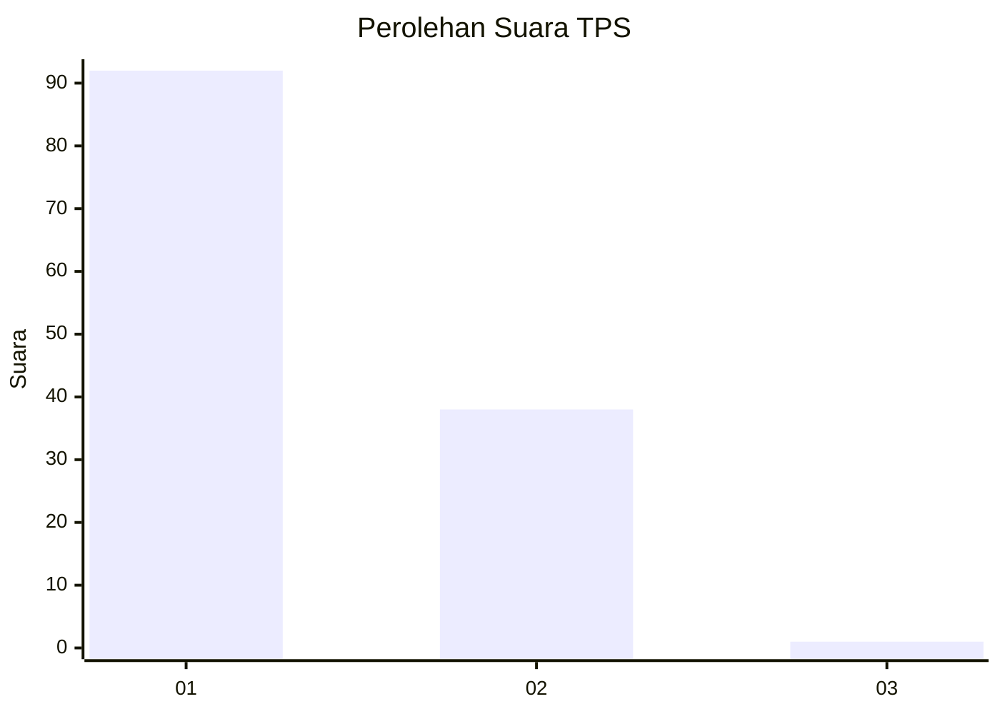
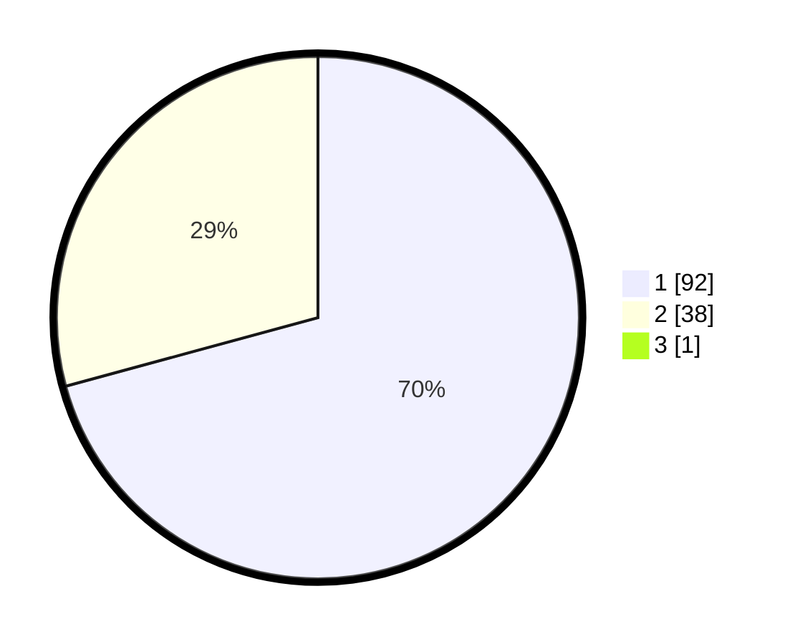

# Hasil

## Grafik

## Tabel

| No. | Nama Paslon    | Suara | Suara (raw) | Persentase |
|:--- |:-------------- | -----:| -----------:| ----------:|
| 1   | ANIES MUHAIMIN | 92    | [92][p-1]   | 70,23      |
| 2   | PRABOWO GIBRAN | 38    | [38][p-2]   | 29,01      |
| 3   | GANJAR MAHFUD  | 1     | [1][p-3]    | 0,76       |

[p-1]: https://github.com/gigit-pemilu/pemilu-2024/blob/main/pilpres/hitung-suara/sub/12-sumatera-utara/sub/10-labuhanbatu/sub/01-rantau-utara/sub/1003-sirandorung/sub/033-tps/sub/paslon-1.txt
[p-2]: https://github.com/gigit-pemilu/pemilu-2024/blob/main/pilpres/hitung-suara/sub/12-sumatera-utara/sub/10-labuhanbatu/sub/01-rantau-utara/sub/1003-sirandorung/sub/033-tps/sub/paslon-2.txt
[p-3]: https://github.com/gigit-pemilu/pemilu-2024/blob/main/pilpres/hitung-suara/sub/12-sumatera-utara/sub/10-labuhanbatu/sub/01-rantau-utara/sub/1003-sirandorung/sub/033-tps/sub/paslon-3.txt

## Foto C Plano

https://sirekap-obj-formc.kpu.go.id/eba2/pemilu/ppwp/12/10/01/10/03/1210011003033-20240215-031527--f85265f0-0a15-488f-8865-412790fad797.jpg

https://sirekap-obj-formc.kpu.go.id/eba2/pemilu/ppwp/12/10/01/10/03/1210011003033-20240215-031818--b2a7e86b-7a1d-49fc-bc42-99b08327016c.jpg

https://sirekap-obj-formc.kpu.go.id/eba2/pemilu/ppwp/12/10/01/10/03/1210011003033-20240215-032131--d36dc696-7f51-4d90-ae32-61e7be4897bd.jpg

## Metadata

| Key        | Value               |
| ---------- | ------------------- |
| Time Stamp | 2024-02-15 19:00:26 |

