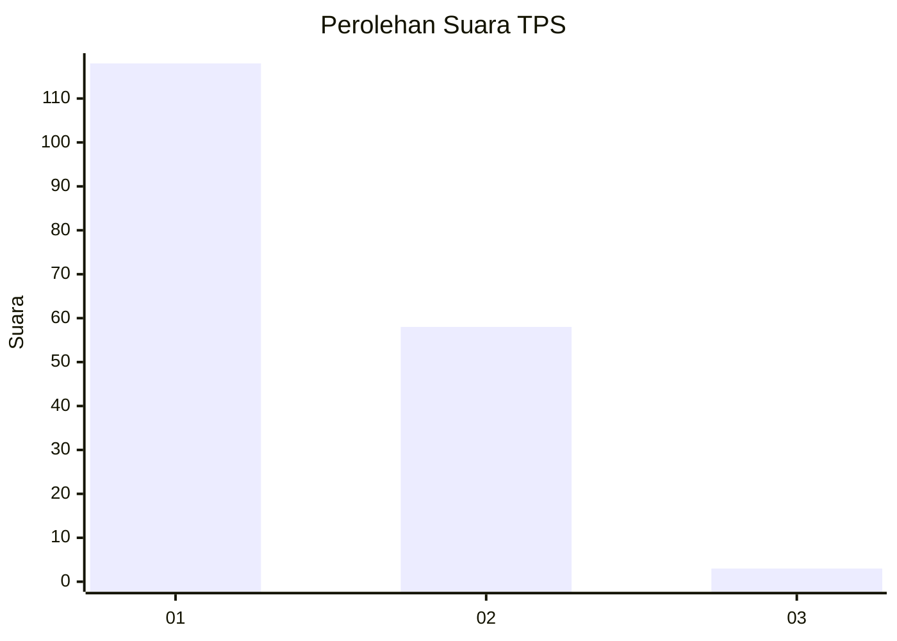
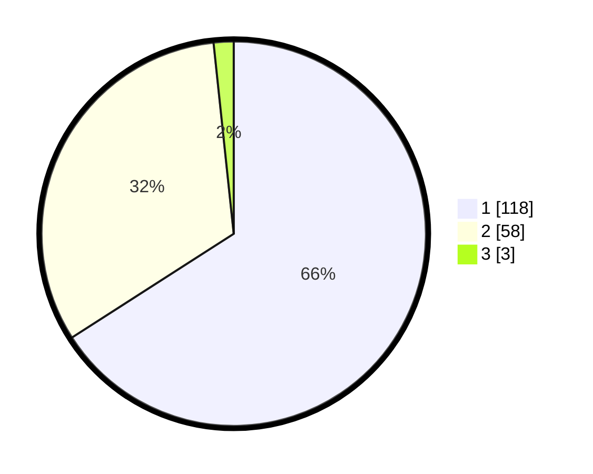

# Hasil

## Grafik

## Tabel

| No. | Nama Paslon    | Suara | Suara (raw) | Persentase |
|:--- |:-------------- | -----:| -----------:| ----------:|
| 1   | ANIES MUHAIMIN | 118   | [118][p-1]  | 65,92      |
| 2   | PRABOWO GIBRAN | 58    | [58][p-2]   | 32,40      |
| 3   | GANJAR MAHFUD  | 3     | [3][p-3]    | 1,68       |

[p-1]: https://github.com/gigit-pemilu/pemilu-2024-12-sumatera-utara/blob/main/pilpres/hitung-suara/sub/12-sumatera-utara/sub/10-labuhanbatu/sub/01-rantau-utara/sub/1009-padang-bulan/sub/007-tps/sub/paslon-1.txt
[p-2]: https://github.com/gigit-pemilu/pemilu-2024-12-sumatera-utara/blob/main/pilpres/hitung-suara/sub/12-sumatera-utara/sub/10-labuhanbatu/sub/01-rantau-utara/sub/1009-padang-bulan/sub/007-tps/sub/paslon-2.txt
[p-3]: https://github.com/gigit-pemilu/pemilu-2024-12-sumatera-utara/blob/main/pilpres/hitung-suara/sub/12-sumatera-utara/sub/10-labuhanbatu/sub/01-rantau-utara/sub/1009-padang-bulan/sub/007-tps/sub/paslon-3.txt

## Foto C Plano

https://sirekap-obj-formc.kpu.go.id/dcb2/pemilu/ppwp/12/10/01/10/09/1210011009007-20240215-005155--c6a94bd9-c87a-474c-b562-2364541e648f.jpg

https://sirekap-obj-formc.kpu.go.id/dcb2/pemilu/ppwp/12/10/01/10/09/1210011009007-20240215-005324--6628bd53-8550-4cac-9629-cc29a1fa0e6f.jpg

https://sirekap-obj-formc.kpu.go.id/dcb2/pemilu/ppwp/12/10/01/10/09/1210011009007-20240215-005442--34c20808-c4f2-4883-ac40-5d7ce22d6cba.jpg

## Metadata

| Key        | Value               |
| ---------- | ------------------- |
| Time Stamp | 2024-02-15 09:00:24 |

