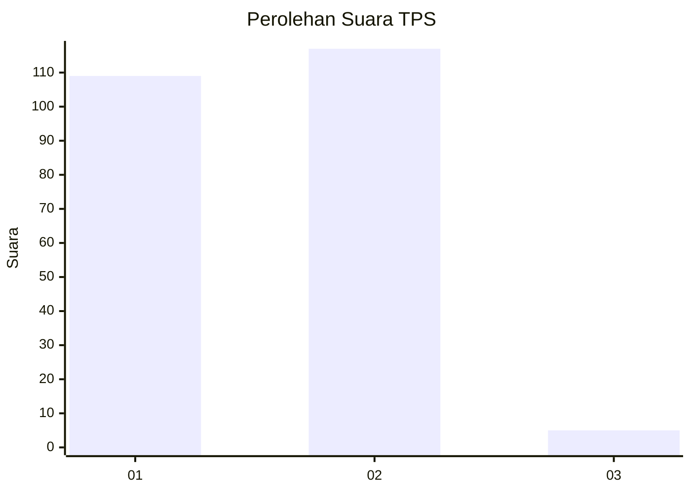
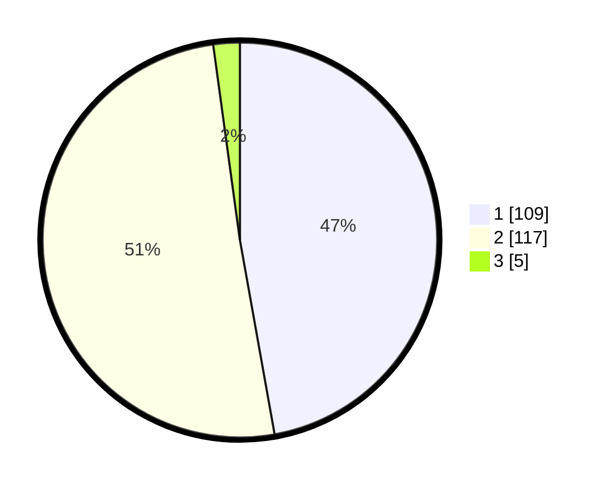

# Hasil

## Grafik

## Tabel

| No. | Nama Paslon    | Suara | Suara (raw) | Persentase |
|:--- |:-------------- | -----:| -----------:| ----------:|
| 1   | ANIES MUHAIMIN | 109   | [109][p-1]  | 47,19      |
| 2   | PRABOWO GIBRAN | 117   | [117][p-2]  | 50,65      |
| 3   | GANJAR MAHFUD  | 5     | [5][p-3]    | 2,16       |

[p-1]: https://github.com/gigit-pemilu/pemilu-2024/blob/main/pilpres/hitung-suara/sub/12-sumatera-utara/sub/10-labuhanbatu/sub/02-rantau-selatan/sub/1001-bakaran-batu/sub/006-tps/sub/paslon-1.txt
[p-2]: https://github.com/gigit-pemilu/pemilu-2024/blob/main/pilpres/hitung-suara/sub/12-sumatera-utara/sub/10-labuhanbatu/sub/02-rantau-selatan/sub/1001-bakaran-batu/sub/006-tps/sub/paslon-2.txt
[p-3]: https://github.com/gigit-pemilu/pemilu-2024/blob/main/pilpres/hitung-suara/sub/12-sumatera-utara/sub/10-labuhanbatu/sub/02-rantau-selatan/sub/1001-bakaran-batu/sub/006-tps/sub/paslon-3.txt

## Foto C Plano

https://sirekap-obj-formc.kpu.go.id/0823/pemilu/ppwp/12/10/02/10/01/1210021001006-20240215-121226--b75c6e60-93a6-45bc-b12f-92df9ac779f9.jpg

https://sirekap-obj-formc.kpu.go.id/0823/pemilu/ppwp/12/10/02/10/01/1210021001006-20240215-121231--b7d2b9f6-c55a-4653-be13-bef5403b75d8.jpg

https://sirekap-obj-formc.kpu.go.id/0823/pemilu/ppwp/12/10/02/10/01/1210021001006-20240215-121236--350a21f8-6870-4db5-b29e-24a3ff20d495.jpg

## Metadata

| Key        | Value               |
| ---------- | ------------------- |
| Time Stamp | 2024-02-15 22:00:27 |

